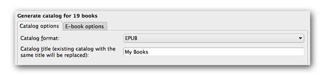
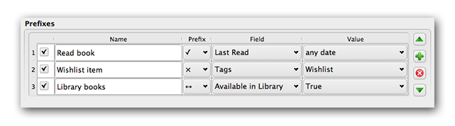
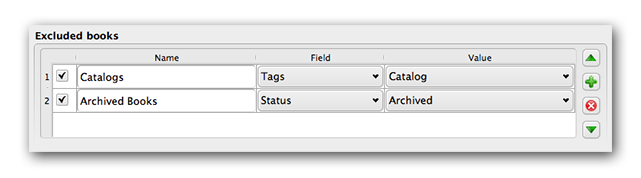
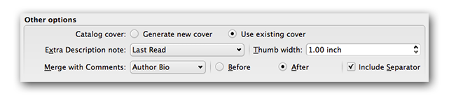

.. include:: global.rst

.. _catalog_tut:

Creating AZW3 • EPUB • MOBI Catalogs 
=====================================

|app|'s Create catalog feature enables you to create a catalog of your library in a variety of formats. This help file describes cataloging options when generating a catalog in AZW3, EPUB and MOBI formats.

.. contents::
    :depth: 1
    :local:

Selecting books to catalog
-------------------------------

If you want *all* of your library cataloged, remove any search or filtering criteria in the main window. With a single book selected, all books in your library will be candidates for inclusion in the generated catalog. Individual books may be excluded by various criteria; see the :ref:`excluded_genres` section below for more information.

If you want only *some* of your library cataloged, you have two options:

    * Create a multiple selection of the books you want cataloged. With more than one book selected in |app|'s main window, only the selected books will be cataloged.
    * Use the Search field or the Tag Browser to filter the displayed books. Only the displayed books will be cataloged.

To begin catalog generation, select the menu item :guilabel:`Convert books > Create a catalog of the books in your calibre library`. You may also add a :guilabel:`Create Catalog` button to a toolbar in :guilabel:`Preferences > Interface > Toolbars` for easier access to the Generate catalog dialog.

In :guilabel:`Catalog options`, select **AZW3, EPUB or MOBI** as the Catalog format. In the :guilabel:`Catalog title` field, provide a name that will be used for the generated catalog. If a catalog of the same name and format already exists, it will be replaced with the newly-generated catalog.

.. image:: images/catalog_send_to_device.png
    :alt: Catalog send to device
    :align: center

Enabling :guilabel:`Send catalog to device automatically` will download the generated catalog to a connected device upon completion.

Included sections
-------------------

Sections enabled by a checkmark will be included in the generated catalog:

    * :guilabel:`Authors` - all books, sorted by author, presented in a list format. Non-series books are listed before series books.
    * :guilabel:`Titles` - all books, sorted by title, presented in a list format.
    * :guilabel:`Series` - all books that are part of a series, sorted by series, presented in a list format.
    * :guilabel:`Genres` - individual genres presented in a list, sorted by Author and Series.
    * :guilabel:`Recently` Added - all books, sorted in reverse chronological order. List includes books added in the last 30 days, then a month-by-month listing of added books.
    * :guilabel:`Descriptions` - detailed description page for each book, including a cover thumbnail and comments. Sorted by author, with non-series books listed before series books.

Prefixes
---------

Prefix rules allow you to add a prefix to book listings when certain criteria are met. For example, you might want to mark books you've read with a checkmark, or books on your wishlist with an X.

The checkbox in the first column enables the rule. :guilabel:`Name` is a rule name that you provide. :guilabel:`Field` is either :guilabel:`Tags` or a custom column from your library. :guilabel:`Value` is the content of :guilabel:`Field` to match. When a prefix rule is satisfied, the book will be marked with the selected :guilabel:`Prefix`.

Three prefix rules have been specified in the example above:

    1. :guilabel:`Read book` specifies that a book with any date in a custom column named :guilabel:`Last read` will be prefixed with a checkmark symbol.
    2. :guilabel:`Wishlist` item specifies that any book with a :guilabel:`Wishlist` tag will be prefixed with an X symbol.
    3. :guilabel:`Library` books specifies that any book with a value of True (or Yes) in a custom column :guilabel:`Available in Library` will be prefixed with a double arrow symbol.

The first matching rule supplies the prefix. Disabled or incomplete rules are ignored.

Excluded books
-----------------

Exclusion rules allow you to specify books that will not be cataloged.

The checkbox in the first column enables the rule. :guilabel:`Name` is a rule name that you provide. :guilabel:`Field` is either :guilabel:`Tags` or a custom column in your library. :guilabel:`Value` is the content of :guilabel:`Field` to match. When an exclusion rule is satisfied, the book will be excluded from the generated catalog.

Two exclusion rules have been specified in the example above:

    1. The :guilabel:`Catalogs` rule specifies that any book with a :guilabel:`Catalog` tag will be excluded from the generated catalog.
    2. The :guilabel:`Archived` Books rule specifies that any book with a value of :guilabel:`Archived` in the custom column :guilabel:`Status` will be excluded from the generated catalog.

All rules are evaluated for every book. Disabled or incomplete rules are ignored.

.. _excluded_genres:

Excluded genres
---------------

When the catalog is generated, tags in your database are used as genres. For example, you may use the tags ``Fiction`` and ``Nonfiction``. These tags become genres in the generated catalog, with books listed under their respective genre lists based on their assigned tags. A book will be listed in every genre section for which it has a corresponding tag.

You may be using certain tags for other purposes, perhaps a + to indicate a read book, or a bracketed tag like ``[Amazon Freebie]`` to indicate a book's source. The :guilabel:`Excluded genres` regex allows you to specify tags that you don't want used as genres in the generated catalog. The default exclusion regex pattern ``\[.+\]\+`` excludes any tags of the form ``[tag]``, as well as excluding ``+``, the default tag for read books, from being used as genres in the generated catalog.

You can also use an exact tag name in a regex. For example, ``[Amazon Freebie]`` or ``[Project Gutenberg]``. If you want to list multiple exact tags for exclusion, put a pipe (vertical bar) character between them: ``[Amazon Freebie]|[Project Gutenberg]``.

:guilabel:`Results of regex` shows you which tags will be excluded when the catalog is built, based on the tags in your database and the regex pattern you enter. The results are updated as you modify the regex pattern.

Other options
--------------

:guilabel:`Catalog cover` specifies whether to generate a new cover or use an existing cover. It is possible to create a custom cover for your catalogs - see :ref:`Custom catalog covers` for more information. If you have created a custom cover that you want to reuse, select :guilabel:`Use existing cover`. Otherwise, select :guilabel:`Generate new cover`.

:guilabel:`Extra Description note` specifies a custom column's contents to be inserted into the Description page, next to the cover thumbnail. For example, you might want to display the date you last read a book using a :guilabel:`Last Read` custom column. For advanced use of the Description note feature, see `this post in the calibre forum <http://www.mobileread.com/forums/showpost.php?p=1335767&postcount=395>`_.

:guilabel:`Thumb width` specifies a width preference for cover thumbnails included with Descriptions pages. Thumbnails are cached to improve performance.To experiment with different widths, try generating a catalog with just a few books until you've determined your preferred width, then generate your full catalog. The first time a catalog is generated with a new thumbnail width, performance will be slower, but subsequent builds of the catalog will take advantage of the thumbnail cache.

:guilabel:`Merge with Comments` specifies a custom column whose content will be non-destructively merged with the Comments metadata during catalog generation. For example, you might have a custom column :guilabel:`Author Bio` that you'd like to append to the Comments metadata. You can choose to insert the custom column contents *before or after* the Comments section, and optionally separate the appended content with a horizontal rule separator. Eligible custom column types include ``text, comments, and composite``.

.. _Custom catalog covers:

Custom catalog covers
-----------------------

|cc| With the `Generate Cover plugin <http://www.mobileread.com/forums/showthread.php?t=124219>`_ installed, you can create custom covers for your catalog. 
To install the plugin, go to :guilabel:`Preferences > Advanced > Plugins > Get new plugins`.

Additional help resources
---------------------------

For more information on |app|'s Catalog feature, see the MobileRead forum sticky `Creating Catalogs - Start here <http://www.mobileread.com/forums/showthread.php?t=118556>`_, where you can find information on how to customize the catalog templates, and how to submit a bug report.

To ask questions or discuss calibre's Catalog feature with other users, visit the MobileRead forum `Calibre Catalogs <http://www.mobileread.com/forums/forumdisplay.php?f=238>`_.

