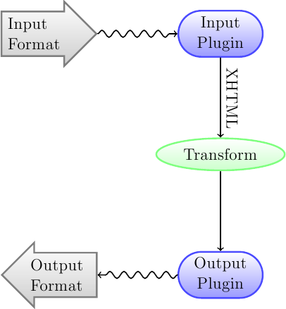

.. _conversion:

Ebook Conversion
===================

calibre has a conversion system that is designed to be very easy to use.
Normally, you just add a book to calibre, click convert and calibre will try hard
to generate output that is as close as possible to the input. However, calibre
accepts a very large number of input formats, not all of which are as suitable
as others for conversion to ebooks. In the case of such input formats, or if
you just want greater control over the conversion system, calibre has a lot of
options to fine tune the conversion process. Note however that calibre's
conversion system is not a substitute for a full blown ebook editor. To edit
ebooks, I recommend first converting them to EPUB or AZW3 using calibre and
then using the Edit Book feature to get them into perfect shape. You can then
use the edited ebook as input for conversion into other formats in calibre.

This document will refer mainly to the conversion settings as found in the
conversion dialog, pictured below. All these settings are also available via
command line interface to conversion, documented at :doc:`generated/en/ebook-convert`. In
calibre, you can obtain help on any individual setting by holding your mouse over
it, a tooltip will appear describing the setting.

.. image:: images/conv_dialog.png
    :align: center
    :alt: Ebook conversion dialog
    :class: half-width-img

.. contents:: Contents
  :depth: 1
  :local: 

.. _conversion-introduction:

Introduction
-------------

The first thing to understand about the conversion system is that it is designed as a pipeline.
Schematically, it looks like this:

The input format is first converted to XHTML by the appropriate *Input Plugin*.
This HTML is then *transformed*. In the last step, the processed XHTML is converted
to the specified output format by the appropriate *output plugin*. The results
of the conversion can vary greatly, based on the input format. Some formats
convert much better than others. A list of the best source formats for conversion
is available :ref:`here <best-source-formats>`.

The transforms that act on the XHTML output are where all the work happens. There are various
transforms, for example, to insert book metadata as a page at the start of the book,
to detect chapter headings and automatically create a Table of Contents, to proportionally
adjust font sizes, et cetera. It is important to remeber that all the transforms act on the
XHTML output by the *Input Plugin*, not on the input file itself. So, for example, if you ask calibre
to convert an RTF file to EPUB, it will first be converted to XHTML internally,
the various transforms will be applied to the XHTML and then the *output plugin* will
create the EPUB file, automatically generating all metadata, Table of Contents, et cetera.

You can see this process in action by using the debug option |dbgi|. Just specify the path to
a directory for the debug output. During conversion, calibre will place the XHTML generated by
the various stages of the conversion pipeline in different sub-directories.
The four sub-directories are:

.. table:: Stages of the conversion pipeline

    ==========    =============
    Directory     Description
    ==========    =============
    input         This contains the HTML output by the Input Plugin. Use this to debug the Input Plugin.
    parsed        The result of pre-processing and converting to XHTML the output from the Input Plugin. Use to debug structure detection. 
    structure     Post structure detection, but before CSS flattening and font size conversion. Use to debug font size conversion and CSS transforms.
    processed     Just before the ebook is passed to the output plugin. Use to debug the output plugin.
    ==========    =============

If you want to edit the input document a little before having calibre convert it, the best thing to 
do is edit the files in the :file:`input` sub-directory, then zip it up, and use the zip file as the 
input format for subsequent conversions. To do this use the :guilabel:`Edit meta information` dialog
to add the zip file as a format for the book and then, in the top left corner of the conversion dialog,
select ZIP as the input format.

This document will deal mainly with the various transforms that operate on the intermediate XHTML
and how to control them. At the end are some tips specific to each Input/Output format.

Look & feel
-------------

.. contents:: Contents
  :depth: 1
  :local:

This group of options controls various aspects of the look and feel of the converted ebook. 

.. _font-size-rescaling:

Font size rescaling
~~~~~~~~~~~~~~~~~~~~~~~

One of the nicest features of the e-reading experience is the ability to easily adjust font sizes to
suit individual needs and lighting conditions. calibre has sophisticated algorithms to ensure that
all the books it outputs have a consistent font sizes, no matter what font sizes are specified
in the input document.

The base font size of a document is the most common font size in that document,
i.e., the size of the bulk of text in that document. When you specify a
:guilabel:`Base font size`, calibre automatically rescales all font sizes in the document
proportionately, so that the most common font size becomes the specified base font size and other
font sizes are rescaled appropriately. By choosing a larger base font size, you can make the fonts
in the document larger and vice versa. When you set the base font size, for best results, you should
also set the font size key.

Normally, calibre will automatically choose a base font size appropriate to the output profile you
have chosen (see :ref:`page-setup`). However, you can override this here in case the default is
not suitable for you.

The :guilabel:`Font size key` option lets you control how non-base font sizes are rescaled. 
The font rescaling algorithm works using a font size key, which is simply a comma-separated
list of font sizes. The font size key tells calibre how many "steps" bigger or smaller a given font
size should be compared to the base font size. The idea is that there should be a limited number
of font sizes in a document. For example, one size for the body text, a couple of sizes for
different levels of headings and a couple of sizes for super/sub scripts and footnotes. The
font size key allows calibre to compartmentalize the font sizes in the input documents into
separate "bins" corresponding to the different logical font sizes. 

Let's illustrate with an example. 
Suppose the source document we are converting was produced by someone with excellent
eyesight and has a base font size of 8pt. That means the bulk of the text in the document is sized
at 8pts, while headings are somewhat larger (say 10 and 12pt) and footnotes somewhat smaller at 6pt. 
Now if we use the following settings::

    Base font size : 12pt
    Font size key  : 7, 8, 10, 12, 14, 16, 18, 20

The output document will have a base font size of 12pt, headings of 14 and 16pt and footnotes of 8pt.
Now suppose we want to make the largest heading size stand out more and make the footnotes a
little larger as well. To achieve this, the font key should be changed to::

    New font size key : 7, 9, 12, 14, 18, 20, 22

The largest headings will now become 18pt, while the footnotes will become 9pt. You can
play with these settings to try and figure out what would be optimum for you by using the
font rescaling wizard, which can be accessed by clicking the little button next to the
:guilabel:`Font size key` setting.

All the font size rescaling in the conversion can also be disabled here, if you would
like to preserve the font sizes in the input document. 

A related setting is :guilabel:`Line height`. Line height controls the vertical height of
lines. By default, (a line height of 0), no manipulation of line heights is performed. If
you specify a non-default value, line heights will be set in all locations that don't specify their
own line heights. However, this is something of a blunt weapon and should be used sparingly.
If you want to adjust the line heights for some section of the input, it's better to use
the :ref:`extra-css`.

Paragraph spacing
~~~~~~~~~~~~~~~~~~~

Normally, paragraphs in XHTML are rendered with a blank line between them and no leading text
indent. calibre has a couple of options to control this. :guilabel:`Remove spacing between paragraphs`
forcefully ensure that all paragraphs have no inter paragraph spacing. It also sets the text
indent to 1.5em (can be changed) to mark the start of every paragraph.
:guilabel:`Insert blank line` does the
opposite, guaranteeing that there is exactly one blank line between each pair of paragraphs. 
Both these options are very comprehensive, removing spacing, or inserting it for *all* paragraphs
(technically 
 and 
 tags). This is so that you can just set the option and be sure that
it performs as advertised, irrespective of how messy the input file is. The one exception is
when the input file uses hard line breaks to implement inter-paragraph spacing.

If you want to remove the spacing between all paragraphs, except a select few, don't use these
options. Instead add the following CSS code to :ref:`extra-css`::

    p, div { margin: 0pt; border: 0pt; text-indent: 1.5em }
    .spacious { margin-bottom: 1em; text-indent: 0pt; }

Then, in your source document, mark the paragraphs that need spacing with `class="spacious"`.
If your input document is not in HTML, use the Debug option, described in the Introduction to get HTML
(use the :file:`input` sub-directory).

.. _extra-css:

Extra CSS
~~~~~~~~~~

This option allows you to specify arbitrary CSS that will be applied to all HTML files in the
input. This CSS is applied with very high priority and so should override most CSS present in
the **input document** itself. You can use this setting to fine tune the presentation/layout of your
document. For example, if you want all paragraphs of class `endnote` to be right aligned, just 
add::
    
    .endnote { text-align: right }

or if you want to change the indentation of all paragraphs::

    p { text-indent: 5mm; }

:guilabel:`Extra CSS` is a very powerful option, but you do need an understanding of how CSS works
to use it to its full potential. You can use the debug pipeline option described above to see what
CSS is present in your input document.

Miscellaneous
~~~~~~~~~~~~~~

There are a few more options in this section.

:guilabel:`No text justification`
    Normally, if the output format supports it, calibre will force the output ebook
    to have *justified* text (i.e., a smooth right margin). This option will turn
    off this behavior, in which case whatever justification is specified in the input document
    will be used instead.

:guilabel:`Linearize tables`
    Some badly designed documents use tables to control the layout of text on the page.
    When converted these documents often have text that runs off the page and other artifacts.
    This option will extract the content from the tables and present it in a linear fashion.
    Note that this option linearizes *all* tables, so only use it if you are sure the
    input document does not use tables for legitimate purposes, like presenting tabular information.

:guilabel:`Transliterate unicode characters`
    Transliterate unicode characters to an ASCII representation. Use with care because this will
    replace unicode characters with ASCII. For instance it will replace "Михаил Горбачёв"
    with "Mikhail Gorbachiov". Also, note that in cases where there are multiple representations
    of a character (characters shared by Chinese and Japanese for instance) the representation used
    by the largest number of people will be used (Chinese in the previous example).
    This option is mainly useful if you are going to view the ebook on a device that does not
    have support for unicode.

:guilabel:`Input character encoding`
    Older documents sometimes don't specify their character encoding. When converted, this can
    result in non-English characters or special characters like smart quotes being corrupted. 
    calibre tries to auto-detect the character encoding of the source document, but it does not
    always succeed. You can force it to assume a particular character encoding by using this setting.
    `cp1252` is a common encoding for documents produced using windows software. You should also read
    :ref:`char-encoding-faq` for more on encoding issues.
    

.. _page-setup:

Page setup
-------------

The :guilabel:`Page setup` options are for controlling screen layout, like margins and screen sizes. There are
options to setup page margins, which will be used by the output plugin, if the selected output format
supports page margins. In addition, you should choose an Input profile and an output profile. Both sets
of profiles basically deal with how to interpret measurements in the input/output documents, screen sizes
and default font rescaling keys. 

If you know that the file you are converting was intended to be used on a particular device/software platform,
choose the corresponding input profile, otherwise just choose the default input profile. If you know the files
you are producing are meant for a particular device type, choose the corresponding output profile. In particular, for MOBI output files, you should choose the Kindle, for LIT the Microsoft Reader and for EPUB the Sony Reader. In the case of EPUB, the Sony Reader profile will result in EPUB files that will work everywhere. However, it has some side effects, like inserting artificial section breaks to keep internal components below the size threshold, needed for SONY devices. In particular for the iPhone/Android phones, choose the SONY output profile. If you know your EPUB files will not be read on a SONY or similar device, use the default output profile. If you are producing MOBI files that are not intended for the Kindle, choose the Mobipocket books output profile.

The output profile also controls the screen size. This will cause, for example, images to be auto-resized to be fit to the screen in some output formats. So choose a profile of a device that has a screen size similar to your device.

.. _heuristic-processing:

Heuristic processing
---------------------

Heuristic processing provides a variety of functions which can be used to try and detect and correct 
common problems in poorly formatted input documents.  Use these functions if your input document suffers 
from poor formatting. Because these functions rely on common patterns, be aware that in some cases an 
option may lead to worse results, so use with care.  As an example, several of these options will
remove all non-breaking-space entities, or may include false positive matches relating to the function.

:guilabel:`Enable heuristic processing`
    This option activates calibre's :guilabel:`Heuristic processing` stage of the conversion pipeline.
    This must be enabled in order for various sub-functions to be applied

:guilabel:`Unwrap lines`
    Enabling this option will cause calibre to attempt to detect and correct hard line breaks that exist 
    within a document using punctuation clues and line length. calibre will first attempt to detect whether 
    hard line breaks exist, if they do not appear to exist calibre will not attempt to unwrap lines. The 
    line-unwrap factor can be reduced if you want to 'force' calibre to unwrap lines.

:guilabel:`Line-unwrap factor`
    This option controls the algorithm calibre uses to remove hard line breaks. For example, if the value of this
    option is 0.4, that means calibre will remove hard line breaks from the end of lines whose lengths are less
    than the length of 40% of all lines in the document.  If your document only has a few line breaks which need
    correction, then this value should be reduced to somewhere between 0.1 and 0.2.
    
:guilabel:`Detect and markup unformatted chapter headings and sub headings`
    If your document does not have chapter headings and titles formatted differently from the rest of the text,
    calibre can use this option to attempt detection them and surround them with heading tags. <h2> tags are used 
    for chapter headings; <h3> tags are used for any titles that are detected.  
    
    This function will not create a TOC, but in many cases it will cause calibre's default chapter detection settings 
    to correctly detect chapters and build a TOC.  Adjust the XPath under Structure detection if a TOC is not automatically
    created.  If there are no other headings used in the document then setting "//h:h2" under Structure detection would
    be the easiest way to create a TOC for the document.
    
    The inserted headings are not formatted, to apply formatting use the :guilabel:`Extra CSS` option under
    the Look and Feel conversion settings.  For example, to center heading tags, use the following::

        h2, h3 { text-align: center }

:guilabel:`Renumber sequences of <h1> or <h2> tags`
    Some publishers format chapter headings using multiple <h1> or <h2> tags sequentially.  
    calibre's default conversion settings will cause such titles to be split into two pieces.  This option 
    will re-number the heading tags to prevent splitting.

:guilabel:`Delete blank lines between paragraphs`
    This option will cause calibre to analyze blank lines included within the document.  If every paragraph is interleaved
    with a blank line, then calibre will remove all those blank paragraphs.  Sequences of multiple blank lines will be
    considered scene breaks and retained as a single paragraph.  This option differs from the 'Remove Paragraph Spacing' 
    option under 'Look and Feel' in that it actually modifies the HTML content, while the other option modifies the document
    styles.  This option can also remove paragraphs which were inserted using calibre's 'Insert blank line' option.

:guilabel:`Ensure scene breaks are consistently formatted`
    With this option calibre will attempt to detect common scene-break markers and ensure that they are center aligned.  
    'Soft' scene break markers, i.e. scene breaks only defined by extra white space, are styled to ensure that they 
    will not be displayed in conjunction with page breaks.

:guilabel:`Replace scene breaks`
    If this option is configured then calibre will replace scene break markers it finds with the replacement text specified by the
    user.  Please note that some ornamental characters may not be supported across all reading devices.
    
    In general you should avoid using html tags, calibre will discard any tags and use pre-defined markup.  

    tags, i.e. horizontal rules, and  tags are exceptions.  Horizontal rules can optionally be specified with styles, if you 
    choose to add your own style be sure to include the 'width' setting, otherwise the style information will be discarded.  Image 
    tags can used, but calibre does not provide the ability to add the image during conversion, this must be done after the fact using 
    the 'Edit Book' feature.
        
        Example image tag (place the image within an 'Images' folder inside the epub after conversion):
            
        
        Example horizontal rule with styles:
            

 
:guilabel:`Remove unnecessary hyphens`
    calibre will analyze all hyphenated content in the document when this option is enabled.  The document itself is used
    as a dictionary for analysis.  This allows calibre to accurately remove hyphens for any words in the document in any language, 
    along with made-up and obscure scientific words.  The primary drawback is words appearing only a single time in the document 
    will not be changed.  Analysis happens in two passes, the first pass analyzes line endings.  Lines are only unwrapped if the 
    word exists with or without a hyphen in the document.  The second pass analyzes all hyphenated words throughout the document, 
    hyphens are removed if the word exists elsewhere in the document without a match.

:guilabel:`Italicize common words and patterns`
    When enabled, calibre will look for common words and patterns that denote italics and italicize them.  Examples are common text
    conventions such as ~word~ or phrases that should generally be italicized, e.g. latin phrases like 'etc.' or 'et cetera'.

:guilabel:`Replace entity indents with CSS indents`
    Some documents use a convention of defining text indents using non-breaking space entities.  When this option is enabled calibre will
    attempt to detect this sort of formatting and convert them to a 3% text indent using css.

.. _search-replace:

Search & Replace
---------------------

These options are useful primarily for conversion of PDF documents or OCR conversions, though they can 
also be used to fix many document specific problems. As an example, some conversions can leaves behind page  
headers and footers in the text. These options use regular expressions to try and detect headers, footers, 
or other arbitrary text and remove or replace them. Remember that they operate on the intermediate XHTML produced 
by the conversion pipeline. There is a wizard to help you customize the regular expressions for 
your document.  Click the magic wand beside the expression box, and click the 'Test' button after composing 
your search expression.  Successful matches will be highlighted in Yellow.

The search works by using a python regular expression. All matched text is simply removed from 
the document or replaced using the replacement pattern. The replacement pattern is optional, if left blank 
then text matching the search pattern will be deleted from the document.  You can learn more about regular expressions  
and their syntax at :ref:`regexptutorial`.

.. _structure-detection:

Structure detection
---------------------

Structure detection involves calibre trying its best to detect structural elements in the input document, when they are not properly specified. For example, chapters, page breaks, headers, footers, etc. As you can imagine, this process varies widely from book to book. Fortunately, calibre has very powerful options to control this. With power comes complexity, but if once you take the time to learn the complexity, you will find it well worth the effort.

Chapters and page breaks
~~~~~~~~~~~~~~~~~~~~~~~~~~~

calibre has two sets of options for :guilabel:`chapter detection` and :guilabel:`inserting page breaks`. This can sometimes be slightly confusing, as by default,
calibre will insert page breaks before detected chapters as well as the locations detected by the page breaks option.
The reason for this is that there are often location where page breaks should be inserted that are not chapter boundaries.
Also, detected chapters can be optionally inserted into the auto generated Table of Contents. 

calibre uses *XPath*, a powerful language to allow the user to specify chapter boundaries/page breaks. XPath can seem a little daunting
to use at first, fortunately, there is a :ref:`XPath tutorial <xpath-tutorial>` in the User Manual. Remember that Structure detection
operates on the intermediate XHTML produced by the conversion pipeline. Use the debug option described in the
:ref:`conversion-introduction` to figure out the appropriate settings for your book. There is also a button for a XPath wizard
to help with the generation of simple XPath expressions.

By default, calibre uses the following expression for chapter detection::

    //*[((name()='h1' or name()='h2') and re:test(., 'chapter|book|section|part\s+', 'i')) or @class = 'chapter']

This expression is rather complex, because it tries to handle a number of common cases simultaneously. What it means
is that calibre will assume chapters start at either `<h1>` or `<h2>` tags that have any of the words 
`(chapter, book, section or part)` in them or that have the `class="chapter"` attribute. 

A related option is :guilabel:`Chapter mark`, which allows you to control what calibre does when it detects a chapter. By default,
it will insert a page break before the chapter. You can have it insert a ruled line instead of, or in addition to the page break.
You can also have it do nothing.

The default setting for detecting page breaks is::

    //*[name()='h1' or name()='h2']

which means that calibre will insert page breaks before every `<h1>` and `<h2>` tag by default.

.. note::
    
    The default expressions may change depending on the input format you are converting.

Miscellaneous
~~~~~~~~~~~~~~

There are a few more options in this section.

:guilabel:`Insert metadata as page at start of book`
    One of the great things about calibre is that it allows you to maintain very complete metadata
    about all of your books, for example, a rating, tags, comments, etc. This option will create
    a single page with all this metadata and insert it into the converted ebook, typically just
    after the cover. Think of it as a way to create your own customised book jacket.

:guilabel:`Remove first image`
    Sometimes, the source document you are converting includes the cover as part of the book, instead
    of as a separate cover. If you also specify a cover in calibre, then the converted book will have
    two covers. This option will simply remove the first image from the source document, thereby
    ensuring that the converted book has only one cover, the one specified in calibre.

    
Table of Contents
------------------

When the input document has a Table of Contents in its metadata, calibre will just use that. However,
a number of older formats either do not support a metadata based Table of Contents, or individual
documents do not have one. In these cases, the options in this section can help you automatically
generate a Table of Contents in the converted ebook, based on the actual content in the input document.

.. note:: Using these options can be a little challenging to get exactly right.
    If you prefer creating/editing the Table of Contents by hand, convert to
    the EPUB or AZW3 formats and select the checkbox at the bottom of the Table
    of Contents section of the conversion dialog that says 
    :guilabel:`Manually fine-tune the Table of Contents after conversion`. 
    This will launch the ToC Editor tool after the conversion. It allows you to
    create entries in the Table of Contents by simply clicking the place in the
    book where you want the entry to point. You can also use the ToC Editor by
    itself, without doing a conversion. Go to :guilabel:`Preferences->Toolbars`
    and add the ToC Editor to the main toolbar. Then just select the book you
    want to edit and click the ToC Editor button.

The first option is :guilabel:`Force use of auto-generated Table of Contents`. By checking this option
you can have calibre override any Table of Contents found in the metadata of the input document with the
auto generated one. 

The default way that the creation of the auto generated Table of Contents works is that, calibre will first try
to add any detected chapters to the generated table of contents. You can learn how to customize the detection of chapters
in the :ref:`structure-detection` section above. If you do not want to include detected chapters in the generated
table of contents, check the :guilabel:`Do not add detected chapters` option.

If less than the :guilabel:`Chapter threshold` number of chapters were detected, calibre will then add any hyperlinks
it finds in the input document to the Table of Contents. This often works well many input documents include a
hyperlinked Table of Contents right at the start. The :guilabel:`Number of links` option can be used to control
this behavior. If set to zero, no links are added. If set to a number greater than zero, at most that number of links
is added.

calibre will automatically filter duplicates from the generated Table of Contents. However, if there are some additional
undesirable entries, you can filter them using the :guilabel:`TOC Filter` option. This is a regular expression that
will match the title of entries in the generated table of contents. Whenever a match is found, it will be removed.
For example, to remove all entries titles "Next" or "Previous" use::

    Next|Previous

The :guilabel:`Level 1,2,3 TOC` options allow you to create a sophisticated multi-level Table of Contents.
They are XPath expressions that match tags in the intermediate XHTML produced by the conversion pipeline. See the 
:ref:`conversion-introduction` for how to get access to this XHTML. Also read the :ref:`xpath-tutorial`, to learn
how to construct XPath expressions. Next to each option is a button that launches a wizard to help with the creation
of basic XPath expressions. The following simple example illustrates how to use these options.

Suppose you have an input document that results in XHTML that look like this:

.. code-block:: html

    <html xmlns="http://www.w3.org/1999/xhtml">
        <head>
            <title>Sample document</title>
        </head>
        <body>
            <h1>Chapter 1</h1>
            ...
            <h2>Section 1.1</h2>
            ...
            <h2>Section 1.2</h2>
            ...
            <h1>Chapter 2</h1>
            ...
            <h2>Section 2.1</h2>
            ...
        </body>
    </html>

Then, we set the options as::

    Level 1 TOC : //h:h1
    Level 2 TOC : //h:h2

This will result in an automatically generated two level Table of Contents that looks like::

    Chapter 1
        Section 1.1
        Section 1.2
    Chapter 2
        Section 2.1

.. warning::

    Not all output formats support a multi level Table of Contents. You should first try with EPUB output. If that
    works, then try your format of choice. 

Using images as chapter titles when converting HTML input documents
---------------------------------------------------------------------

Suppose you want to use an image as your chapter title, but still want calibre to be able to automatically generate a Table of Contents for you from the chapter titles.
Use the following HTML markup to achieve this

.. code-block:: html

    <html>
        <body>
            <h2>Chapter 1</h2>
            
chapter 1 text...

            <h2 title="Chapter 2"></h2>
            
chapter 2 text...

        </body>
    </html>

Set the :guilabel:`Level 1 TOC` setting to ``//h:h2``. Then, for chapter two, calibre will take the title from the value of the ``title`` attribute on the ``<h2>`` tag, since the tag has no text.

Using tag attributes to supply the text for entries in the Table of Contents
-----------------------------------------------------------------------------

If you have particularly long chapter titles and want shortened versions in the
Table of Contents, you can use the title attribute to achieve this, for
example:

.. code-block:: html

    <html>
        <body>
            <h2 title="Chapter 1">Chapter 1: Some very long title</h2>
            
chapter 1 text...

            <h2 title="Chapter 2">Chapter 2: Some other very long title</h2>
            
chapter 2 text...

        </body>
    </html>

Set the :guilabel:`Level 1 TOC` setting to ``//h:h2/@title``. Then calibre will
take the title from the value of the ``title`` attribute on the ``<h2>`` tags,
instead of using the text inside the tag. Note the trailing ``/@title`` on the
XPath expression, you can use this form to tell calibre to get the text from any
attribute you like. 

How options are set/saved for Conversion
-------------------------------------------

There are two places where conversion options can be set in calibre. The first is
in Preferences->Conversion. These settings are the defaults for the conversion
options. Whenever you try to convert a new book, the settings set here will be
used by default.

You can also change settings in the conversion dialog for each book conversion.
When you convert a book, calibre remembers the settings you used for that book,
so that if you convert it again, the saved settings for the individual book
will take precedence over the defaults set in Preferences. You can restore the
individual settings to defaults by using the Restore to defaults button in the
individual book conversion dialog. You can remove the saved settings for a
group of books by selecting all the books and then clicking the edit metadata
button to bring up the bulk metadata edit dialog, near the bottom of the dialog
is an option to remove stored conversion settings.

When you Bulk Convert a set of books, settings are taken in the following order (last one wins):

    * From the defaults set in Preferences->Conversion 

    * From the saved conversion settings for each book being converted (if
      any). This can be turned off by the option in the top left corner of the
      Bulk Conversion dialog.  

    * From the settings set in the Bulk conversion dialog

Note that the final settings for each book in a Bulk Conversion will be saved
and re-used if the book is converted again. Since the highest priority in Bulk
Conversion is given to the settings in the Bulk Conversion dialog, these will
override any book specific settings. So you should only bulk convert books
together that need similar settings. The exceptions are metadata and input
format specific settings. Since the Bulk Conversion dialog does not have
settings for these two categories, they will be taken from book specific
settings (if any) or the defaults. 

.. note::

    You can see the actual settings used during any conversion by clicking the rotating icon in the lower right corner 
    and then double clicking the individual conversion job. This will bring up a conversion log
    that will contain the actual settings used, near the top. 

Format specific tips
----------------------

Here you will find tips specific to the conversion of particular formats. Options specific to particular
format, whether input or output are available in the conversion dialog under their own section, for example
`TXT Input` or `EPUB Output`.

Convert Microsoft Word documents
~~~~~~~~~~~~~~~~~~~~~~~~~~~~~~~~~~

calibre can automatically convert ``.docx`` files created by Microsoft Word 2007 and
newer. Just add the file to calibre and click convert (make sure you are running
the latest version of calibre as support for ``.docx`` files is very new).

.. note::
    There is a `demo .docx file <https://calibre-ebook.com/downloads/demos/demo.docx>`_
    that demonstrates the capabilities of the calibre conversion engine. Just
    download it and convert it to EPUB or AZW3 to see what calibre can do.

calibre will automatically generate a Table of Contents based on headings if you mark
your headings with the ``Heading 1``, ``Heading 2``, etc. styles in Word. Open
the output ebook in the calibre viewer and click the Table of Contents button
to view the generated Table of Contents.

Older .doc files
^^^^^^^^^^^^^^^^^

For older .doc files, you can save the document as HTML with Microsoft Word
and then convert the resulting HTML file with calibre. When saving as
HTML, be sure to use the "Save as Web Page, Filtered" option as this will
produce clean HTML that will convert well. Note that Word produces really messy
HTML, converting it can take a long time, so be patient. If you have a newer
version of Word available, you can directly save it as docx as well.

Another alternative is to use the free OpenOffice. Open your .doc file in
OpenOffice and save it in OpenOffice's format .odt. calibre can directly convert
.odt files.

Convert TXT documents
~~~~~~~~~~~~~~~~~~~~~~

TXT documents have no well defined way to specify formatting like bold, italics, etc, or document 
structure like paragraphs, headings, sections and so on, but there are a variety of conventions commonly 
used.  By default calibre attempts automatic detection of the correct formatting and markup based on those
conventions.

TXT input supports a number of options to differentiate how paragraphs are detected.

    :guilabel:`Paragraph Style: Auto`
        Analyzes the text file and attempts to automatically determine how paragraphs are defined.  This
        option will generally work fine, if you achieve undesirable results try one of the manual options.

    :guilabel:`Paragraph Style: Block`
        Assumes one or more blank lines are a paragraph boundary::
        
            This is the first.
    
            This is the
            second paragraph.

    :guilabel:`Paragraph Style: Single`
        Assumes that every line is a paragraph::

            This is the first.
            This is the second.
            This is the third.
        
    :guilabel:`Paragraph Style: Print`
        Assumes that every paragraph starts with an indent (either a tab or 2+ spaces). Paragraphs end when
        the next line that starts with an indent is reached::

              This is the
            first.
              This is the second.
            
              This is the
            third.

    :guilabel:`Paragraph Style: Unformatted`
        Assumes that the document has no formatting, but does use hard line breaks.  Punctuation
        and median line length are used to attempt to re-create paragraphs.

    :guilabel:`Formatting Style: Auto`
        Attempts to detect the type of formatting markup being used.  If no markup is used then heuristic
        formatting will be applied.

    :guilabel:`Formatting Style: Heuristic`
        Analyzes the document for common chapter headings, scene breaks, and italicized words and applies the
        appropriate html markup during conversion.

    :guilabel:`Formatting Style: Markdown`
        calibre also supports running TXT input though a transformation preprocessor known as markdown. Markdown
        allows for basic formatting to be added to TXT documents, such as bold, italics, section headings, tables,
        lists, a Table of Contents, etc. Marking chapter headings with a leading # and setting the chapter XPath detection
        expression to "//h:h1" is the easiest way to have a proper table of contents generated from a TXT document.
        You can learn more about the markdown syntax at `daringfireball <https://daringfireball.net/projects/markdown/syntax>`_.

    :guilabel:`Formatting Style: None`
        Applies no special formatting to the text, the document is converted to html with no other changes.

.. _pdfconversion:

Convert PDF documents
~~~~~~~~~~~~~~~~~~~~~~~~~~~

PDF documents are one of the worst formats to convert from. They are a fixed page size and text placement format.
Meaning, it is very difficult to determine where one paragraph ends and another begins. calibre will try to unwrap
paragraphs using a configurable, :guilabel:`Line Un-Wrapping Factor`. This is a scale used to determine the length
at which a line should be unwrapped. Valid values are a decimal
between 0 and 1. The default is 0.45, just under the median line length. Lower this value to include more
text in the unwrapping. Increase to include less. You can adjust this value in the conversion settings under :guilabel:`PDF Input`.

Also, they often have headers and footers as part of the document that will become included with the text.
Use the Search and Replace panel to remove headers and footers to mitigate this issue. If the headers and footers are not
removed from the text it can throw off the paragraph unwrapping. To learn how to use the header and footer removal options, read 
:ref:`regexptutorial`.

Some limitations of PDF input are: 
    
    * Complex, multi-column, and image based documents are not supported.
    * Extraction of vector images and tables from within the document is also not supported.
    * Some PDFs use special glyphs to represent ll or ff or fi, etc. Conversion of these may or may not work depending on just how they are represented internally in the PDF.
    * Links and Tables of Contents are not supported
    * PDFs that use embedded non-unicode fonts to represent non-English characters will result in garbled output for those characters
    * Some PDFs are made up of photographs of the page with OCRed text behind them. In such cases calibre uses the OCRed text, which can be very different from what you see when you view the PDF file
    * PDFs that are used to display complex text, like right to left languages and math typesetting will not convert correctly

To re-iterate **PDF is a really, really bad** format to use as input. If you absolutely must use PDF, then be prepared for an
output ranging anywhere from decent to unusable, depending on the input PDF.

Comic Book Collections
~~~~~~~~~~~~~~~~~~~~~~~~~

A comic book collection is a .cbc file. A .cbc file is a zip file that contains other CBZ/CBR files. In addition the
.cbc file must contain a simple text file called comics.txt, encoded in UTF-8. The comics.txt file must contain
a list of the comics files inside the .cbc file, in the form filename:title, as shown below::

    one.cbz:Chapter One
    two.cbz:Chapter Two
    three.cbz:Chapter Three

The .cbc file will then contain::

    comics.txt
    one.cbz
    two.cbz
    three.cbz

calibre will automatically convert this .cbc file into a ebook with a Table of Contents pointing to each entry in comics.txt.

EPUB advanced formatting demo
~~~~~~~~~~~~~~~~~~~~~~~~~~~~~~

Various advanced formatting for EPUB files is demonstrated in this `demo file <https://calibre-ebook.com/downloads/demos/demo.epub>`_.
The file was created from hand coded HTML using calibre and is meant to be used as a template for your own EPUB creation efforts. 

The source HTML it was created from is available `demo.zip <https://calibre-ebook.com/downloads/demos/demo.zip>`_. The settings used to create the
EPUB from the ZIP file are::

    ebook-convert demo.zip .epub -vv --authors "Kovid Goyal" --language en --level1-toc '//*[@class="title"]' --disable-font-rescaling --page-breaks-before / --no-default-epub-cover

Note that because this file explores the potential of EPUB, most of the advanced formatting is not going to work on readers less capable than calibre's built-in EPUB viewer. 

Convert ODT documents
~~~~~~~~~~~~~~~~~~~~~

calibre can directly convert ODT (OpenDocument Text) files. You should use styles to format your document and minimize the use of direct formatting.
When inserting images into your document you need to anchor them to the paragraph, images anchored to a page will all end up in the front of the conversion.

To enable automatic detection of chapters, you need to mark them with the build-in styles called 'Heading 1', 'Heading 2', ..., 'Heading 6' ('Heading 1' equates to the HTML tag <h1>, 'Heading 2' to <h2> etc). When you convert in calibre you can enter which style you used into the 'Detect chapters at' box. Example:

  * If you mark Chapters with style 'Heading 2', you have to set the 'Detect chapters at' box to ``//h:h2``
  * For a nested TOC with Sections marked with 'Heading 2' and the Chapters marked with 'Heading 3' you need to enter ``//h:h2|//h:h3``. On the Convert - TOC page set the 'Level 1 TOC' box to ``//h:h2`` and the 'Level 2 TOC' box to ``//h:h3``.

Well-known document properties (Title, Keywords, Description, Creator) are recognized and calibre will use the first image (not to small, and with good aspect-ratio) as the cover image.

There is also an advanced property conversion mode, which is activated by setting the custom property ``opf.metadata`` ('Yes or No' type) to Yes in your ODT document (File->Properties->Custom Properties).
If this property is detected by calibre, the following custom properties are recognized (``opf.authors`` overrides document creator)::

    opf.titlesort
    opf.authors
    opf.authorsort
    opf.publisher
    opf.pubdate
    opf.isbn
    opf.language
    opf.series
    opf.seriesindex

In addition to this, you can specify the picture to use as the cover by naming
it ``opf.cover`` (right click, Picture->Options->Name) in the ODT. If no
picture with this name is found, the 'smart' method is used.  As the cover
detection might result in double covers in certain output formats, the process
will remove the paragraph (only if the only content is the cover!) from the
document. But this works only with the named picture!

To disable cover detection you can set the custom property ``opf.nocover`` ('Yes or No' type) to Yes in advanced mode.

Converting to PDF
~~~~~~~~~~~~~~~~~~~

The first, most important, setting to decide on when converting to PDF is the page
size. By default, calibre uses a page size of "U.S. Letter". You can change this
to another standard page size or a completely custom size in the :guilabel:`PDF Output`
section of the conversion dialog. If you are generating a PDF to be used on a
specific device, you can turn on the option to use the page size from the
:guilabel:`output profile` instead. So if your output profile is set to Kindle, calibre
will create a PDF with page size suitable for viewing on the small kindle
screen. 

Headers and Footers
^^^^^^^^^^^^^^^^^^^^
You can insert arbitrary headers and footers on each page of the PDF by
specifying header and footer templates. Templates are just snippets of HTML
code that get rendered in the header and footer locations. For example, to
display page numbers centered at the bottom of every page, in green, use the following
footer template::

    
Page _PAGENUM_

calibre will automatically replace _PAGENUM_ with the current page number. You
can even put different content on even and odd pages, for example the following
header template will show the title on odd pages and the author on even pages::

    
_AUTHOR_<i>_TITLE_</i>

calibre will automatically replace _TITLE_ and _AUTHOR_ with the title and author
of the document being converted.  You can also display text at the left and
right edges and change the font size, as demonstrated with this header
template::

    

_TITLE_

<i>_AUTHOR_</i>

This will display the title at the left and the author at the right, in a font
size smaller than the main text.

You can also use the current section in templates, as shown below::

    
_SECTION_

_SECTION_ is replaced by whatever the name of the current section is. These
names are taken from the metadata Table of Contents in the document (the PDF
Outline). If the document has no table of contents then it will be replaced by
empty text. If a single PDF page has multiple sections, the first section on
the page will be used. Similarly, there is a variable named _TOP_LEVEL_SECTION_
that can be used to get the name of the current top-level section.

You can even use javascript inside the header and footer templates, for
example, the following template will cause page numbers to start at 4 instead
of 1::

    

.. note:: When adding headers and footers make sure you set the page top and
    bottom margins to large enough values, under the Page setup section of the
    conversion dialog.

Printable Table of Contents
^^^^^^^^^^^^^^^^^^^^^^^^^^^^

You can also insert a printable Table of Contents at the end of the PDF that
lists the page numbers for every section. This is very useful if you intend to
print out the PDF to paper. If you wish to use the PDF on an electronic device,
then the PDF Outline provides this functionality and is generated by default.

You can customize the look of the generated Table of contents by using the
Extra CSS conversion setting under the Look & feel part of the conversion
dialog. The default css used is listed below, simply copy it and make whatever
changes you like.

.. code-block:: css

        .calibre-pdf-toc table { width: 100%% }

        .calibre-pdf-toc table tr td:last-of-type { text-align: right }

        .calibre-pdf-toc .level-0 {
            font-size: larger;
        }

        .calibre-pdf-toc .level-1 td:first-of-type { padding-left: 1.4em }
        .calibre-pdf-toc .level-2 td:first-of-type { padding-left: 2.8em }

