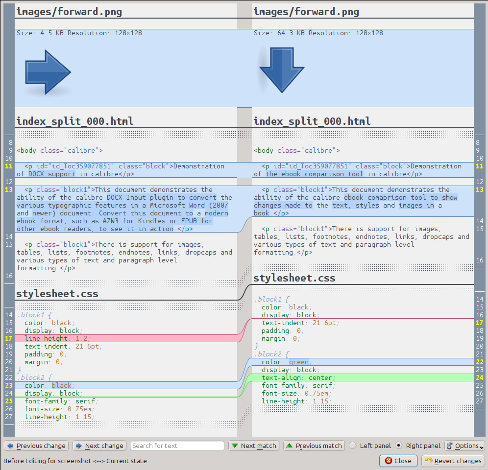

.. _diff:

Comparing e-books 
========================

calibre includes an integrated e-book comparison tool that can be used to see
what has changed inside an ebook after editing or converting it. It can compare
books in the EPUB and AZW3 formats.

To use it, either open the ebook in the tool for :ref:`edit` and then click
:guilabel:`File->Compare to other book` or use the :ref:`book_details` panel.
If you do a conversion from EPUB to EPUB, the original EPUB file will be saved
as ORIGINAL_EPUB. Simply right click on the ORIGINAL_EPUB entry in the Book
Details panel and choose :guilabel:`Compare to EPUB format`.

The comparison tool that opens will look like the screenshot below. It shows
you the differences in text, styles and images in the chosen books.

Understanding the comparison view
----------------------------------

As can be seen in the screenshot above, the comparison view shows the
differences between the two books side by side. Only the differences, with a
few lines of context around them are shown. This makes it easy to see at a
glance only what was changed inside a large document like a book.

Added text is shown with a green background, removed text with a red background 
and changed text with a blue background.

The line numbers of all changed text are show at the sides, making it easy to
go to a particular change in the editor. When you open the comparison tool from
within the editor, you can also double click on a line in the right panel to
go to that line in the editor automatically.

One useful technique when comparing books is to tell the comparison tool to
beautify the text and style files before calculating differences. This can
often result in cleaner and easier to follow differences. To do this, click the
:guilabel:`Options` button in the bottom right and choose :guilabel:`Beautify
files before comparing`. Note that beautifying can sometimes have undesired
effects, as it can cause invalid markup to be altered to make it valid. You can
also change the number of lines of context shown around differences via the
:guilabel:`Options` button.

You can search for any text in the differences via the search bar at the
bottom. You will need to specify which panel to search, the :guilabel:`Left` or
the :guilabel:`Right`.

Launching the comparison tool
-----------------------------------

The comparison tool is most useful when you have two versions of the same book
and you want to see what is different between them. To that end, there are
several ways to launch the tool.

Comparing two ebook files
^^^^^^^^^^^^^^^^^^^^^^^^^^^^^^^

Open the first file in the :ref:`edit` tool. Now click :guilabel:`File->Compare
to another book` and choose the second file (it must be in the same format as
the first). The comparison view will open with the file being edited on the
right and the second file on the left.

Comparing the ORIGINAL_FMT to FMT
^^^^^^^^^^^^^^^^^^^^^^^^^^^^^^^^^^^

When you do a conversion in calibre from a FMT to itself, the original file is
saved as ORIGINAL_FMT. You can see what was changed by the conversion, by right
clicking on the ORIGINAL_FMT entry in the :ref:`book_details` panel in the main
calibre window and selecting :guilabel:`Compare to FMT`. The comparison view will
open with ORIGINAL_FMT on the left and FMT on the right.

Comparing a checkpoint to the current state of the book while editing
^^^^^^^^^^^^^^^^^^^^^^^^^^^^^^^^^^^^^^^^^^^^^^^^^^^^^^^^^^^^^^^^^^^^^^^

The :ref:`edit` tool has a very useful feature, called :ref:`checkpoints`. This
allows you to save the current state of the book as a named
*checkpoint*, to which you can revert if you do not like the changes you have
made since creating the checkpoint. Checkpoints are also created automatically
when you perform various automated actions in the editor. You can see the list
of checkpoints by going to :guilabel:`View->Checkpoints` and then use the
:guilabel:`Compare` button to compare the book at the selected checkpoint with
the current state. The comparison tool will show the checkpoint on the left and
the current state on the right.

