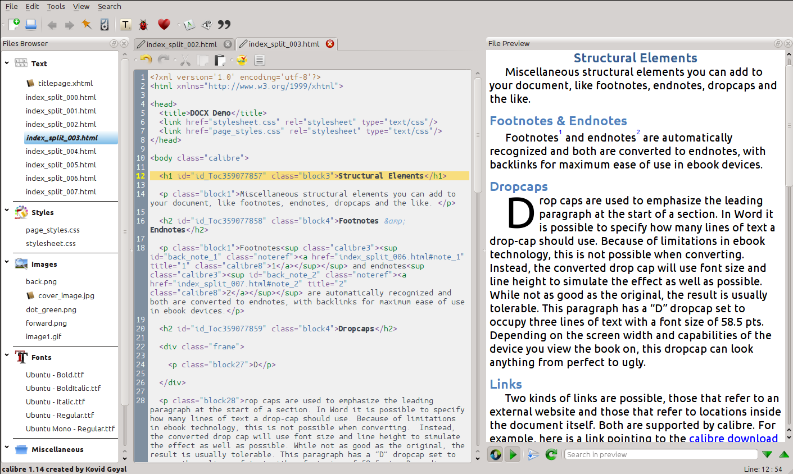
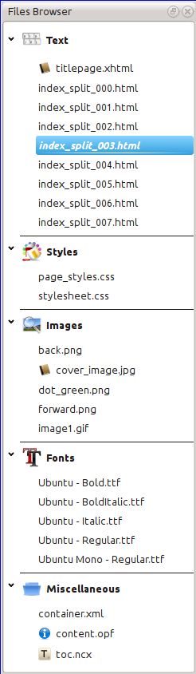
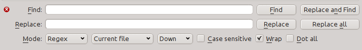
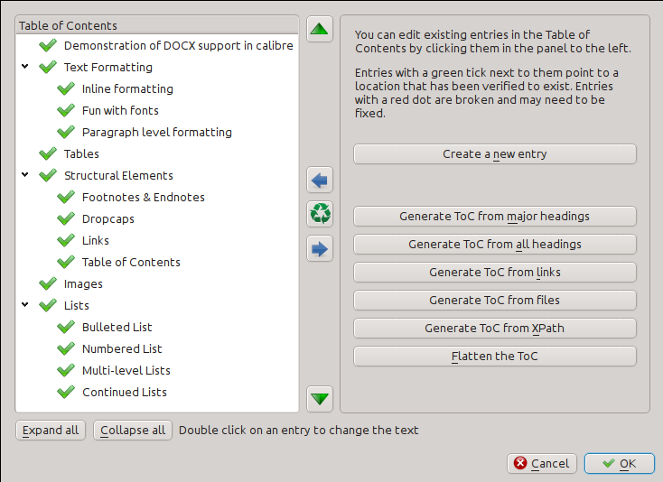
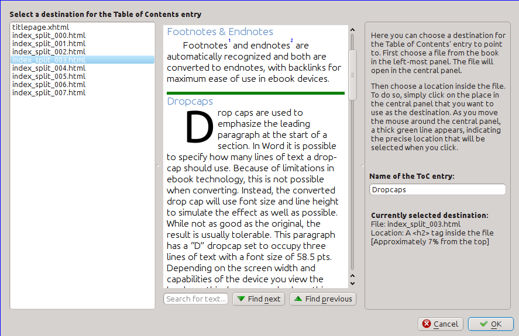
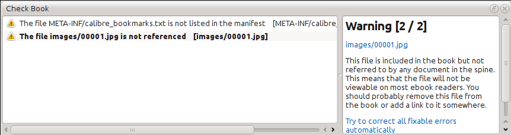
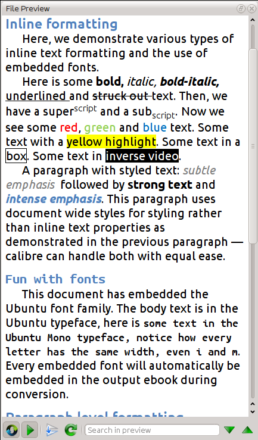
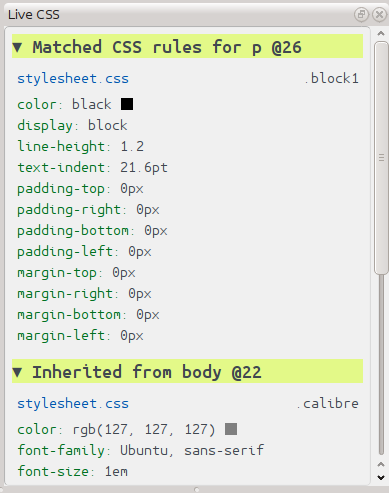
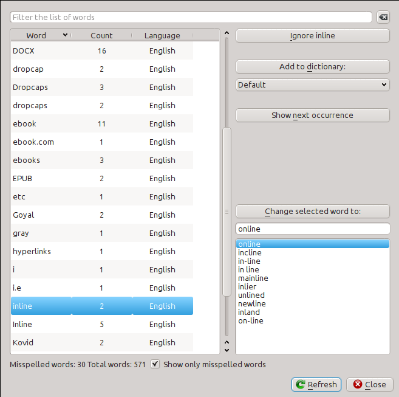
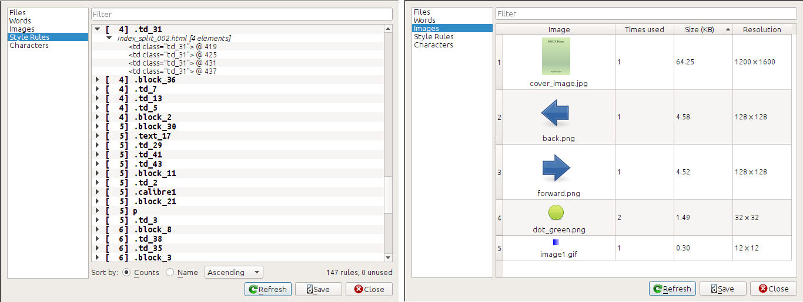

.. _edit:

Editing e-books
========================

calibre has an integrated e-book editor that can be used to edit books in the
EPUB and AZW3 (Kindle) formats. The editor shows you the HTML and CSS that is
used internally inside the book files, with a live preview that updates as you
make changes. It also contains various automated tools to perform common
cleanup and fixing tasks.

You can use this editor by right clicking on any book in calibre and selecting
:guilabel:`Edit book`.



.. contents:: Contents
  :depth: 2
  :local:


Basic workflow
---------------

.. note::
    A video tour of the calibre editor is available `here
    <https://calibre-ebook.com/demo#tutorials>`_.

When you first open a book with the Edit book tool, you will be presented with
a list of files on the left. These are the individual HTML files, stylesheets,
images, etc. that make up the content of the book. Simply double click on a
file to start editing it. Note that if you want to do anything more
sophisticated than making a few small tweaks, you will need to know `HTML
Tutorial <http://html.net/tutorials/html/>`_ and `CSS Tutorial
<http://html.net/tutorials/css/>`_.

As you make changes to the HTML or CSS in the editor, the changes will be
previewed, live, in the preview panel to the right. When you are happy with how
the changes you have made look, click the :guilabel:`Save` button or use
:guilabel:`File->Save` to save your changes into the ebook.

One useful feature is :guilabel:`Checkpoints`. Before you embark on some
ambitious set of edits, you can create a checkpoint. The checkpoint
will preserve the current state of your book, then if in the future you decide
you don't like the changes you have made to you can go back to the state when
you created the checkpoint. To create a checkpoint, use :guilabel:`Edit->Create
checkpoint`. Checkpoints will also be automatically created for you whenever you
run any automated tool like global search and replace. The checkpointing
functionality is in addition to the normal Undo/redo mechanism when editing
individual files. Checkpoints are useful for when changes are spread over
multiple files in the book.

That is the basic work flow for editing books -- Open a file, make changes,
preview and save. The rest of this manual will discuss the various tools and
features present to allow you to perform specific tasks efficiently.

The File browser
------------------



The :guilabel:`File browser` gives you an overview of the various files inside
the book you are editing. The files are arranged by category, with text (HTML)
files at the top, followed by stylesheet (CSS) files, images and so on. Simply
double click on a file to start editing it. Editing is supported for HTML, CSS
and image files. The order of text files is the same order that they would be
displayed in, if you were reading the book. All other files are arranged
alphabetically.

By hovering your mouse over an entry, you can see its size, and also, at
the bottom of the screen, the full path to the file inside the book. Note that
files inside ebooks are compressed, so the size of the final book is not the
sum of the individual file sizes.

Many files have special meaning, in the book. These will typically have
an icon next to their names, indicating the special meaning. For example, in
the picture to the left, you can see that the files :guilabel:`cover_image.jpg`
and :guilabel:`titlepage.xhtml` have the icon of a cover next to them, this
indicates they are the book cover image and titlepage. Similarly, the
:guilabel:`content.opf` file has a metadata icon next to it, indicating the
book metadata is present in it and the :guilabel:`toc.ncx` file has a T
icon next to it, indicating it is the Table of Contents.

You can perform many actions on individual files, by right clicking them.

Renaming files
^^^^^^^^^^^^^^^

You can rename an individual file by right clicking it and selecting
:guilabel:`Rename`. Renaming a file automatically updates all links and
references to it throughout the book. So all you have to do is provide the new
name, calibre will take care of the rest.

You can also bulk rename many files at once. This is useful
if you want the files to have some simple name pattern. For example you might
want to rename all the HTML files to have names Chapter-1.html, Chapter-2.html
and so on. Select the files you want bulk renamed by holding down the Shift or
Ctrl key and clicking the files. Then right click and select :guilabel:`Bulk
rename`. Enter a prefix and what number you would like the automatic numbering
to start at, click OK and you are done.

Finally, you can bulk change the file extension for all selected files. Select
multiple files, as above, and right click and choose :guilabel:`Change the file
extension for the selected files`.

Merging files
^^^^^^^^^^^^^^

Sometimes, you may want to merge two HTML files or two CSS files together. It
can sometimes be useful to have everything in a single file. Be wary, though,
putting a lot of content into a single file will cause performance problems
when viewing the book in a typical ebook reader.

To merge multiple files together, select them by holding the Ctrl key and
clicking on them (make sure you only select files of one type, either all HTML
files or all CSS files and so on). Then right click and select merge. That's
all, calibre will merge the files, automatically taking care of migrating all
links and references to the merged files. Note that merging files can sometimes
cause text styling to change, since the individual files could have used
different stylesheets.

Changing text file order
^^^^^^^^^^^^^^^^^^^^^^^^^^

You can re-arrange the order in which text (HTML) files are opened when reading
the book by simply dragging and dropping them in the Files browser. For the
technically inclined, this is called re-ordering the book spine. Note that you
have to drop the items *between* other items, not on top of them, this can be a
little fiddly until you get used to it.

Marking the cover
^^^^^^^^^^^^^^^^^^^^^^^^^^^

E-books typically have a cover image. This image is indicated in the
:guilabel:`File browser` by the icon of a brown book next to the image name. If
you want to designate some other image as the cover, you can do so by right
clicking on the file and choosing :guilabel:`Mark as cover`.

In addition, EPUB files has the concept of a *titlepage*. A title page is a
HTML file that acts as the title page/cover for the book. You can mark an HTML
file as the titlepage when editing EPUBs by right-clicking. Be careful that the
file you mark contains only the cover information. If it contains other
content, such as the first chapter, then that content will be lost if the user
ever converts the EPUB file in calibre to another format. This is because when
converting, calibre assumes that the marked title page contains only the cover
and no other content.

Deleting files
^^^^^^^^^^^^^^^^

You can delete files by either right clicking on them or by selecting them and
pressing the Delete key. Deleting a file removes all references to the file
from the OPF file, saving you that chore. However, references in other places
are not removed, you can use the Check Book tool to easily find and
remove/replace them.

Exporting files
^^^^^^^^^^^^^^^^^^^^^^^^

You can export a file from inside the book to somewhere else on your computer.
This is useful if you want to work on the file in isolation, with specialised
tools. To do this, simply right click on the file and choose
:guilabel:`Export`.

Once you are done working on the exported file, you can re-import it into the
book, by right clicking on the file again and choosing :guilabel:`Replace with
file...` which will allow you to replace the file in the book with
the previously exported file.

Adding new images/fonts/etc. or creating new blank files
^^^^^^^^^^^^^^^^^^^^^^^^^^^^^^^^^^^^^^^^^^^^^^^^^^^^^^^^^

You can add a new image, font, stylesheet, etc. from your computer into the
book by clicking :guilabel:`File->New file`. This lets you either import a file
by clicking the :guilabel:`Import resource file` button or create a new blank html file
or stylesheet by simply entering the file name into the box for the new file.

You can also import multiple files into the book at once using File->Import
files into book.

Replacing files
^^^^^^^^^^^^^^^^

You can easily replace existing files in the book, by right clicking on the
file and choosing replace. This will automatically update all links and
references, in case the replacement file has a different name than the file
being replaced.

Linking stylesheets to HTML files efficiently
^^^^^^^^^^^^^^^^^^^^^^^^^^^^^^^^^^^^^^^^^^^^^^^^^

As a convenience, you can select multiple HTML files in the File browser,
right click and choose Link stylesheets to have calibre automatically insert the
<link> tags for those stylesheets into all the selected HTML files.

.. raw:: html epub

    <div style="clear:both"></div>


Search & Replace
-------------------

Edit book has a very powerful search and replace interface that allows you to
search and replace text in the current file, across all files and even in a
marked region of the current file. You can search using a normal search or
using regular expressions. To learn how to use regular expressions for advanced
searching, see :ref:`regexptutorial`.



Start the search and replace via the :guilabel:`Search->Find/replace` menu
entry (you must be editing an HTML or CSS file).

Type the text you want to find into the Find box and its replacement into the
Replace box. You can the click the appropriate buttons to Find the next match,
replace the current match and replace all matches.

Using the drop downs at the bottom of the box, you can have the search operate
over the current file, all text files, all style files or all files. You can
also choose the search mode to be a normal (string) search or a regular
expression search.

You can count all the matches for a search expression via
:guilabel:`Search->Count all`. The count will run over whatever files/regions
you have selected in the dropdown box.

You can also go to a specific line in the currently open editor via
:guilabel:`Search->Go to line`.

.. note::
    Remember, to harness the full power of search and replace, you will
    need to use regular expressions. See :ref:`regexptutorial`.

Saved searches
^^^^^^^^^^^^^^^

You can save frequently used search/replace expressions and reuse them multiple times.
To save a search simply right click in the Find box and select :guilabel:`Save current search`.

You can bring up the dialog of saved searches via :guilabel:`Search->Saved
Searches`. This will present you with a list of search and replace expressions
that you can apply. You can even select multiple entries in the list by holding
down the Ctrl Key while clicking so as to run multiple search and replace
expressions in a single operation.

Function mode
^^^^^^^^^^^^^^^^^^^^^

Function mode allows you to write arbitrarily powerful python functions that
are run on every Find/replace. You can do pretty much any text manipulation you
like in function mode. For more information, see :doc:`function_mode`.

Search ignoring HTML tags
^^^^^^^^^^^^^^^^^^^^^^^^^^^

There is also a dedicated tool for searching for text, ignoring any HTML tags
in between. For example, if the book has the HTML ``Empahisis on a
<i>word</i>.`` you can search for ``on a word`` and it will be found even
though there is an ``<i>`` tag in the middle. Use this
tool via the :guilabel:`Search->Search ignoring HTML markup` menu item.

Automated tools
-------------------

Edit book has various tools to help with common tasks. These are
accessed via the :guilabel:`Tools` menu.

Editing the Table of Contents
^^^^^^^^^^^^^^^^^^^^^^^^^^^^^

There is a dedicated tool to ease editing of the Table of Contents. Launch it
with :guilabel:`Tools->Table of Contents->Edit Table of Contents`.



The Edit Table of Contents tool shows you the current Table of Contents (if
any) on the left. Simply double click on any entry to change its text. You can
also re-arrange entries by drag and drop or by using the buttons to the right.

For books that do not have a pre-existing Table of Contents, the tool gives you
various options to auto-generate a Table of Contents from the text. You can
generate from the headings in the document, from links, from individual files
and so on.

You can edit individual entries by clicking on them and then clicking the
:guilabel:`Change the location this entry points to` button. This will open up
a mini-preview of the book, simply move the mouse cursor over the book view
panel, and click where you want the entry to point to. A thick green line
will show you the location. Click OK once you are happy with the location.



Checking the Book
^^^^^^^^^^^^^^^^^^^^^

The :guilabel:`Check Book` tool searches your book for problems that could
prevent it working as intended on actual reader devices. Activate it via
:guilabel:`Tools->Check Book`.



Any problems found are
reported in a nice, easy to use list. Clicking any entry in the list shows you
some help about that error as well as giving you the option to auto-fix that
error, if the error can be fixed automatically. You can also double click the
error to open the location of the error in an editor, so you can fix it
yourself.

Some of the checks performed are:

    * Malformed HTML markup. Any HTML markup that does not parse as well-formed
      XML is reported. Correcting it will ensure that your markup works as
      intended in all contexts. calibre can also auto-fix these errors, but
      auto-fixing can sometimes have unexpected effects, so use with care. As
      always, a checkpoint is created before auto-fixing so you can easily
      revert all changes. Auto-fixing works by parsing the markup using the
      HTML5 algorithm, which is highly fault tolerant and then converting to
      well formed XML.

    * Malformed or unknown CSS styles. Any CSS that is not valid or that has
      properties not defined in the CSS 2.1 standard (plus a few from CSS 3)
      are reported. CSS is checked in all stylesheets, inline style attributes
      and <style> tags in HTML files.

    * Broken links. Links that point to files inside the book that are missing
      are reported.

    * Unreferenced files. Files in the book that are not referenced by any
      other file or are not in the spine are reported.

    * Various common problems in OPF files such as duplicate spine or manifest
      items, broken idrefs or meta cover tags, missing required sections and
      so on.

    * Various compatibility checks for known problems that can cause the book
      to malfunction on reader devices.

Adding a cover
^^^^^^^^^^^^^^^

You can easily add a cover to the book via :guilabel:`Tools->Add cover`. This
allows you to either choose an existing image in the book as the cover or
import a new image into the book and make it the cover. When editing EPUB
files, the HTML wrapper for the cover is automatically generated. If an
existing cover in the book is found, it is replaced. The tool also
automatically takes care of correctly marking the cover files as covers in the
OPF.

Embedding referenced fonts
^^^^^^^^^^^^^^^^^^^^^^^^^^^^

Accessed via :guilabel:`Tools->Embed reference fonts`, this tool finds all
fonts referenced in the book and if they are not already embedded, searches
your computer for them and embeds them into the book, if found. Please make
sure that you have the necessary copyrights for embedding commercially licensed
fonts, before doing this.

Subsetting embedded fonts
^^^^^^^^^^^^^^^^^^^^^^^^^^^

Accessed via :guilabel:`Tools->Subset embedded fonts`, this tool reduces all
the fonts in the book to only contain glyphs for the text actually present in
the book. This commonly reduces the size of the font files by ~ 50%. However,
be aware that once the fonts are subset, if you add new text whose characters
are not previously present in the subset font, the font will not work for the
new text. So do this only as the last step in your workflow.

Smartening punctuation
^^^^^^^^^^^^^^^^^^^^^^^^^

Convert plain text dashes, ellipsis, quotes, multiple hyphens, etc. into their
typographically correct equivalents.
Note that the algorithm can sometimes generate incorrect results, especially
when single quotes at the start of contractions are involved. Accessed via
:guilabel:`Tools->Smarten punctuation`.

Transforming CSS properties
^^^^^^^^^^^^^^^^^^^^^^^^^^^^^^

Create rules to transform the styling of the book. For example, create a rule
to convert all red text to green or to double the font size of all text in the
book or make text of a certain font family italic, etc.

Creating the rules is simple, the rules follow a natural language format, that
looks like:

 * If the property *color* is *red* *change* it to *green*
 * If the property *font-size* is *any value* *multiply* the value by *2*

Accessed via :guilabel:`Tools->Transform styles`.

Removing unused CSS rules
^^^^^^^^^^^^^^^^^^^^^^^^^^^^

Remove all unused CSS rules from stylesheets and <style> tags. Some books
created from production templates can have a large number of extra CSS rules
that don't match any actual content. These extra rules can slow down readers
that need to process them all. Accessed via :guilabel:`Tools->Remove unused CSS`.


Fixing HTML
^^^^^^^^^^^

This tool simply converts HTML that cannot be parsed as XML into well-formed
XML. It is very common in ebooks to have non-well-formed XML, so this tool
simply automates the process of fixing such HTML. The tool works by parsing the
HTML using the HTML5 algorithm (the algorithm used in all modern browsers) and
then converting the result into XML. Be aware that auto-fixing can sometimes
have counter-intuitive results. If you prefer, you can use the Check Book tool
discussed above to find and manually correct problems in the HTML. Accessed via
:guilabel:`Tools->Fix HTML`.

Beautifying files
^^^^^^^^^^^^^^^^^^^

This tool is used to auto-format all HTML and CSS files so that they "look
pretty". The code is auto-indented so that it lines up nicely, blank lines are
inserted where appropriate and so on. Note that beautifying also auto-fixes
broken HTML/CSS. Therefore, if you don't want any auto-fixing to be performed,
first use the Check Book tool to correct all problems and only then run
beautify.  Accessed via :guilabel:`Tools->Beautify all files`.

.. note::
    In HTML any text can have significant whitespace, via the CSS white-space
    directive. Therefore, beautification could potentially change the rendering
    of the HTML. To avoid this as far as possible, the beautify algorithm
    only beautifies block level tags that contain other block level tags. So,
    for example, text inside a <p> tag will not have its whitespace changed.
    But a <body> tag that contains only other <p> and <div> tags will be
    beautified.  This can sometimes mean that a particular file will not be
    affected by beautify as it has no suitable block level tags. In such
    cases you can try different beautification tools, that are less careful,
    for example: `HTML Tidy <https://infohound.net/tidy/>`_.


Inserting an inline Table of Contents
^^^^^^^^^^^^^^^^^^^^^^^^^^^^^^^^^^^^^^

Normally in ebooks, the Table of Contents is separate from the main text and is
typically accessed via a special Table of Contents button/menu in the ebook
reading device. You can also have calibre automatically generate an *inline*
Table of Contents that becomes part of the text of the book. It is
generated based on the currently defined Table of Contents.

If you use this tool multiple times, each invocation will cause the previously
created inline Table of Contents to be replaced. The tool can be accessed via
:guilabel:`Tools->Table of Contents->Insert inline Table of Contents`.

Setting Semantics
^^^^^^^^^^^^^^^^^

This tool is used to set *semantics* in EPUB files. Semantics are simply,
links in the OPF file that identify certain locations in the book as having
special meaning. You can use them to identify the foreword, dedication, cover,
table of contents, etc. Simply choose the type of semantic information you want
to specify and then select the location in the book the link should point to.
This tool can be accessed via :guilabel:`Tools->Set semantics`.

Filtering style information
^^^^^^^^^^^^^^^^^^^^^^^^^^^

This tool can be used to easily remove specified CSS style properties from the
entire book. You can tell it what properties you want removed, for example,
``color, background-color, line-height`` and it will remove them from
everywhere they occur --- stylesheets, ``<style>`` tags and inline ``style``
attributes. After removing the style information, a summary of all the changes
made is displayed so you can see exactly what was changed. The tool can be
accessed via :guilabel:`Tools->Filter style information`.

.. _checkpoints:

Checkpoints
------------------------

:guilabel:`Checkpoints` are a way to mark the current state of the book as "special". You
can then go on to do whatever changes you want to the book and if you don't like
the results, return to the checkpointed state. Checkpoints are automatically
created every time you run any of the automated tools described in the
previous section.

You can create a checkpoint via :guilabel:`Edit->Create checkpoint`. And go back
to a previous checkpoint with :guilabel:`Edit->Revert to ...`

The check pointing functionality is in addition to the normal Undo/redo
mechanism when editing individual files. Checkpoints are particularly useful
for when changes are spread over multiple files in the book or when you wish to
be able to revert a large group of related changes as a whole.

You can see a list of available checkpoints via :guilabel:`View->Checkpoints`.
You can compare the current state of the book to a specified checkpoint
using the :ref:`diff` tool -- by selecting the checkpoint of interest and clicking
the :guilabel:`Compare` button. The :guilabel:`Revert to` button restores the
book to the selected checkpoint, undoing all changes since that checkpoint was
created.

The Live preview panel
------------------------



The :guilabel:`File preview` gives you an overview of the various files inside
The live preview panel shows you the changes you are making live (with a second
or two of delay). As you edit HTML or CSS files, the preview panel is updated
automatically to reflect your changes. As you move the cursor around in the
editor, the preview panel will track its location, showing you the
corresponding location in the book. Clicking in the preview panel, will cause
the cursor in the editor to be positioned over the element you clicked. If you
click a link pointing to another file in the book, that file will be opened in
the edit and the preview panel, automatically.

You can turn off the automatic syncing of position and live preview of changes
-- by buttons under the preview panel. The live update of the preview
panel only happens when you are not actively typing in the editor, so as not to
be distracting or slow you down, waiting for the preview to render.

The preview panel shows you how the text will look when viewed. However, the
preview panel is not a substitute for actually testing your book an actual
reader device. It is both more, and less capable than an actual reader. It will
tolerate errors and sloppy markup much better than most reader devices. It will
also not show you page margins, page breaks and embedded fonts that use font
name aliasing. Use the preview panel while you are working on the book, but
once you are done, review it in an actual reader device or software emulator.

.. note::
    The preview panel does not support embedded fonts if the name of the font
    inside the font file does not match the name in the CSS @font-face rule.
    You can use the Check Book tool to quickly find and fix any such
    problem fonts.

Splitting HTML files
^^^^^^^^^^^^^^^^^^^^^^


One, perhaps non-obvious, use of the preview panel is to split long HTML files.
While viewing the file you want to split, click the :guilabel:`split mode`
button under the preview panel |spmb|. Then simply move your mouse to the place
where you want to split the file and click. A thick green line will show you
exactly where the split will happen as you move your mouse. Once you have found
the location you want, simply click and the split will be performed.

Splitting the file will automatically update all links and references that
pointed into the bottom half of the file and will open the newly split file in
an editor.

You can also split a single HTML file at multiple locations automatically, by
right clicking inside the file in the editor and choosing :guilabel:`Split at
multiple locations`. This will allow you to easily split a large file at all
heading tags or all tags having a certain class and so on.

.. raw:: html epub

    <div style="clear:both"></div>

The Live CSS panel
---------------------




The :guilabel:`Live CSS` panel shows you all the style rules that apply to the
tag you are currently editing. The name of tag, along with its line number in
the editor are displayed, followed by a list of matching style rules.

It is a great way to quickly see which style rules apply to any tag. The view
also has clickable links (in blue), which take you directly to the location
where the style was defined, in case you wish to make any changes to the style
rules. Style rules that apply directly to the tag, as well as rules that are
inherited from parent tags are shown.

The panel also shows you what the finally calculated styles for the tag are.
Properties in the list that are superseded by higher priority rules are shown
with a line through them.

You can enable the Live CSS panel via :guilabel:`View->Live CSS`.

.. raw:: html epub

    <div style="clear:both"></div>

Miscellaneous tools
----------------------

There are a few more tools that can be useful while you edit the book.

The Table of Contents view
^^^^^^^^^^^^^^^^^^^^^^^^^^^^

The Table of Contents view shows you the current table of contents in the book.
Double clicking on any entry opens the place that entry points to in an editor.
You can right click to edit the Table of Contents, refresh the view or
expand/collapse all items. Access this view via :guilabel:`View->Table of
Contents`.

Checking the spelling of words in the book
^^^^^^^^^^^^^^^^^^^^^^^^^^^^^^^^^^^^^^^^^^^^

You can run a spelling checker via :guilabel:`Tools->Check spelling`.



Words are shown with the number of times they occur in the book and the
language the word belongs to. Language information is taken from the books
metadata and from ``lang`` attributes in the HTML files. This allows the spell
checker to work well even with books that contain text in multiple languages.
For example, in the following HTML extract, the word color will be checked
using American English and the word colour using British English::

    <div lang="en_US">color <span lang="en_GB">colour</span></div>

.. note::
    You can double click a word to highlight the next occurrence of that word
    in the editor. This is useful if you wish to manually edit the word, or see
    what context it is in.

To change a word, simply double click one of the suggested alternative
spellings on the right, or type in your own corrected spelling and click the
:guilabel:`Change selected word to` button. This will replace all occurrences
of the word in the book. You can also right click on a word in the main word
list to change the word conveniently from the right click menu.

You can have the spelling checker ignore a word for the current session by
clicking the :guilabel:`Ignore` button. You can also add a word to the user
dictionary by clicking the :guilabel:`Add to dictionary` button. The spelling
checker supports multiple user dictionaries, so you can select the dictionary
you want the word added to.

You can also have the spelling checker display all the words in your book, not
just the incorrectly spelled ones. This is useful to see what words are most
common in your book and to run a simple search and replace on individual words.

.. note::
    If you make any changes to the book by editing files while the spell check
    tool is open, you should click the :guilabel:`Refresh` button in the spell
    check tool. If you do not do this and continue to use the spell check tool,
    you could lose the changes you have made in the editor.

Adding new dictionaries
###########################

The spelling checker comes with builtin dictionaries for the English and
Spanish languages. You can install your own dictionaries via
:guilabel:`Preferences->Editor->Manage spelling dictionaries`. The spell
checker can use dictionaries from the LibreOffice program (in the .oxt
format). You can download these dictionaries from
`The LibreOffice Extensions repository <https://extensions.libreoffice.org/extension-center?getCategories=Dictionary&getCompatibility=any&sort_on=positive_ratings>`_.


Inserting special characters
^^^^^^^^^^^^^^^^^^^^^^^^^^^^^^^^

You can insert characters that are difficult to type by using the
:guilabel:`Edit->Insert special character` tool. This shows you all unicode
characters, simply click on the character you want to type. If you hold Ctrl
while clicking, the window will close itself after inserting the selected
character. This tool can be used to insert special characters into the main
text or into any other area of the user interface, such as the Search and
replace tool.

Because there are a lot of characters, you can define your own :guilabel:`Favorite`
characters, that will be shown first. Simply right click on a character to mark
it as favorite. You can also right click on a character in favorites to remove
it from favorites. Finally, you can re-arrange the order of characters in
favorites by clicking the :guilabel:`Re-arrange favorites` button and then drag
and dropping the characters in favorites around.

You can also directly type in special characters using the keyboard. To do
this, you type the unicode code for the character (in hexadecimal) and then
press the :guilabel:`Alt+X` key which will convert the previously typed code
into the corresponding character. For example, to type ÿ you would type ff and
then Alt+X. To type a non-breaking space you would use a0 and then
:guilabel:`Alt+X`, to type the horizontal ellipsis you would use 2026 and
:guilabel:`Alt+X` and so on.

Finally, you can type in special characters by using HTML named entities. For
example, typing &nbsp; will be replaced by a non breaking space when you type the
semi-colon. The replacement happens only when typing the semi-colon.

The code inspector view
^^^^^^^^^^^^^^^^^^^^^^^^^^

This view shows you the HTML coding and CSS that applies to the current element
of interest. You open it by right clicking a location in the preview panel and
choosing :guilabel:`Inspect`. It allows you to see the HTML coding for that
element and more importantly, the CSS styles that apply to it. You can even
dynamically edit the styles and see what effect your changes have instantly.
Note that editing the styles does not actually make changes to the book
contents, it only allows for quick experimentation. The ability to live edit
inside the Inspector is under development.

Checking external links
^^^^^^^^^^^^^^^^^^^^^^^^^^^

You can use this tool to check all links in your book that point to external
websites. The tool will try to visit every externally linked website, and
if the visit fails, it will report all broken links in a convenient format for 
you to fix.


Downloading external resources
^^^^^^^^^^^^^^^^^^^^^^^^^^^^^^^^^

You can use this tool to automatically download any images/stylesheets/etc. in
the book that are not bundled with the book (i.e. they have URLs pointing to a
location on the internet). The tool will find all such resources and
automatically download them, add them to the book and replace all references to
them to use the downloaded files.


Arranging files into folders by type
^^^^^^^^^^^^^^^^^^^^^^^^^^^^^^^^^^^^^

Often when editing EPUB files that you get from somewhere, you will find that
the files inside the EPUB are arranged haphazardly, in different sub-folders.
This tool allows you to automatically move all files into sub-folders based on
their types. Access it via :guilabel:`Tools->Arrange into folders`. Note that
this tool only changes how the files are arranged inside the EPUB, it does not
change how they are displayed in the File browser.

Importing files in other e-book formats as EPUB
^^^^^^^^^^^^^^^^^^^^^^^^^^^^^^^^^^^^^^^^^^^^^^^^

The editor includes the ability to import files in some other e-book formats
directly as a new EPUB, without going through a full conversion. This is
particularly useful to directly create EPUB files from your own hand-edited
HTML files. You can do this via :guilabel:`File->Import an HTML or DOCX file as
a new book`.

.. toctree::
    :hidden:

    function_mode
    snippets

The Reports tool
^^^^^^^^^^^^^^^^^^^^^

The editor includes a nice *Reports* tool (via :guilabel:`Tools->Reports`) that
shows summaries of the files, images, links, words, characters and styles used
in the book. Every line in the report is hot-linked. Double clicking a line
jumps to the place in the book where that item is used or defined (as
appropriate). For example, in the :guilabel:`Links` view, you can double click
entries the :guilabel:`Source` column to jump to where the link is defined and
entries in the :guilabel:`Target` column to jump to where the link points.




Special features in the code editor
---------------------------------------

The calibre HTML editor is very powerful. It has many features that make
editing of HTML (and CSS) easier.

Syntax highlighting
^^^^^^^^^^^^^^^^^^^^^

The HTML editor has very sophisticated syntax highlighting. Features include:

    * The text inside bold, italic and heading tags is made bold/italic
    * As you move your cursor through the HTML, the matching HTML tags are
      highlighted, and you can jump to the opening or closing tag with the
      keyboard shortcuts :kbd:`Ctrl+{` and :kbd:`Ctrl+}`
    * Invalid HTML is highlighted with a red underline
    * Spelling errors in the text inside HTML tags and attributes such as title
      are highlighted. The spell checking is language aware, based on the value
      of the lang attribute of the current tag and the overall book language.
    * CSS embedded inside ``<style>`` tags is highlighted
    * Special characters that can be hard to distinguish such as non-breaking
      spaces, different types of hyphens, etc. are highlighted.
    * Links to other files in ``<a>`` tags, ```` and ``<link>`` tags all
      have the filenames highlighted. If the filename they point to does not
      exist, the filename is marked with a red underline.

Context sensitive help
^^^^^^^^^^^^^^^^^^^^^^^^

You can right click on an HTML tag name or a CSS property name to get help for that tag or property.

You can also hold down the Ctrl key and click on any filename inside a link tag
to open that file in the editor automatically.

.. _editor_auto_complete:

Auto-complete
^^^^^^^^^^^^^^^^

When editing an ebook, one of the most tedious tasks is creating links to other
files inside the book, or to CSS stylesheets, or images. You have to figure out
the correct filename and relative path to the file. The editor has
auto-complete to make that easier.

As you type a filename, the editor automatically pops up suggestions. Simply
use the Tab key to select the correct file name. The editor even offers
suggestions for links pointing to an anchor inside another HTML file. After you
type the ``#`` character, the editor will show you a list of all anchors in the
target file, with a small snippet of text to help you choose the right anchor.

Note that unlike most other completion systems, the editor's completion system
uses subsequence matching. This means that you can type just two or three
letters from anywhere in the filename to complete the filename. For example,
say you want the filename ``../images/arrow1.png``, you can simply type ``ia1``
and press Tab to complete the filename. When searching for matches, the
completion system prioritizes letters that are at the start of a word, or
immediately after a path separator. Once you get used to this system, you will
find it saves you a lot of time and effort.

Snippets
^^^^^^^^^^^^^^^

The calibre editor supports *snippets*. A snippet is a
piece of text that is either re-used often or contains a lot of redundant
text. The editor allows you to insert a snippet with only a few key strokes.
The snippets are very powerful, with many features, such as placeholders you
can jump between, automatic mirroring of repeated text and so on.
For more information, see :doc:`snippets`.
