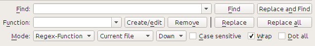

Function Mode for Search & Replace in the Editor
================================================

The Search & Replace tool in the editor support a *function mode*. In this
mode, you can combine regular expressions (see :doc:`regexp`) with
arbitrarily powerful python functions to do all sorts of advanced text
processing.

In the standard *regexp* mode for search and replace, you specify both a
regular expression to search for as well as a template that is used to replace
all found matches. In function mode, instead of using a fixed template, you
specify an arbitrary function, in the
`python programming language <https://docs.python.org/2.7/>`_. This allows
you to do lots of things that are not possible with simple templates.

Techniques for using function mode and the syntax will be described by means of
examples, showing you how to create functions to perform progressively more
complex tasks.

Automatically fixing the case of headings in the document
---------------------------------------------------------

Here, we will leverage one of the builtin functions in the editor to
automatically change the case of all text inside heading tags to title case::

    Find expression: <([Hh][1-6])[^>]*>.+?</\1>

For the function, simply choose the :guilabel:`Title-case text (ignore tags)` builtin
function. The will change titles that look like: ``<h1>some TITLE</h1>`` to
``<h1>Some Title</h1>``. It will work even if there are other HTML tags inside
the heading tags.

Your first custom function - smartening hyphens
-----------------------------------------------

The real power of function mode comes from being able to create your own
functions to process text in arbitrary ways. The Smarten Punctuation tool in
the editor leaves individual hyphens alone, so you can use the this function to
replace them with em-dashes.

To create a new function, simply click the Create/Edit button to create a new
function and copy the python code from below.

.. code-block:: python

    def replace(match, number, file_name, metadata, dictionaries, data, functions, *args, **kwargs):
        return match.group().replace('--', '—').replace('-', '—')

Every Search & Replace custom function must have a unique name and consist of a
python function named replace, that accepts all the arguments shown above.
For the moment, we wont worry about all the different arguments to
``replace()`` function. Just focus on the ``match`` argument. It represents a
match when running a search and replace. Its full documentation in available
`here <https://docs.python.org/2.7/library/re.html#match-objects>`_.
``match.group()`` simply returns all the matched text and all we do is replace
hyphens in that text with em-dashes, first replacing double hyphens and
then single hyphens.

Use this function with the find regular expression::

    >[^<>]+<

And it will replace all hyphens with em-dashes, but only in actual text and not
inside HTML tag definitions.

The power of function mode - using a spelling dictionary to fix mis-hyphenated words
------------------------------------------------------------------------------------

Often, ebooks created from scans of printed books contain mis-hyphenated words
-- words that were split at the end of the line on the printed page. We will
write a simple function to automatically find and fix such words.

.. code-block:: python

    import regex
    from calibre import replace_entities
    from calibre import prepare_string_for_xml

    def replace(match, number, file_name, metadata, dictionaries, data, functions, *args, **kwargs):

        def replace_word(wmatch):
            # Try to remove the hyphen and replace the words if the resulting
            # hyphen free word is recognized by the dictionary
            without_hyphen = wmatch.group(1) + wmatch.group(2)
            if dictionaries.recognized(without_hyphen):
                return without_hyphen
            return wmatch.group()

        # Search for words split by a hyphen
        text = replace_entities(match.group()[1:-1])  # Handle HTML entities like &amp;
        corrected = regex.sub(r'(\w+)\s*-\s*(\w+)', replace_word, text, flags=regex.VERSION1 | regex.UNICODE)
        return '>%s<' % prepare_string_for_xml(corrected)  # Put back required entities

Use this function with the same find expression as before, namely::

    >[^<>]+<

And it will magically fix all mis-hyphenated words in the text of the book. The
main trick is to use one of the useful extra arguments to the replace function,
``dictionaries``.  This refers to the dictionaries the editor itself uses to
spell check text in the book. What this function does is look for words
separated by a hyphen, remove the hyphen and check if the dictionary recognizes
the composite word, if it does, the original words are replaced by the hyphen
free composite word.

Note that one limitation of this technique is it will only work for
mono-lingual books, because, by default, ``dictionaries.recognized()`` uses the
main language of the book.

Auto numbering sections
-----------------------

Now we will see something a little different. Suppose your HTML file has many
sections, each with a heading in an :code:`<h2>` tag that looks like
:code:`<h2>Some text</h2>`. You can create a custom function that will
automatically number these headings with consecutive section numbers, so that
they look like :code:`<h2>1. Some text</h2>`.

.. code-block:: python

    def replace(match, number, file_name, metadata, dictionaries, data, functions, *args, **kwargs):
        section_number = '%d. ' % number
        return match.group(1) + section_number + match.group(2)

    # Ensure that when running over multiple files, the files are processed
    # in the order in which they appear in the book
    replace.file_order = 'spine'

Use it with the find expression::

    (?s)(<h2[^<>]*>)(.+?</h2>)

Place the cursor at the top of the file and click :guilabel:`Replace all`.

This function uses another of the useful extra arguments to ``replace()``: the
``number`` argument. When doing a :guilabel:`Replace All` number is
automatically incremented for every successive match.

Another new feature is the use of ``replace.file_order`` -- setting that to
``'spine'`` means that if this search is run on multiple HTML files, the files
are processed in the order in which they appear in the book. See
:ref:`file_order_replace_all` for details.

Auto create a Table of Contents
-------------------------------

Finally, lets try something a little more ambitious. Suppose your book has
headings in ``h1`` and ``h2`` tags that look like
``<h1 id="someid">Some Text</h1>``. We will auto-generate an HTML Table of
Contents based on these headings. Create the custom function below:

.. code-block:: python

    from calibre import replace_entities
    from calibre.ebooks.oeb.polish.toc import TOC, toc_to_html
    from calibre.gui2.tweak_book import current_container
    from calibre.ebooks.oeb.base import xml2str

    def replace(match, number, file_name, metadata, dictionaries, data, functions, *args, **kwargs):
        if match is None:
            # All matches found, output the resulting Table of Contents.
            # The argument metadata is the metadata of the book being edited
            if 'toc' in data:
                toc = data['toc']
                root = TOC()
                for (file_name, tag_name, anchor, text) in toc:
                    parent = root.children[-1] if tag_name == 'h2' and root.children else root
                    parent.add(text, file_name, anchor)
                toc = toc_to_html(root, current_container(), 'toc.html', 'Table of Contents for ' + metadata.title, metadata.language)
                print (xml2str(toc))
            else:
                print ('No headings to build ToC from found')
        else:
            # Add an entry corresponding to this match to the Table of Contents
            if 'toc' not in data:
                # The entries are stored in the data object, which will persist
                # for all invocations of this function during a 'Replace All' operation
                data['toc'] = []
            tag_name, anchor, text = match.group(1), replace_entities(match.group(2)), replace_entities(match.group(3))
            data['toc'].append((file_name, tag_name, anchor, text))
            return match.group()  # We don't want to make any actual changes, so return the original matched text

    # Ensure that we are called once after the last match is found so we can
    # output the ToC
    replace.call_after_last_match = True
    # Ensure that when running over multiple files, this function is called,
    # the files are processed in the order in which they appear in the book
    replace.file_order = 'spine'

And use it with the find expression::

    <(h[12]) [^<>]* id=['"]([^'"]+)['"][^<>]*>([^<>]+)

Run the search on :guilabel:`All text files` and at the end of the search, a
window will popup with "Debug Output from your function" which will have the
HTML Table of Contents, ready to be pasted into :file:`toc.html`.

The function above is heavily commented, so it should be easy to follow. The
key new feature is the use of another useful extra argument to the
``replace()`` function, the ``data`` object. The ``data`` object is a python
*dict* that persists between all successive invocations of ``replace()`` during
a single :guilabel:`Replace All` operation.

Another new feature is the use of ``call_after_last_match`` -- setting that to
``True`` on the ``replace()`` function means that the editor will call
``replace()`` one extra time after all matches have been found. For this extra
call, the match object will be ``None``.

This was just a demonstration to show you the power of function mode,
if you really needed to generate a Table of Contents from headings in your book,
you would be better off using the dedicated Table of Contents tool in
:guilabel:`Tools->Table of Contents`.

The API for the function mode
-----------------------------

All function mode functions must be python functions named replace, with the
following signature::

    def replace(match, number, file_name, metadata, dictionaries, data, functions, *args, **kwargs):
        return a_string

When a find/replace is run, for every match that is found, the ``replace()``
function will be called, it must return the replacement string for that match.
If no replacements are to be done, it should return ``match.group()`` which is
the original string. The various arguments to the ``replace()`` function are
documented below.

The ``match`` argument
^^^^^^^^^^^^^^^^^^^^^^

The ``match`` argument represents the currently found match. It is a
`python Match object <https://docs.python.org/2.7/library/re.html#match-objects>`_.
Its most useful method is ``group()`` which can be used to get the matched
text corresponding to individual capture groups in the search regular
expression.

The ``number`` argument
^^^^^^^^^^^^^^^^^^^^^^^

The ``number`` argument is the number of the current match. When you run
:guilabel:`Replace All`, every successive match will cause ``replace()`` to be
called with an increasing number. The first match has number 1.

The ``file_name`` argument
^^^^^^^^^^^^^^^^^^^^^^^^^^

This is the filename of the file in which the current match was found. When
searching inside marked text, the ``file_name`` is empty. The ``file_name`` is
in canonical form, a path relative to the root of the book, using ``/`` as the
path separator.

The ``metadata`` argument
^^^^^^^^^^^^^^^^^^^^^^^^^

This represents the metadata of the current book, such as title, authors,
language, etc. It is an object of class :class:`calibre.ebooks.metadata.book.base.Metadata`.
Useful attributes include, ``title``, ``authors`` (a list of authors) and
``language`` (the language code).

The ``dictionaries`` argument
^^^^^^^^^^^^^^^^^^^^^^^^^^^^^

This represents the collection of dictionaries used for spell checking the
current book. Its most useful method is ``dictionaries.recognized(word)``
which will return ``True`` if the passed in word is recognized by the dictionary
for the current book's language.

The ``data`` argument
^^^^^^^^^^^^^^^^^^^^^

This a simple python ``dict``. When you run
:guilabel:`Replace All`, every successive match will cause ``replace()`` to be
called with the same ``dict`` as data. You can thus use it to store arbitrary
data between invocations of ``replace()`` during a :guilabel:`Replace All`
operation.

The ``functions`` argument
^^^^^^^^^^^^^^^^^^^^^^^^^^

The ``functions`` argument gives you access to all other user defined
functions. This is useful for code re-use. You can define utility functions in
one place and re-use them in all your other functions. For example, suppose you
create a function name ``My Function`` like this:

.. code-block:: python

    def utility():
       # do something

    def replace(match, number, file_name, metadata, dictionaries, data, functions, *args, **kwargs):
        ...

Then, in another function, you can access the ``utility()`` function like this:

.. code-block:: python

    def replace(match, number, file_name, metadata, dictionaries, data, functions, *args, **kwargs):
        utility = functions['My Function']['utility']
        ...

You can also use the functions object to store persistent data, that can be
re-used by other functions. For example, you could have one function that when
run with :guilabel:`Replace All` collects some data and another function that
uses it when it is run afterwards. Consider the following two functions:

.. code-block:: python

    # Function One
    persistent_data = {}

    def replace(match, number, file_name, metadata, dictionaries, data, functions, *args, **kwargs):
        ...
        persistent_data['something'] = 'some data'

    # Function Two
    def replace(match, number, file_name, metadata, dictionaries, data, functions, *args, **kwargs):
        persistent_data = functions['Function One']['persistent_data']
        ...

Debugging your functions
^^^^^^^^^^^^^^^^^^^^^^^^

You can debug the functions you create by using the standard ``print()``
function from python. The output of print will be displayed in a popup window
after the Find/replace has completed. You saw an example of using ``print()``
to output an entire table of contents above.

.. _file_order_replace_all:

Choose file order when running on multiple HTML files
^^^^^^^^^^^^^^^^^^^^^^^^^^^^^^^^^^^^^^^^^^^^^^^^^^^^^

When you run a :guilabel:`Replace All` on multiple HTML files, the order in
which the files are processes depends on what files you have open for editing.
You can force the search to process files in the order in which the appear by
setting the ``file_order`` attribute on your function, like this:

.. code-block:: python

    def replace(match, number, file_name, metadata, dictionaries, data, functions, *args, **kwargs):
        ...

    replace.file_order = 'spine'

``file_order`` accepts two values, ``spine`` and ``spine-reverse`` which cause
the search to process multiple files in the order they appear in the book,
either forwards or backwards, respectively.

Having your function called an extra time after the last match is found
^^^^^^^^^^^^^^^^^^^^^^^^^^^^^^^^^^^^^^^^^^^^^^^^^^^^^^^^^^^^^^^^^^^^^^^

Sometimes, as in the auto generate table of contents example above, it is
useful to have your function called an extra time after the last match is
found. You can do this by setting the ``call_after_last_match`` attribute on your
function, like this:

.. code-block:: python

    def replace(match, number, file_name, metadata, dictionaries, data, functions, *args, **kwargs):
        ...

    replace.call_after_last_match = True

Appending the output from the function to marked text
^^^^^^^^^^^^^^^^^^^^^^^^^^^^^^^^^^^^^^^^^^^^^^^^^^^^^

When running search and replace on marked text, it is sometimes useful to
append so text to the end of the marked text. You can do that by setting
the ``append_final_output_to_marked`` attribute on your function (note that you
also need to set ``call_after_last_match``), like this:

.. code-block:: python

    def replace(match, number, file_name, metadata, dictionaries, data, functions, *args, **kwargs):
        ...
        return 'some text to append'

    replace.call_after_last_match = True
    replace.append_final_output_to_marked = True

Suppressing the result dialog when performing searches on marked text
^^^^^^^^^^^^^^^^^^^^^^^^^^^^^^^^^^^^^^^^^^^^^^^^^^^^^^^^^^^^^^^^^^^^^^^^^

You can also suppress the result dialog (which can slow down the repeated
application of a search/replace on many blocks of text) by setting 
the ``suppress_result_dialog`` attribute on your function, like this:

.. code-block:: python

    def replace(match, number, file_name, metadata, dictionaries, data, functions, *args, **kwargs):
        ...

    replace.suppress_result_dialog = True

More examples
----------------

More useful examples, contributed by calibre users, can be found in the
`calibre Editor forum <https://www.mobileread.com/forums/showthread.php?t=237181>`_.
