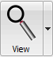
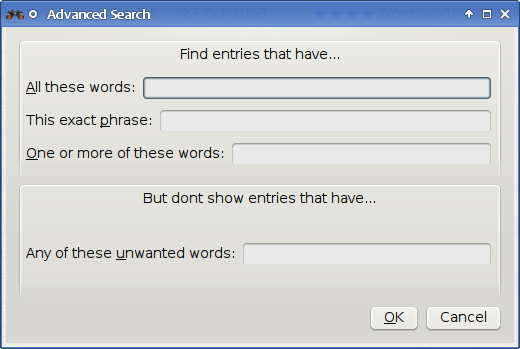

.. _gui:

The Graphical User Interface
===============================================

The Graphical User Interface *(GUI)* provides access to all
library management and e-book format conversion features. The basic workflow
for using calibre is to first add books to the library from your hard disk.
calibre will automatically try to read metadata from the books and add them
to its internal database. Once they are in the database, you can perform various
:ref:`actions` on them that include conversion from one format to another,
transfer to the reading device, viewing on your computer, and editing metadata.
The latter includes modifying the cover, description, and tags among other details.
Note that calibre creates copies of the files you add to it. Your original files are left untouched.

The interface is divided into various sections:

.. contents::
    :depth: 1
    :local:

.. _actions:

Actions
--------

The actions toolbar provides convenient shortcuts to commonly used actions. If you right-click the buttons, you can perform variations on the default action.
Please note that the actions toolbar will look slightly different depending on whether you have an e-book reader attached to your computer.

.. contents::
    :depth: 1
    :local:

.. _add_books:

Add books
~~~~~~~~~~~~~~~~~~

|adbi| The :guilabel:`Add books` action has seven variations accessed by doing a right-click on the button.

    1. **Add books from a single directory**: Opens a file chooser dialog and allows you to specify which books in a directory should be added. This action is *context sensitive*, i.e. it depends on which :ref:`catalog <catalogs>` you have selected. If you have selected the :guilabel:`Library`, books will be added to the library. If you have selected the e-book reader device, the books will be uploaded to the device, and so on.

    2. **Add books from directories, including sub-directories (One book per directory, assumes every e-book file is the same book in a different format)**: Allows you to choose a directory. The directory and all its sub-directories are scanned recursively, and any e-books found are added to the library. calibre assumes that each directory contains a single book. All e-book files in a directory are assumed to be the same book in different formats. This action is the inverse of the :ref:`Save to disk <save_to_disk_multiple>` action, i.e. you can :guilabel:`Save to disk`, delete the books and re-add them with no lost information except for the date (this assumes you have not changed any of the setting for the Save to disk action).

    3. **Add books from directories, including sub-directories (Multiple books per directory, assumes every e-book file is a different book)**: Allows you to choose a directory. The directory and all its sub-directories are scanned recursively and any e-books found are added to the library. calibre assumes that each directory contains many books. All e-book files with the same name in a directory are assumed to be the same book in different formats. E-books with different names are added as different books. 

    4. **Add multiple books from archive (ZIP/RAR)**: Allows you to add multiple e-books that are stored inside the selected ZIP or RAR files. It is a convenient shortcut that avoids having to first unzip the archive and then add the books via one of the above two options.

    5. **Add empty book (Book Entry with no formats)**: Allows you to create a blank book record. This can be used to then manually fill out the information about a book that you may not have yet in your collection.

    6. **Add from ISBN**: Allows you to add one or more books by entering their ISBNs.

    7. **Add files to selected book records**: Allows you to add or update the files associated with an existing book in your library.

The :guilabel:`Add books` action can read metadata from a wide variety of e-book formats. In addition, it tries to guess metadata from the filename.
See the :ref:`config_filename_metadata` section, to learn how to configure this.

To add an additional format for an existing book you can do any of three things:

    1. Drag and drop the file onto the Book details panel on the right side of the main window
           
    2. Right click the :guilabel:`Add books` button and choose :guilabel:`Add files to selected books`.
           
    3. Click the :guilabel:`Add books` button in the top right area of the :guilabel:`Edit Metadata` dialog, accessed by the :ref:`edit_meta_information` action.

.. _edit_meta_information:

Edit metadata
~~~~~~~~~~~~~~~~~~~~~~~~~~~~~~~

|emii| The :guilabel:`Edit metadata` action has four variations which can be accessed by doing a right-click on the button.

    1. **Edit metadata individually**: Allows you to edit the metadata of books one-by-one with the option of fetching metadata, including covers, from the Internet. It also allows you to add or remove particular e-book formats from a book.
    2. **Edit metadata in bulk**: Allows you to edit common metadata fields for large numbers of books simultaneously. It operates on all the books you have selected in the :ref:`Library view <search_sort>`.
    3. **Download metadata and covers**: Downloads metadata and covers (if available) for the books that are selected in the book list.
    4. **Merge book records**: Gives you the capability of merging the metadata and formats of two or more book records. You can choose to either delete or keep the records that were not clicked first.

For more details see :ref:`metadata`.

.. _convert_ebooks:

Convert books
~~~~~~~~~~~~~~~~~~~~~~

|cei| E-books can be converted from a number of formats into whatever format your e-book reader prefers.
Many e-books available for purchase will be protected by `Digital Rights Management <https://drmfree.calibre-ebook.com/about#drm>`_ *(DRM)* technology.
calibre will not convert these e-books. It is easy to remove the DRM from many formats, but as this may be illegal,
you will have to find tools to liberate your books yourself and then use calibre to convert them.

For most people, conversion should be a simple one-click affair. If you want to learn more about the conversion process, see :ref:`conversion`.

The :guilabel:`Convert books` action has three variations, accessed by doing a right-click on the button.

    1. **Convert individually**: Allows you to specify conversion options to customize the conversion of each selected e-book.

    2. **Bulk convert**: Allows you to specify options only once to convert a number of e-books in bulk.

    3. **Create a catalog of the books in your calibre library**: Allows you to generate a complete listing of the books in your library, including all metadata,
       in several formats such as XML, CSV, BiBTeX, EPUB and MOBI. The catalog will contain all the books currently showing in the library view.
       This allows you to use the search features to limit the books to be catalogued. In addition, if you select multiple books using the mouse,
       only those books will be added to the catalog. If you generate the catalog in an e-book format such as EPUB, MOBI or AZW3,
       the next time you connect your e-book reader the catalog will be automatically sent to the device.
       For more information on how catalogs work, read the :ref:`catalog_tut`.

.. _view:

View
~~~~~~~~~~~

|vi| The :guilabel:`View` action displays the book in an e-book viewer program.
calibre has a built-in viewer for many e-book formats.  For other formats it
uses the default operating system application. You can configure which formats
should open with the internal viewer via
:guilabel:`Preferences->Interface->Behavior`. If a book has more than one
format, you can view a particular format by doing a right-click on the button.

.. _send_to_device:

Send to device
~~~~~~~~~~~~~~~~~~~~~~~~

|stdi| The :guilabel:`Send to device` action has eight variations, accessed by doing a right-click on the button.

    1. **Send to main memory**: The selected books are transferred to the main memory of the e-book reader.
    2. **Send to card (A)**: The selected books are transferred to the storage card (A) on the e-book reader.
    3. **Send to card (B)**: The selected books are transferred to the storage card (B) on the e-book reader.
    4. **Send specific format to**: The selected books are transferred to the selected storage location on the device, in the format that you specify.
    5. **Eject device**: Detaches the device from calibre.
    6. **Set default send to device action**: Allows you to specify which of the options, 1 through 5 above or 7 below, will be the default action when you click the main button.
    7. **Send and delete from library**: The selected books are transferred to the selected storage location on the device and then **deleted** from the Library.
    8. **Fetch Annotations (experimental)**: Transfers annotations you may have made on an e-book on your device to the comments metadata of the book in the calibre library.

You can control the file name and folder structure of files sent to the device by setting up a template in
:guilabel:`Preferences->Import/export->Sending books to devices`. Also see :ref:`templatelangcalibre`.

.. _fetch_news:

Fetch news
~~~~~~~~~~~~~~~~~

|fni| The :guilabel:`Fetch news` action downloads news from various websites and converts it into an e-book that can be read on your e-book reader. Normally, the newly created e-book is added to your e-book library, but if an e-book reader is connected at the time the download finishes, the news is also uploaded to the reader automatically.

The :guilabel:`Fetch news` action uses simple recipes (10-15 lines of code) for each news site. To learn how to create recipes for your own news sources, see :ref:`news`.

The :guilabel:`Fetch news` action has three variations, accessed by doing a right-click on the button.

    1. **Schedule news download**: Allows you to schedule the download of your selected news sources from a list of hundreds available.  Scheduling can be set individually for each news source you select and the scheduling is flexible allowing you to select specific days of the week or a frequency of days between downloads.
    2. **Add a custom news source**: Allows you to create a simple recipe for downloading news from a custom news site that you wish to access.  Creating the recipe can be as simple as specifying an RSS news feed URL, or you can be more prescriptive by creating Python-based code for the task. For more information see :ref:`news`.
    3. **Download all scheduled news sources**: Causes calibre to immediately begin downloading all news sources that you have scheduled.

.. _library:

Library
~~~~~~~~~~~~~~~~~

|lii| The :guilabel:`Library` action allows you to create, switch between, rename or remove a Library.  calibre allows you to create as many libraries as you wish. You could, for instance, create a fiction library, a non-fiction library, a foreign language library, a project library, or any structure that suits your needs. Libraries are the highest organizational structure within calibre. Each library has its own set of books, tags, categories and base storage location.

    1. **Switch/create library...**: Allows you to; a) connect to a pre-existing calibre library at another location, b) create an empty library at a new location or, c) move the current library to a newly specified location.
    2. **Quick switch**: Allows you to switch between libraries that have been registered or created within calibre.
    3. **Rename library**: Allows you to rename a Library.
    4. **Delete library**: Allows you to unregister a library from calibre.
    5. **<library name>**: Actions 5, 6 etc... give you immediate switch access between multiple libraries that you have created or attached to. This list contains only the 5 most frequently used libraries. For the complete list, use the Quick Switch menu.
    6. **Library maintenance**: Allows you to check the current library for data consistency issues and restore the current library's database from backups.

.. note:: Metadata about your e-books, e.g. title, author, and tags, is stored in a single file in your calibre library folder called metadata.db. If this file gets corrupted (a very rare event), you can lose the metadata. Fortunately, calibre automatically backs up the metadata for every individual book in the book's folder as an OPF file. By using the Restore database action under Library Maintenance described above, you can have calibre rebuild the metadata.db file from the individual OPF files for you.

You can copy or move books between different libraries (once you have more than one library setup) by right clicking on the book and selecting the action :guilabel:`Copy to library`.

.. _device:

Device
~~~~~~~~~~~~~~~~~
.. |dvi| image:: images/device.png
    :class: float-right-img

|dvi| The :guilabel:`Device` action allows you to view the books in the main memory or storage cards of your device, or to eject the device (detach it from calibre).
This icon shows up automatically on the main calibre toolbar when you connect a supported device. You can click on it to see the books on your device. You can also drag and drop books from your calibre library onto the icon to transfer them to your device. Conversely, you can drag and drop books from your device onto the library icon on the toolbar to transfer books from your device to the calibre library.

.. _save_to_disk:

Save to disk
~~~~~~~~~~~~~~~~~~~~~~~~~

|svdi| The :guilabel:`Save to disk` action has five variations, accessed by doing a right-click on the button.

.. _save_to_disk_multiple:

    1. **Save to disk**: Saves the selected books to disk organized in directories. The directory structure looks like::

            Author_(sort)
                Title
                    Book Files

    You can control the file name and folder structure of files saved to disk by setting up a template in
    :guilabel:`Preferences->Import/export->Saving books to disk`. Also see :ref:`templatelangcalibre`.

.. _save_to_disk_single:

    2. **Save to disk in a single directory**: Saves the selected books to disk in a single directory.

    For 1. and 2., all available formats, as well as metadata, are stored to disk for each selected book. Metadata is stored in an OPF file. Saved books can be re-imported to the library without any loss of information by using the :ref:`Add books <add_books>` action.

    3. **Save only *<your preferred>* format to disk**: Saves the selected books to disk in the directory structure as shown in (1.) but only in your preferred e-book format. You can set your preferred format in :guilabel:`Preferences->Interface->Behaviour->Preferred output format`

    4. **Save only *<your preferred>* format to disk in a single directory**: Saves the selected books to disk in a single directory but only in your preferred e-book format. You can set your preferred format in :guilabel:`Preferences->Interface->Behaviour->Preferred output format`

    5. **Save single format to disk...**: Saves the selected books to disk in the directory structure as shown in (1.) but only in the format you select from the pop-out list.

.. _connect_share:

Connect/share
~~~~~~~~~~~~~~~~~

|csi| The :guilabel:`Connect/share` action allows you to manually connect to a device or folder on your computer. It also allows you to set up your calibre library for access via a web browser or email.

    The :guilabel:`Connect/share` action has four variations, accessed by doing a right-click on the button.

    1. **Connect to folder**: Allows you to connect to any folder on your computer as though it were a device and use all the facilities calibre has for devices with that folder. Useful if your device cannot be supported by calibre but is available as a USB disk.

    2. **Connect to iTunes**: Allows you to connect to your iTunes books database as though it were a device. Once the books are sent to iTunes, you can use iTunes to make them available to your various iDevices.

    3. **Start Content server**: Starts calibre's built-in web server.  When started, your calibre library will be accessible via a web browser from the Internet (if you choose). You can configure how the web server is accessed by setting preferences at :guilabel:`Preferences->Sharing->Sharing over the net`

    4. **Setup email based sharing of books**: Allows sharing of books and news feeds by email.  After setting up email addresses for this option, calibre will send news updates and book updates to the entered email addresses. You can configure how calibre sends email by setting preferences at :guilabel:`Preferences->Sharing->Sharing books by email`. Once you have set up one or more email addresses, this menu entry will be replaced by menu entries to send books to the configured email addresses.

.. _remove_books:

Remove books
~~~~~~~~~~~~~~~~~~~~~

|rbi| The :guilabel:`Remove books` action **deletes books permanently**, so use it with care. It is *context sensitive*, i.e. it depends on which :ref:`catalog <catalogs>` you have selected. If you have selected the :guilabel:`Library`, books will be removed from the library. If you have selected the e-book reader device, books will be removed from the device. To remove only a particular format for a given book use the :ref:`edit_meta_information` action.  Remove books also has five variations which can be accessed by doing a right-click on the button.

    1. **Remove selected books**: Allows you to **permanently** remove all books that are selected in the book list.

    2. **Remove files of a specific format from selected books...**: Allows you to **permanently** remove e-book files of a specified format from books that are selected in the book list.

    3. **Remove all formats from selected books, except...**: Allows you to **permanently** remove e-book files of any format except a specified format from books that are selected in the book list.

    4. **Remove all formats from selected books**: Allows you to **permanently** remove all e-book files from books that are selected in the book list. Only the metadata will remain.

    5. **Remove covers from selected books**: Allows you to **permanently** remove cover image files from books that are selected in the book list.

    6. **Remove matching books from device**: Allows you to remove e-book files from a connected device that match the books that are selected in the book list.

.. note::
    Note that when you use :guilabel:`Remove books` to delete books from your calibre library, the book record is permanently deleted, but on Windows and macOS the files are placed into the recycle bin. This allows you to recover them if you change your mind.

.. _configuration:

Preferences
---------------

|cbi| The :guilabel:`Preferences` action allows you to change the way various aspects of calibre work. It has four variations, accessed by doing a right-click on the button.

    1. **Preferences**: Allows you to change the way various aspects of calibre work. Clicking the button also performs this action.
    2. **Run welcome wizard**: Allows you to start the Welcome Wizard which appeared the first time you started calibre.
    3. **Get plugins to enhance calibre**: Opens a new window that shows plugins for calibre. These plugins are developed by third parties to extend calibre's functionality.
    4. **Restart in debug mode**: Allows you to enable a debugging mode that can assist the calibre developers in solving problems you encounter with the program. For most users this should remain disabled unless instructed by a developer to enable it.

.. _catalogs:

Catalogs
----------

A *catalog* is a collection of books. calibre can manage two types of different catalogs:

    1. **Library**: This is a collection of books stored in your calibre library on your computer.

    2. **Device**:  This is a collection of books stored in your e-book reader. It will be available when you connect the reader to your computer.

Many operations, such as adding books, deleting, viewing, etc., are context sensitive. So, for example, if you click the :guilabel:`View` button when you have the **Device** catalog selected, calibre will open the files on the device to view. If you have the **Library** catalog selected, files in your calibre library will be opened instead.

.. _search_sort:

Search & sort
---------------

The Search & Sort section allows you to perform several powerful actions on your book collections.

    * You can sort them by title, author, date, rating, etc. by clicking on the column titles. You can also sub-sort, i.e. sort on multiple columns. For example, if you click on the title column and then the author column, the book will be sorted by author and then all the entries for the same author will be sorted by title.

    * You can search for a particular book or set of books using the search bar. More on that below.

    * You can quickly and conveniently edit metadata by selecting the entry you want changed in the list and pressing the :kbd:`E` key.

    * You can perform :ref:`actions` on sets to books. To select multiple books you can either:

        - Keep the :kbd:`Ctrl` key pressed and click on the books you want selected.

        - Keep the :kbd:`Shift` key pressed and click on the starting and ending book of a range of books you want selected.

    * You can configure which fields you want displayed by using the :ref:`configuration` dialog.

.. _search_interface:

The search interface
---------------------
You can search all the metadata by entering search terms in the search bar. Searches are case insensitive. For example::

    Asimov Foundation format:lrf

This will match all books in your library that have ``Asimov`` and ``Foundation`` in their metadata and
are available in the LRF format. Some more examples::

    author:Asimov and not series:Foundation
    title:"The Ring" or "This book is about a ring"
    format:epub publisher:feedbooks.com

Searches are by default 'contains'. An item matches if the search string appears anywhere in the indicated metadata.
Two other kinds of searches are available: equality search and search using `regular expressions <https://en.wikipedia.org/wiki/Regular_expression>`_.

Equality searches are indicated by prefixing the search string with an equals sign (=). For example, the query
``tag:"=science"`` will match "science", but not "science fiction" or "hard science". Regular expression searches are
indicated by prefixing the search string with a tilde (~). Any `Python-compatible regular expression <https://docs.python.org/2/library/re.html>`_ can
be used. Note that backslashes used to escape special characters in regular expressions must be doubled because single backslashes will be removed during query parsing. For example, to match a literal parenthesis you must enter ``\\(``. Regular expression searches are 'contains' searches unless the expression contains anchors.

Should you need to search for a string with a leading equals or tilde, prefix the string with a backslash.

Enclose search strings with quotes (") if the string contains parenthesis or spaces. For example, to search
for the tag ``Science Fiction`` you would need to search for ``tag:"=science fiction"``. If you search for
``tag:=science fiction`` you will find all books with the tag 'science' and containing the word 'fiction' in any
metadata.

You can build advanced search queries easily using the :guilabel:`Advanced search dialog` accessed by
clicking the button |sbi|.

Available fields for searching are: ``tag, title, author, publisher, series, series_index, rating, cover,
comments, format, identifiers, date, pubdate, search, size`` and custom columns. If a device is plugged in, the ``ondevice`` field becomes available, when searching the calibre library view. To find the search name (actually called the `lookup name`) for a custom column, hover your mouse over the column header in the library view.

The syntax for searching for dates is::

    pubdate:>2000-1 Will find all books published after Jan, 2000
    date:<=2000-1-3 Will find all books added to calibre before 3 Jan, 2000
    pubdate:=2009 Will find all books published in 2009

If the date is ambiguous, the current locale is used for date comparison. For example, in an mm/dd/yyyy
locale 2/1/2009 is interpreted as 1 Feb 2009. In a dd/mm/yyyy locale it is interpreted as 2 Jan 2009.  Some
special date strings are available. The string ``today`` translates to today's date, whatever it is. The
strings ``yesterday`` and ``thismonth`` (or the translated equivalent in the current language) also work.
In addition, the string ``daysago`` (also translated) can be used to compare to a date some number of days ago.
For example::

    date:>10daysago
    date:<=45daysago
	
To avoid potential problems with translated strings when using a non-English version of calibre, the strings ``_today``, ``_yesterday``, ``_thismonth``, and ``_daysago`` are always available. They are not translated.

You can search for books that have a format of a certain size like this::

    size:>1.1M Will find books with a format larger than 1.1MB
    size:<=1K  Will find books with a format smaller than 1KB

Dates and numeric fields support the relational operators ``=`` (equals), ``>`` (greater than), ``>=``
(greater than or equal to), ``<`` (less than), ``<=`` (less than or equal to), and ``!=`` (not equal to).
Rating fields are considered to be numeric. For example, the search ``rating:>=3`` will find all books rated 3
or higher.

You can search for the number of items in multiple-valued fields such as tags. These searches begin with the character ``#``, then use the same syntax as numeric fields. For example, to find all books with more than 4 tags use ``tags:#>4``. To find all books with exactly 10 tags use ``tags:#=10``.

Series indices are searchable. For the standard series, the search name is 'series_index'. For
custom series columns, use the column search name followed by _index. For example, to search the indices for a
custom series column named ``#my_series``, you would use the search name ``#my_series_index``.
Series indices are numbers, so you can use the relational operators described above.

The special field ``search`` is used for saved searches. So if you save a search with the name
"My spouse's books" you can enter ``search:"My spouse's books"`` in the search bar to reuse the saved
search. More about saving searches below.

You can search for the absence or presence of a field using the special "true" and "false" values. For example::

    cover:false will give you all books without a cover
    series:true will give you all books that belong to a series
    comments:false will give you all books with an empty comment
    format:false will give you all books with no actual files (empty records)

Yes/no custom columns are searchable. Searching for ``false``, ``empty``, or ``blank`` will find all books
with undefined values in the column. Searching for ``true`` will find all books that do not have undefined
values in the column. Searching for ``yes`` or ``checked`` will find all books with ``Yes`` in the column.
Searching for ``no`` or ``unchecked`` will find all books with ``No`` in the column. Note that the words ``yes``, ``no``, ``blank``, ``empty``, ``checked`` and ``unchecked`` are translated; you can use either the current language's equivalent word or the English word. The words ``true`` and ``false`` and the special values ``_yes``, ``_no``, and ``_empty`` are not translated.

Hierarchical items (e.g. A.B.C) use an extended syntax to match initial parts of the hierarchy. This is done by adding a period between the exact match indicator (=) and the text. For example, the query ``tags:=.A`` will find the tags `A` and `A.B`, but will not find the tags `AA` or `AA.B`. The query ``tags:=.A.B`` will find the tags `A.B` and `A.B.C`, but not the tag `A`.

Identifiers (e.g., isbn, doi, lccn etc) also use an extended syntax. First, note that an identifier has the form ``type:value``, as in ``isbn:123456789``. The extended syntax permits you to specify independently which type and value to search for. Both the type and the value parts of the query can use `equality`, `contains`, or `regular expression` matches. Examples:

    * ``identifiers:true`` will find books with any identifier.
    * ``identifiers:false`` will find books with no identifier.
    * ``identifiers:123`` will search for books with any type having a value containing `123`.
    * ``identifiers:=123456789`` will search for books with any type having a value equal to `123456789`.
    * ``identifiers:=isbn:`` and ``identifiers:isbn:true`` will find books with a type equal to isbn having any value
    * ``identifiers:=isbn:false`` will find books with no type equal to isbn.
    * ``identifiers:=isbn:123`` will find books with a type equal to isbn having a value containing `123`.
    * ``identifiers:=isbn:=123456789`` will find books with a type equal to isbn having a value equal to `123456789`.
    * ``identifiers:i:1`` will find books with a type containing an `i` having a value containing a `1`.

.. |sbi| image:: images/search_button.png
    :align: middle

    :guilabel:`Advanced search dialog`

.. _saved_searches:

Saving searches
-----------------

calibre allows you to save a frequently used search under a special name and then reuse that search with a single click. To do this, create your search either by typing it in the search bar or using the Tag browser. Then type the name you would like to give to the search in the Saved Searches box next to the search bar. Click the plus icon next to the saved searches box to save the search.

Now you can access your saved search in the Tag browser under "Searches". A single click will allow you to reuse any arbitrarily complex search easily, without needing to re-create it.

Virtual libraries
-------------------

A :guilabel:`Virtual library` is a way to pretend that your calibre library has
only a few books instead of its full collection. This is an excellent way to
partition your large collection of books into smaller, manageable chunks. To
learn how to create and use virtual libraries, see the tutorial:
:ref:`virtual_libraries`.

.. _config_filename_metadata:

Guessing metadata from file names
------------------------------------

Normally, calibre reads metadata from inside the book file. However, it can
be configured to read metadata from the file name instead, via
:guilabel:`Preferences->Import/export->Adding books->Read metadata from file contents`.

You can also control how metadata is read from the filename using regular
expressions (see :doc:`regexp`).  In the :guilabel:`Adding Books` section of
the configuration dialog, you can specify a regular expression that calibre
will use to try and guess metadata from the names of e-book files that you add
to the library. The default regular expression is::

    title - author

that is, it assumes that all characters up to the first ``-`` are the title of
the book and subsequent characters are the author of the book. For example, the
filename::

    Foundation and Earth - Isaac Asimov.txt

will be interpreted to have the title: Foundation and Earth and author: Isaac Asimov

.. tip::
    If the filename does not contain the hyphen, the above regular expression will fail.

.. _book_details:

Book details
-------------

The Book details display shows the cover and all the metadata for the currently
selected book. It can be hidden via the :guilabel:`Layout` button in the lower
right corner of the main calibre window. The author names shown in the Book
details panel are click-able, they will by default take you to the Wikipedia
page for the author.  This can be customized by right clicking on the author
name and selecting Manage this author.

Similarly, if you download metadata for the book, the Book details panel will
automatically show you links pointing to the web pages for the book on amazon,
worldcat, etc. from where the metadata was downloaded.

You can right click on individual e-book formats in the Book details panel to
delete them, compare them to their original versions, save them to disk, open
them with an external program, etc.

You can change the cover of the book by simply drag and dropping an
image onto the Book details panel. If you wish to edit the cover image in
an external program, simply right click on it and choose :guilabel:`Open with`.

You can also add e-book files to the current book by drag and dropping the files
onto the Book details panel.

Double clicking the Book details panel will open it up in a separate popup
window.

Finally, you can customize exactly what information is displayed in the Book
details panel via :guilabel:`Preferences->Interface->Look & feel->Book details`.

.. raw:: html epub
    
    

.. _tag_browser:

Tag browser
-------------

The Tag browser allows you to easily browse your collection by Author/Tags/Series/etc. If you click on any item in the Tag browser, for example the author name Isaac Asimov, then the list of books to the right is restricted to showing books by that author. You can click on category names as well. For example, clicking on "Series" will show you all books in any series.

The first click on an item will restrict the list of books to those that contain or match the item. Continuing the above example, clicking on Isaac Asimov will show books by that author. Clicking again on the item will change what is shown, depending on whether the item has children (see sub-categories and hierarchical items below). Continuing the Isaac Asimov example, clicking again on Isaac Asimov will restrict the list of books to those not by Isaac Asimov. A third click will remove the restriction, showing all books. If you hold down the Ctrl or Shift keys and click on multiple items, then restrictions based on multiple items are created. For example you could hold Ctrl and click on the tags History and Europe for finding books on European history. The Tag browser works by constructing search expressions that are automatically entered into the Search bar. Looking at what the Tag browser generates is a good way to learn how to construct basic search expressions.

Items in the Tag browser have their icons partially colored. The amount of color depends on the average rating of the books in that category. So for example if the books by Isaac Asimov have an average of four stars, the icon for Isaac Asimov in the Tag browser will be 4/5th colored. You can hover your mouse over the icon to see the average rating.

The outer-level items in the :guilabel:`Tag browser`, such as Authors and Series, are called categories. You can create your own categories, called :guilabel:`User categories`, which are useful for organizing items. For example, you can use the :guilabel:`User categories editor` (click the :guilabel:`Configure` button at the lower-left of the :guilabel:`Tag browser` and choose :guilabel:`Manage authors, series, etc->User categories`) to create a User category called ``Favorite Authors``, then put the items for your favorites into the category. User categories can have sub-categories. For example, the User category ``Favorites.Authors`` is a sub-category of ``Favorites``. You might also have ``Favorites.Series``, in which case there will be two sub-categories under ``Favorites``. Sub-categories can be created by right-clicking on a User category, choosing :guilabel:`Add sub-category to...`, and entering the sub-category name; or by using the :guilabel:`User categories editor` by entering names like the Favorites example above.

You can search User categories in the same way as built-in categories, by clicking on them. There are four different searches cycled through by clicking:
    1. "everything matching an item in the category" indicated by a single green plus sign.
    2. "everything matching an item in the category or its sub-categories" indicated by two green plus signs.
    3. "everything not matching an item in the category" shown by a single red minus sign.
    4. "everything not matching an item in the category or its sub-categories" shown by two red minus signs.

It is also possible to create hierarchies inside some of the text categories such as tags, series, and custom columns. These hierarchies show with the small triangle, permitting the sub-items to be hidden. To use hierarchies of items in a category, you must first go to :guilabel:`Preferences->Interface->Look & feel` and enter the category name(s) into the "Categories with hierarchical items" box. Once this is done, items in that category that contain periods will be shown using the small triangle. For example, assume you create a custom column called "Genre" and indicate that it contains hierarchical items. Once done, items such as Mystery.Thriller and Mystery.English will display as Mystery with the small triangle next to it. Clicking on the triangle will show Thriller and English as sub-items. See :ref:`Managing subgroups of books, for example "genre" <subgroups-tutorial>` for more information.

Hierarchical items (items with children) use the same four 'click-on' searches as User categories. Items that do not have children use two of the searches: "everything matching" and "everything not matching".

You can drag and drop items in the Tag browser onto User categories to add them to that category. If the source is a User category, holding the shift key while dragging will move the item to the new category. You can also drag and drop books from the book list onto items in the Tag browser; dropping a book on an item causes that item to be automatically applied to the dropped books. For example, dragging a book onto Isaac Asimov will set the author of that book to Isaac Asimov. Dropping it onto the tag History will add the tag History to the book's tags.

You can easily find any item in the Tag browser by clicking the search button at the lower-right corner. In addition, you can right click on any item and choose one of several operations. Some examples are to hide it, rename it, or open a "Manage x" dialog that allows you to manage items of that kind. For example, the "Manage Authors" dialog allows you to rename authors and control how their names are sorted.

You can control how items are sorted in the Tag browser via the :guilabel:`Configure` button at the lower-left of the Tag browser. You can choose to sort by name, average rating or popularity (popularity is the number of books with an item in your library; for example, the popularity of Isaac Asimov is the number of books in your library by Isaac Asimov).

.. raw:: html epub
    
    

Cover grid
-----------

You can have calibre display a grid of book covers instead of a list of books,
if you prefer to browse your collection by covers instead. The :guilabel:`Cover
grid` is activated by clicking the :guilabel:`Layout` button in the bottom
right corner of the main calibre window. You can customize the cover sizes and
the background of the :guilabel:`Cover grid` via
:guilabel:`Preferences->Interface->Look & feel->Cover grid`. You can even have
calibre display any specified field under the covers, such as title or authors
or rating or a custom column of your own devising.

Cover browser
---------------

In addition to the :guilabel:`Cover grid` described above, you can also have calibre display
covers in the single row. This is activated via the :guilabel:`Layout` button in the lower right
corner of the main window. In :guilabel:`Preferences->Interface->Look & feel->Cover
browser` you can change the number of covers displayed, and even have the
:guilabel:`Cover browser` display itself in a separate popup window.

Quickview
----------

Sometimes you want to select a book and quickly get a list of books with the same value in some category (authors, tags, publisher, series, etc) as the currently selected book, but without changing the current view of the library. You can do this with Quickview. Quickview opens a second window showing the list of books matching the value of interest.

For example, assume you want to see a list of all the books with the same author of the currently-selected book. Click in the author cell you are interested in and press the 'Q' key. A window will open with all the authors for that book on the left, and all the books by the selected author on the right. 

Some example Quickview usages: quickly seeing what other books:
	- have some tag that is applied to the currently selected book,
	- are in the same series as the current book
	- have the same values in a custom column as the current book
	- are written by one of the same authors of the current book

without changing the contents of the library view.

The Quickview window opens on top of the calibre window and will stay open until you explicitly close it. You can use Quickview and the calibre library view at the same time. For example, if in the calibre library view you click on a category column (tags, series, publisher, authors, etc) for a book, the Quickview window contents will change to show you in the left-hand side pane the items in that category for the selected book (e.g., the tags for that book). The first item in that list will be selected, and Quickview will show you on the right-hand side pane all the books in your library that reference that item. Click on an different item in the left-hand pane to see the books with that different item. 

Double-click on a book in the Quickview window to select that book in the library view. This will also change the items display in the QuickView window (the left-hand pane) to show the items in the newly-selected book.

Shift- (or Ctrl-) double-click on a book in the Quickview window to open the edit metadata dialog on that book in the calibre window.

You can see if a column can be Quickview'ed by hovering your mouse over the column heading and looking at the tooltip for that heading. You can also know by right-clicking on the column heading to see of the "Quickview" option is shown in the menu, in which case choosing that Quickview option is equivalent to pressing 'Q' in the current cell.

Quickview respects the virtual library setting, showing only books in the current virtual library.

.. raw:: html epub
    
    

.. _jobs:

Jobs
-----

The Jobs panel shows the number of currently running jobs. Jobs are tasks that run in a separate process. They include converting e-books and talking to your reader device. You can click on the jobs panel to access the list of jobs. Once a job has completed you can see a detailed log from that job by double-clicking it in the list. This is useful to debug jobs that may not have completed successfully.

.. raw:: html epub
    
    

Keyboard shortcuts
---------------------

calibre has several keyboard shortcuts to save you time and mouse movement. These shortcuts are active in the book list view (when you're not editing the details of a particular book), and most of them affect the title you have selected. The calibre E-book viewer has its own shortcuts which can be customised by clicking the :guilabel:`Preferences` button in the viewer.

.. note::

    Note: The calibre keyboard shortcuts do not require a modifier key (Command, Option, Control, etc.), unless specifically noted. You only need to press the letter key, e.g. E to edit.

.. list-table:: Keyboard Shortcuts
    :widths: 10 100
    :header-rows: 1

    * - Keyboard shortcut
      - Action
    * - :kbd:`F2 (Enter in macOS)`
      - Edit the metadata of the currently selected field in the book list.
    * - :kbd:`A`
      - Add Books
    * - :kbd:`Shift+A`
      - Add Formats to the selected books
    * - :kbd:`C`
      - Convert selected Books
    * - :kbd:`D`
      - Send to device
    * - :kbd:`Del`
      - Remove selected Books
    * - :kbd:`E`
      - Edit metadata of selected books
    * - :kbd:`G`
      - Get books
    * - :kbd:`I`
      - Show Book details
    * - :kbd:`K`
      - Edit Table of Contents
    * - :kbd:`M`
      - Merge selected records
    * - :kbd:`Alt+M`
      - Merge selected records, keeping originals
    * - :kbd:`O`
      - Open containing folder
    * - :kbd:`P`
      - Polish books
    * - :kbd:`S`
      - Save to disk
    * - :kbd:`T`
      - Edit book
    * - :kbd:`V`
      - View
    * - :kbd:`Alt+V/Cmd+V in macOS`
      - View specific format
    * - :kbd:`Alt+Shift+J`
      - Toggle jobs list
    * - :kbd:`Alt+Shift+B`
      - Toggle Cover browser
    * - :kbd:`Alt+Shift+D`
      - Toggle Book details panel
    * - :kbd:`Alt+Shift+T`
      - Toggle Tag browser
    * - :kbd:`Alt+Shift+G`
      - Toggle Cover grid
    * - :kbd:`Alt+A`
      - Show books by the same author as the current book
    * - :kbd:`Alt+T`
      - Show books with the same tags as current book
    * - :kbd:`Alt+P`
      - Show books by the same publisher as current book
    * - :kbd:`Alt+Shift+S`
      - Show books in the same series as current book
    * - :kbd:`/, Ctrl+F`
      - Focus the search bar
    * - :kbd:`Shift+Ctrl+F`
      - Open the advanced search dialog
    * - :kbd:`Esc`
      - Clear the current search
    * - :kbd:`Shift+Esc`
      - Focus the book list
    * - :kbd:`Ctrl+Esc`
      - Clear the virtual library
    * - :kbd:`Alt+Esc`
      - Clear the additional restriction
    * - :kbd:`Ctrl+*`
      - Create a temporary virtual library based on the current search
    * - :kbd:`Ctrl+Right`
      - Select the next virtual library tab
    * - :kbd:`Ctrl+Left`
      - Select the previous virtual library tab
    * - :kbd:`N or F3`
      - Find the next book that matches the current search (only works if search highlighting is turned on in search preferences)
    * - :kbd:`Shift+N or Shift+F3`
      - Find the previous book that matches the current search (only works if search highlighting is turned on in search preferences)
    * - :kbd:`Ctrl+D`
      - Download metadata and covers
    * - :kbd:`Ctrl+R`
      - Restart calibre
    * - :kbd:`Ctrl+Shift+R`
      - Restart calibre in debug mode
    * - :kbd:`Shift+Ctrl+E`
      - Add empty books to calibre
    * - :kbd:`Ctrl+M`
      - Toggle mark/unmarked status on selected books
    * - :kbd:`Q`
      - Open the Quick View popup for viewing books in related series/tags/etc.
    * - :kbd:`Shift+Q`
      - Focus the opened Quick View panel
    * - :kbd:`Shift+S`
      - Perform a search in the Quick View panel
    * - :kbd:`Ctrl+Q`
      - Quit calibre
