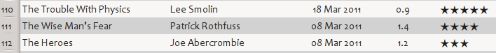

.. include:: global.rst
===============================================
|app| User Manual
===============================================

|app| is an ebook library manager. It can view, convert and catalog ebooks in most of the major ebook formats. It can also talk to many ebook reader devices. It can go out to the Internet and fetch metadata for your books. It can download newspapers and convert them into ebooks for convenient reading. It is cross platform, running on Linux, Windows and OS X. 

You've just started |app|. What do you do now? Before |app| can do anything with your ebooks, it first has to know about them. Drag and drop a few ebook files into |app|, or click the "Add books" button and browse for the ebooks you want to work with. Once you've added the books, they will show up in the main view looking something like this:

Once you've admired the list of books you just added to your heart's content, you'll probably want to read one. In order to do that you'll have to convert the book to a format your reader understands. When first running |app|, the Welcome Wizard starts and will set up calibre for your reader device. Conversion is a breeze. Just select the book you want to convert then click the "Convert books" button. Ignore all the options for now and click "OK". The little icon in the bottom right corner will start spinning. Once it's finished spinning, your converted book is ready. Click the "View" button to read the book.

If you want to read the book on your reader, connect it to the computer, wait till calibre detects it (10-20 seconds) and then click the "Send to device" button. Once the icon stops spinning again, disconnect your reader and read away! If you didn't convert the book in the previous step, |app| will auto convert it to the format your reader device understands. 

To get started with more advanced usage, you should read about the :ref:`Graphical User Interface <gui>`. For even more power and versatility, learn the :ref:`Command Line Interface <cli>`. You will find the list of :ref:`Frequently Asked Questions <faq>` useful as well. 

.. only:: online
    
    **An ebook version of this user manual is available in** `EPUB format <calibre.epub>`_,  `AZW3 (Kindle Fire) format <calibre.azw3>`_ and `PDF format <calibre.pdf>`_.
    
Sections
------------

.. toctree::
   :maxdepth: 1

   gui
   news
   viewer
   conversion
   metadata
   faq 
   tutorials
   customize
   cli/cli-index
   develop
   glossary

The main |app| user interface
^^^^^^^^^^^^^^^^^^^^^^^^^^^^^^^^

.. toctree::
   :maxdepth: 2

   gui

Adding your favorite news website to |app|
^^^^^^^^^^^^^^^^^^^^^^^^^^^^^^^^^^^^^^^^^^^

.. toctree::
   :maxdepth: 2

   news

The |app| ebook viewer
^^^^^^^^^^^^^^^^^^^^^^^^^^

.. toctree::
   :maxdepth: 2

   viewer

Customizing |app|'s ebook conversion
^^^^^^^^^^^^^^^^^^^^^^^^^^^^^^^^^^^^^^^^^

.. toctree::
   :maxdepth: 2

   conversion

Editing ebook metadata
^^^^^^^^^^^^^^^^^^^^^^^^^^^

.. toctree::
   :maxdepth: 2

   metadata

Frequently Asked Questions
^^^^^^^^^^^^^^^^^^^^^^^^^^^

.. toctree::
   :maxdepth: 2

   faq

Tutorials
^^^^^^^^^^^^^^^^^^^^^^^^^^^

.. toctree::
   :maxdepth: 2

   tutorials

Customizing |app|
^^^^^^^^^^^^^^^^^^^^^^^^^^^

.. toctree::
   :maxdepth: 2

   customize

The Command Line Interface
^^^^^^^^^^^^^^^^^^^^^^^^^^^

.. toctree::
   :maxdepth: 2

   cli/cli-index

Setting up a |app| development environment
^^^^^^^^^^^^^^^^^^^^^^^^^^^^^^^^^^^^^^^^^^^

.. toctree::
   :maxdepth: 2

   develop

