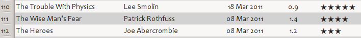

===============================================
calibre User Manual
===============================================

calibre is an e-book library manager. It can view, convert and catalog e-books in most of the major e-book formats. It can also talk to many e-book reader devices. It can go out to the Internet and fetch metadata for your books. It can download newspapers and convert them into e-books for convenient reading. It is cross platform, running on Linux, Windows and macOS.

You've just started calibre. What do you do now? Before calibre can do anything with your e-books, it first has to know about them. Drag and drop a few e-book files into calibre, or click the "Add books" button and browse for the e-books you want to work with. Once you've added the books, they will show up in the main view looking something like this:

Once you've admired the list of books you just added to your heart's content, you'll probably want to read one. In order to do that you'll have to convert the book to a format your reader understands. When first running calibre, the :guilabel:`Welcome wizard` starts and will set up calibre for your reader device. Conversion is a breeze. Just select the book you want to convert then click the "Convert books" button. Ignore all the options for now and click "OK". The little icon in the bottom right corner will start spinning. Once it's finished spinning, your converted book is ready. Click the "View" button to read the book.

If you want to read the book on your reader, connect it to the computer, wait till calibre detects it (10-20 seconds) and then click the "Send to device" button. Once the icon stops spinning again, disconnect your reader and read away! If you didn't convert the book in the previous step, calibre will auto convert it to the format your reader device understands.

To get started with more advanced usage, you should read about :doc:`gui`. For even more power and versatility, learn the :doc:`generated/en/cli-index`. You will find the list of :doc:`faq` useful as well.

If you have more questions, or want to discuss calibre with other users or ask
for help with specific things, there are `forums and other help resources
available <https://calibre-ebook.com/help>`_.

.. only:: online

    **An e-book version of this User Manual is available in** `EPUB format <calibre.epub>`_,  `AZW3 (Kindle Fire) format <calibre.azw3>`_ and `PDF format <calibre.pdf>`_.

.. rubric:: Sections

.. toctree::
   :maxdepth: 1

   gui
   news
   viewer
   conversion
   edit
   server
   diff
   metadata
   faq
   tutorials
   url_scheme
   customize
   generated/en/cli-index
   develop
   drm
   glossary
