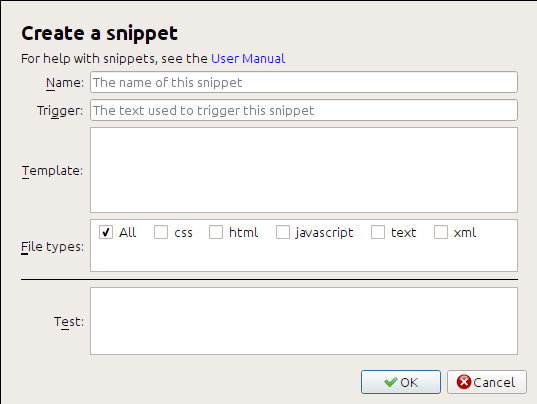

Snippets
========================

.. |ct| replace:: ``Control+J``

The calibre editor supports *snippets*. A snippet is a 
piece of text that is either re-used often or contains a lot of redundant
text. The editor allows you to insert a snippet with only a few key strokes.
For example, suppose you often find yourself inserting link tags when editing
HTML files, then you can simply type ``<a`` in the editor and press
|ct|. The editor will expand it to::

    <a href="filename"></a>

Not only that, the word ``filename`` will be selected, with the cursor placed over
it, so that you can easily type in the real filename, using the editor's nifty
:ref:`editor_auto_complete` feature. And once you are done typing the filename,
press |ct| again and the cursor will jump to the position in between the
``<a>`` tags so you can easily type in the text for the link.

The snippets system in the editor is very sophisticated, there are a few
built-in snippets and you can create your own to suit your editing style.

The following discussion of the built-in snippets should help illustrate the
power of the snippets system.

.. note:: 
    You can also use snippets in the text entry fields in the :guilabel:`Search & replace`
    panel, however, placeholders (using |ct| to jump around) will not
    work.

The built-in snippets
------------------------

The built-in snippets are described below. Note that you can override them by
creating your own snippets with the same trigger text.

Inserting filler text [Lorem]
^^^^^^^^^^^^^^^^^^^^^^^^^^^^^^^

The first built-in snippet, and the simplest is used to insert filler text into
a document. The filler text is taken from `De finibus bonorum et malorum
<https://en.wikipedia.org/wiki/De_finibus_bonorum_et_malorum>`_ a philosophical
work by Cicero (translated to English). To use it simply type ``Lorem`` in an
HTML file and press |ct|. It will be replaced by a couple of paragraphs of
filler.

The definition of this snippet is very simple, the trigger text is defined as
``Lorem`` and the template is defined simply as the literal text to be
inserted. You can easily customize it to use your favorite form of filler text.

Inserting a self-closing HTML tag [<>]
^^^^^^^^^^^^^^^^^^^^^^^^^^^^^^^^^^^^^^^^

Now let's look at a simple example of the powerful concept of *placeholders*.
Say you want to insert the self-closing tag ``<hr/>``. Just type ``<>``, and
press |ct|, the editor will expand the snippet to::

    <|/>

Here, the ``|`` symbol represents the current cursor position. You can then
type ``hr`` and press |ct| to move the cursor to after the end of the tag.
This snippet is defined as::

    Trigger: <>
    Template: <$1/>$2

Placeholders are simply the dollar ($) sign followed by a number. When the
snippet is expanded by pressing |ct| the cursor is positioned at the first
placeholder (the placeholder with the lowest number). When you press |ct| again
the cursor jumps to the next placeholder (the placeholder with the next higher
number). 

Inserting an HTML link tag [<a]
^^^^^^^^^^^^^^^^^^^^^^^^^^^^^^^^^

HTML link tags all share a common structure. They have an ``href`` attribute and
some text between the opening and closing tags. A snippet to make typing them
more efficient will introduce us to some more features of placeholders. To use
this snippet, simply type ``<a`` and press |ct|. The editor will expand this
to::

    <a href="filename|"></a>

Not only that, the word ``filename`` will be selected, with the cursor placed
over it, so that you can easily type in the real filename, using the editor's
nifty :ref:`editor_auto_complete` feature. And once you are done typing the
filename, press |ct| again and the cursor will jump to the position in between
the ``<a>`` tags so you can easily type in the text for the link. After you are
done typing the text, press |ct| again to jump to the point after the closing
tag.  This snippet is defined as::

    Trigger: <a
    Template: <a href="${1:filename}">${2*}</a>$3

There are a couple of new features here. First the ``$1`` placeholder has
become more complex. It now includes some *default text* (the word
``filename``). If a placeholder contains default text, the default text is
substituted for the placeholder when the snippet is expanded. Also when you
jump to a placeholder with default text using |ct|, the default text is
selected. In this way, you can use default text to act as a reminder to you to
fill in important parts of the template. You can specify default text for a
placeholder by using the syntax: ``${<number>:default text}``. 

The other new feature is that the second placeholder has an asterisk after it
(``${2*}``). This means that any text that was selected before expanding the
template is substituted for the placeholder. To see this in action, select some
text in the editor, press |ct|, type ``<a`` and press |ct| again, the template
will be expanded to::

    <a href="filename">whatever text you selected</a>

Inserting a HTML image tag [<i]
^^^^^^^^^^^^^^^^^^^^^^^^^^^^^^^^

This is very similar to inserting an HTML link, as we saw above. It allows you
to quickly input an ```` tag and jump
between the ``src`` and ``alt`` attributes::

    Trigger: <i
    Template: $3

Insert an arbitrary HTML tag [<<]
^^^^^^^^^^^^^^^^^^^^^^^^^^^^^^^^^^

This allows you to insert an arbitrary full HTML tag (or wrap previously
selected text in the tag). To use it, simply type ``<<`` and press |ct|.
The editor will expand it to::

    <|></>

Type the tag name, for example: ``span`` and press |ct|, that will result in::

    <span>|</span>

You will note that the closing tag has been automatically filled with ``span``.
This is achieved with yet another feature of placeholders, *mirroring*.
Mirroring simply means that if you specify the sample placeholder more than
once in a template, the second and all later positions will be automatically
filled in with whatever you type in the first position, when you press |ct|.
The definition for this snippet is::

    Trigger: <<
    Template: <$1>${2*}</$1>$3

As you can see, the first placeholder ($1) has been specified twice, the second
time in the closing tag, which will simply copy whatever you type in the
opening tag.

Inserting an arbitrary HTML tag with a class attribute [<c]
^^^^^^^^^^^^^^^^^^^^^^^^^^^^^^^^^^^^^^^^^^^^^^^^^^^^^^^^^^^^

This is very similar to the insert arbitrary tag example above, except that it
assumes that you want to specify a class for the tag::

    Trigger: <c
    Template: <$1 class="${2:classname}">${3*}</$1>$4

This will allow you to first type the tag name, press |ct|, type the class
name, press |ct| type the contents of the tag and press |ct| one last time to
jump out of the tag. The closing tag will be auto-filled.
    

Creating your own snippets
----------------------------

Snippets really shine because you can create your own to suit your editing
style. To create your own snippets go to :guilabel:`Edit->Preferences->Editor
settings->Manage snippets` in the editor. This will pop-up an easy to use
dialog to help you create your own snippets. Simply click the :guilabel:`Add
snippet` button and you will see a dialog that looks like:



First give your snippet a name, something descriptive, to help identify the
snippet in the future. Then specify the *trigger*. A trigger is simply the text
that you have to type in the editor before pressing |ct| in order to expand the
snippet.

Then specify the snippet template. You should start with one of the example
above and modify it to suit your needs. Finally, specify which file types you
want the snippet to be active for. This way you can have multiple snippets with
the same trigger text that work differently in different file types.

The next step is to test your newly created snippet. Use the :guilabel:`Test`
box at the bottom. Type in the trigger text and press |ct| to expand the
snippet and jump between placeholders.
