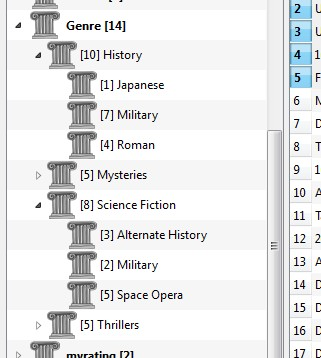
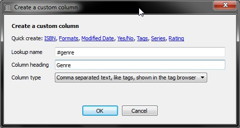
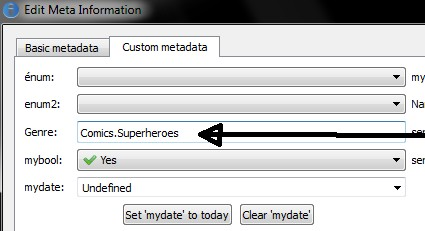
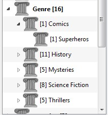
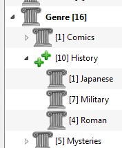
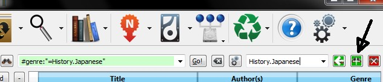
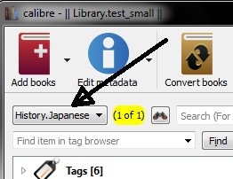

.. include:: global.rst

.. _subgroups-tutorial:

Managing subgroups of books, for example "genre"
==================================================

Some people wish to organize the books in their library into subgroups, similar to subfolders. The most commonly provided reason is to create genre hierarchies, but there are many others. One user asked for a way to organize textbooks by subject and course number. Another wanted to keep track of gifts by subject and recipient. This tutorial will use the genre example for the rest of this post.

Before going on, please note that we are not talking about folders on the hard disk. Subgroups are not file folders. Books will not be copied anywhere. Calibre's library file structure is not affected. Instead, we are presenting a way to organize and display subgroups of books within a |app| library.

.. contents::
    :depth: 1
    :local:

The commonly-provided requirements for subgroups such as genres are:

    * A subgroup (e.g., a genre) must contain (point to) books, not categories of books. This is what distinguishes subgroups from |app| user categories.
    * A book can be in multiple subgroups (genres). This distinguishes subgroups from physical file folders.
    * Subgroups (genres) must form a hierarchy; subgroups can contain subgroups.

Tags give you the first two. If you tag a book with the genre then you can use the tag browser (or search) for find the books with that genre, giving you the first. Many books can have the same tag(s), giving you the second. The problem is that tags don't satisfy the third requirement. They don't provide a hierarchy.

|sgtree| Calibre's hierarchy feature gives you the third, the ability to see the genres in a 'tree' and the ability to easily search for books in genre or sub-genre. For example, assume that your genre structure is similar to the following::

    Genre
        . History
        .. Japanese
        .. Military
        .. Roman
        . Mysteries
        .. English
        .. Vampire
        . Science Fiction
        .. Alternate History
        .. Military
        .. Space Opera
        . Thrillers
        .. Crime
        .. Horror
        etc.

By using the hierarchy feature, you can see these genres in the tag browser in tree form, as shown in the screen image. In this example the outermost level (Genre) is a custom column that contains the genres. Genres containing sub-genres appear with a small triangle next to them. Clicking on that triangle will open the item and show the sub-genres, as you can see with History and Science Fiction.

Clicking on a genre can search for all books with that genre or children of that genre. For example, clicking on Science Fiction can give all three of the child genres, Alternate History, Military, and Space Opera. Clicking on Alternate History will give books in that genre, ignoring those in Military and Space Opera. Of course, a book can have multiple genres. If a book has both Space Opera and Military genres, then you will see that book if you click on either genre. Searching is discussed in more detail below.

Another thing you can see from the image is that the genre Military appears twice, once under History and once under Science Fiction. Because the genres are in a hierarchy, these are two separate genres. A book can be in one, the other, or (doubtfully in this case) both. For example, the books in Winston Churchill's "The Second World War" could be in "History.Military". David Weber's Honor Harrington books could be in "Science Fiction.Military", and for that matter also in "Science Fiction.Space Opera."

Once a genre exists, that is at least one book has that genre, you can easily apply it to other books by dragging the books from the library view onto the genre you want the books to have. You can also apply genres in the metadata editors; more on this below.

Setup
----------------------------------------

By now, your question might be "How was all of this up?" There are three steps: 1) create the custom column, 2) tell |app| that the new column is to be treated as a hierarchy, and 3) add genres.

You create the custom column in the usual way, using Preferences -> Add your own columns. This example uses "#genre" as the lookup name and "Genre" as the column heading. The column type is "Comma-separated text, like tags, shown in the tag browser." 

Then after restarting |app|, you must tell |app| that the column is to be treated as a hierarchy. Go to Preferences -> Look and Feel -> Tag Browser and enter the lookup name "#genre" into the "Categories with hierarchical items" box. Press Apply, and you are done with setting up.

.. image:: images/sg_pref.jpg
    :align: center

At the point there are no genres in the column. We are left with the last step: how to apply a genre to a book. A genre does not exist in |app| until it appears on at least one book. To learn how to apply a genre for the first time, we must go into some detail about what a genre looks like in the metadata for a book.

A hierarchy of 'things' is built by creating an item consisting of phrases separated by periods. Continuing the genre example, these items would "History.Military", "Mysteries.Vampire", "Science Fiction.Space Opera", etc. Thus to create a new genre, you pick a book that should have that genre, edit its metadata, and enter the new genre into the column you created. Continuing our example, if you want to assign a new genre "Comics" with a sub-genre "Superheroes" to a book, you would 'edit metadata' for that (comic) book, choose the Custom metadata tab, and then enter "Comics.Superheroes" as shown in the following (ignore the other custom columns):

After doing the above, you see in the tag browser:

From here on, to apply this new genre to a book (a comic book, presumably), you can either drag the book onto the genre, or add it to the book using edit metadata in exactly the same way as done above.

Searching
---------------

The easiest way to search for genres is using the tag browser, clicking on the genre you wish to see. Clicking on a genre with children will show you books with that genre and all child genres. However, this might bring up a question. Just because a genre has children doesn't mean that it isn't a genre in its own right. For example, a book can have the genre "History" but not "History.Military". How do you search for books with only "History"?

The tag browser search mechanism knows if an item has children. If it does, clicking on the item cycles through 5 searches instead of the normal three. The first is the normal green plus, which shows you books with that genre only (e.g., History). The second is a doubled plus (shown above), which shows you books with that genre and all sub-genres (e.g., History and History.Military). The third is the normal red minus, which shows you books without that exact genre. The fourth is a doubled minus, which shows you books without that genre or sub-genres. The fifth is back to the beginning, no mark, meaning no search.

Restrictions
---------------

If you search for a genre then create a saved search for it, you can use the 'restrict to' box to create a virtual library of books with that genre. This is useful if you want to do other searches within the genre or to manage/update metadata for books in the genre. Continuing our example, you can create a saved search named 'History.Japanese' by first clicking on the genre Japanese in the tag browser to get a search into the search box, entering History.Japanese into the saved search box, then pushing the "save search" button (the green box with the white plus, on the right-hand side).

After creating the saved search, you can use it as a restriction.

Useful Template Functions
-------------------------
 
 You might want to use the genre information in a template, such as with save to disk or send to device. The question might then be "How do I get the outermost genre name or names?" A |app| template function, subitems, is provided to make doing this easier.
 
 For example, assume you want to add the outermost genre level to the save-to-disk template to make genre folders, as in "History/The Gathering Storm - Churchill, Winston". To do this, you must extract the first level of the hierarchy and add it to the front along with a slash to indicate that it should make a folder. The template below accomplishes this::
 
    {#genre:subitems(0,1)||/}{title} - {authors}

See :ref:`The template language <templatelangcalibre>` for more information templates and the :func:`subitems` function.
