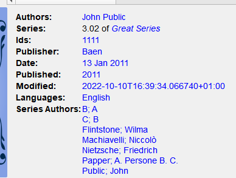

.. _templatelangcalibre:

The calibre template language
=======================================================

The calibre template language is a calibre-specific language used throughout calibre for tasks such as specifying file paths, formatting values, and computing the value for user-specified columns. Examples:

* Specify the folder structure and file names when saving files from the calibre library to the disk or e-book reader.
* Define rules for adding icons and colors to the calibre book list.
* Define `virtual columns` that contain data from other columns.
* Advanced library searching.
* Advanced metadata search and replace.

The language is built around the notion of a `template`, which specifies which book metadata to use, computations on that metadata, and how it is to be formatted.

Basic templates
---------------

A basic template consists one or more ``template expressions``. A ``template expression`` consists of text and names in curly brackets (``{}``) that is replaced by the corresponding metadata from the book being processed. For example, the default template in calibre used for saving books to device has 4 ``template expressions``::

    {author_sort}/{title}/{title} - {authors}

For the book "The Foundation" by "Isaac Asimov" the  will become::

    Asimov, Isaac/The Foundation/The Foundation - Isaac Asimov

The slashes are not ``template expressions`` because they are in between in ``{}``. Such text is left where it appears. For example, if the template is::

    {author_sort} Some Important Text {title}/{title} - {authors}

then for "The Foundation" the template produces::

    Asimov, Isaac Some Important Text The Foundation/The Foundation - Isaac Asimov

A ``template expression`` can access all the metadata available in calibre, including custom columns (columns you create yourself), by using a column's ``lookup name``. To find the lookup name for a `column` (sometimes called `fields`), hover your mouse over the column header in calibre's book list. Lookup names for custom columns always begin with ``#``. For series type columns there is an additional field named ``#lookup name_index`` that is the series index for that book in the series. For example, if you have a custom series column named ``#myseries``, there will also be a column named ``#myseries_index``. The standard series column's index is named ``series_index``.

In addition to the standard column based fields, you also can use:

  * ``{formats}`` - A list of formats available in the calibre library for a book
  * ``{identifiers:select(isbn)}`` - The ISBN of the book

If the metadata for the field for a given book is not defined then the field in the template is replaced by the empty string (``''``). For example, consider the following template::

    {author_sort}/{series}/{title} {series_index}

If Asimov's book "Second Foundation" is in the series "Foundation" then the template produces::

    Asimov, Isaac/Foundation/Second Foundation 3

If a series has not been entered for the book then the template produces::

    Asimov, Isaac/Second Foundation

The template processor automatically removes multiple slashes and leading or trailing spaces.

Advanced formatting
----------------------

In addition to metadata substitution, templates can conditionally include additional text and control how substituted data is formatted.

**Conditionally including text**

Sometimes you want text to appear in the output only if a field is not empty. A common case is ``series`` and ``series_index`` where you want either nothing or the two values separated by a hyphen. calibre handles this case using a special ``template expression`` syntax.

For example and using the above Foundation example, assume you want the template to produce `Foundation - 3 - Second Foundation`. This template produces that output:

  ``{series} - {series_index} - {title}``

However, if a book has no series the template will produce `- - the title`, which is probably not what you want. Generally, people want the result be the title without the extraneous hyphens. You can accomplish this using the following template syntax:

  ``{field:|prefix_text|suffix_text}``

This ``template expression`` says that if ``field`` has the value `XXXX` then the result will be `prefix_textXXXXXsuffix_text`. If ``field`` is empty (has no value) then the result will be the empty string (nothing) because the prefix and suffix are ignored. The prefix and suffix can contain blanks.

**Do not use subtemplates (`{ ... }`) or functions (see below) in the prefix or the suffix.**

Using this syntax, we can solve the above no-series problem with the template::

  {series}{series_index:| - | - }{title}

The hyphens will be included only if the book has a series index, which it has only if it has a series. Continuing the Foundation example again, the template will produce `Foundation - 1 - Second Foundation`.

Notes:

* You must include the colon after the ``lookup name`` if you are using a prefix or a suffix.
* You must either use either no or both ``|`` characters. Using one, as in ``{field:| - }``, is not allowed.
* It is OK to provide no text for either the prefix or the suffix, such as in ``{series:|| - }``. The template ``{title:||}`` is the same as ``{title}``.

**Formatting**

Suppose you want the ``series_index`` to be formatted as three digits with leading zeros. This does the trick:

  ``{series_index:0>3s}`` - Three digits with leading zeros

For trailing zeros, use:

  ``{series_index:0<3s}`` - Three digits with trailing zeros

If you use series indices with fractional values, e.g., 1.1, you might want the decimal points to line up. For example, you might want the indices 1 and 2.5 to appear as 01.00 and 02.50 so that they will sort correctly on a device that does lexical sorting. To do this, use:

  ``{series_index:0>5.2f}`` - Five characters consisting of two digits with leading zeros, a decimal point, then 2 digits after the decimal point.

If you want only the first two letters of the data, use:

  ``{author_sort:.2}`` - Only the first two letters of the author sort name

Much of the calibre template language formatting comes from Python. For more details on the syntax of these advanced formatting operations see the `Python documentation <https://docs.python.org/3/library/string.html#formatstrings>`_.

Using templates to define custom columns
-----------------------------------------

Templates can be used to display information that isn't in calibre metadata, or to display metadata differently from calibre's normal format. For example, you might want to show the ``ISBN``, a field that calibre does not display. You can accomplish this creating a custom column with the type `Column built from other columns` (hereafter called `composite columns`) and providing a template to generate the displayed text. The column will display the result of evaluating the template. For example, to display the ISBN, create the column and enter ``{identifiers:select(isbn)}`` in the template box. To display a column containing the values of two series custom columns, separated by a comma, use ``{#series1:||,}{#series2}``.

Composite columns can use any template option, including formatting.

Note: You cannot edit the data displayed in a composite column. Instead you edit the source columns. If you edit a composite column, for example by double-clicking it, calibre will open the template for editing, not the underlying data.

Templates and plugboards
---------------------------

Plugboards are used for changing the metadata written into books during send-to-device and save-to-disk operations. A plugboard permits you to specify a template to provide the data to write into the book's metadata. You can use plugboards to modify the following fields: authors, author_sort, language, publisher, tags, title, title_sort. This feature helps people who want to use different metadata in books on devices to solve sorting or display issues.

When you create a plugboard, you specify the format and device for which the plugboard is to be used. A special device is provided, ``save_to_disk``, that is used when saving formats (as opposed to sending them to a device). Once you have chosen the format and device, you choose the metadata fields to change, providing templates to supply the new values. These templates are `connected` to their destination fields, hence the name `plugboards`. You can of course use composite columns in these templates.

Plugboards are quite flexible and can be written in Single Function Mode, Template Program Mode, General Program Mode, or Python Template mode.

When a plugboard might apply (Content server, save to disk, or send to device), calibre searches the
defined plugboards to choose the correct one for the given format and device. For example, to find the appropriate plugboard for an EPUB book being sent to an ANDROID device, calibre searches
the plugboards using the following search order:

* a plugboard with an exact match on format and device, e.g., ``EPUB`` and ``ANDROID``
* a plugboard with an exact match on format and the special ``any device`` choice, e.g., ``EPUB`` and ``any device``
* a plugboard with the special ``any format`` choice and an exact match on device, e.g., ``any format`` and ``ANDROID``
* a plugboard with ``any format`` and ``any device``

The tags and authors fields have special treatment, because both of these fields can hold more than one item. A book can have many tags and many authors. When you specify that one of these two fields is to be changed, the template's result is examined to see if more than one item is there. For tags, the result is cut apart wherever calibre finds a comma. For example, if the template produces
the value ``Thriller, Horror``, then the result will be two tags, ``Thriller`` and ``Horror``. There is no way to put a comma in the middle of a tag.

The same thing happens for authors, but using a different character for the cut, a `&` (ampersand) instead of a comma. For example, if the template produces the value ``Blogs, Joe&Posts, Susan``, then the book will end up with two authors, ``Blogs, Joe`` and ``Posts, Susan``. If the template produces the value ``Blogs, Joe;Posts, Susan``, then the book will have one author with a rather strange name.

Plugboards affect the metadata written into the book when it is saved to disk or written to the device. Plugboards do not affect the metadata used by ``save to disk`` and ``send to device`` to create the file names. Instead, file names are constructed using the templates entered on the appropriate preferences window.

.. _single_mode:

Using functions in templates - Single Function Mode
---------------------------------------------------

Suppose you want to display the value of a field in upper case when that field is normally in title case. You can do this using `template functions`. For example, to display the title in upper case use the ``uppercase`` function, as in ``{title:uppercase()}``. To display it in title case, use ``{title:titlecase()}``.

Functions go into the format part of the template, after the ``:`` and before the first ``|`` or the closing ``}`` if no prefix/suffix is used. If you have both a format and a function reference, the function comes after a second ``:``.  Functions return the value of the column specified in the template, suitably modified.

The syntax for using functions is one of::

  {lookup_name:function(arguments)}
  {lookup_name:format:function(arguments)}
  {lookup_name:function(arguments)|prefix|suffix}
  {lookup_name:format:function(arguments)|prefix|suffix}

Function names must always be followed by opening and closing parentheses. Some functions require extra values (arguments), and these go inside the parentheses. Arguments are separated by commas. Literal commas (commas as text, not argument separators) must be preceded by a backslash (``\``) . The last (or only) argument cannot contain a textual closing parenthesis.

Functions are evaluated before format specifications and the prefix/suffix. See further down for an example of using both a format and a function.

**Important**: If you have programming experience, please note that the syntax in `Single Function Mode` is not what you expect. Strings are not quoted and spaces are significant. All arguments are considered to be constants; there are no expressions.

**Do not use subtemplates (`{ ... }`) as function arguments.** Instead, use :ref:`Template Program Mode <template_mode>` and :ref:`General Program Mode <general_mode>`.

Some functions require regular expressions. In the template language regular expression matching is case-insensitive.

In the function documentation below, the notation ``[something]*`` means that ``something`` can be repeated zero or more times. The notation ``[something]+`` means that the ``something`` is repeated one or more times (must exist at least one time).

The functions intended for use in Single Function Mode are:

* ``capitalize()`` -- returns the value with the first letter upper case and the rest lower case.
* ``contains(pattern, text if match, text if not match)`` -- checks if the value is matched by the regular expression ``pattern``. Returns ``text if match`` if the pattern matches the value, otherwise returns ``text if no match``.
* ``count(separator)`` -- interprets the value as a list of items separated by ``separator`` and returns the number of items in the list. Most lists use a comma as the separator, but ``authors`` uses an ampersand (&). Examples: ``{tags:count(,)}``, ``{authors:count(&)}``. Aliases: ``count()``, ``list_count()``
* ``format_number(template)`` -- interprets the value as a number and formats that number using a Python formatting template such as ``{0:5.2f}`` or ``{0:,d}`` or ``${0:5,.2f}``. The formatting template must begin with ``{0:`` and end with ``}`` as in the above examples. Exception: you can leave off the leading "{0:" and trailing "}" if the format template contains only a format. See the template language and the `Python documentation <https://docs.python.org/3/library/string.html#formatstrings>`_ for more examples. Returns the empty string if formatting fails.
* ``human_readable()`` -- expects the value to be a number and returns a string representing that number in KB, MB, GB, etc.
* ``ifempty(text if empty)`` -- if the value is not empty then return the value of the field, otherwise return `text if empty`.
* ``in_list(separator, [ pattern, found_val, ]* not_found_val)`` -- interpret the value as a list of items separated by ``separator``, checking the ``pattern`` against each item in the list. If the ``pattern`` matches an item then return ``found_val``, otherwise return ``not_found_val``. The pair ``pattern`` and ``found_value`` can be repeated as many times as desired, permitting returning different values depending on the item's value. The patterns are checked in order, and the first match is returned.
* ``language_strings(localize)`` -- return the `language names <https://www.loc.gov/standards/iso639-2/php/code_list.php>`_ for the `language codes <https://www.loc.gov/standards/iso639-2/php/code_list.php>`_ passed in as the value. Example: ``{languages:language_strings()}``.  If ``localize`` is zero, return the strings in English. If ``localize`` is not zero, return the strings in the language of the current locale. ``Lang_codes`` is a comma-separated list.
* ``list_item(index, separator)`` -- interpret the value as a list of items separated by ``separator``, returning the 'index'th item. The first item is number zero. The last item has the index ``-1`` as in ``list_item(-1,separator)``. If the item is not in the list, then the empty string is returned.
* ``lookup([ pattern, key, ]* else_key)`` -- The patterns will be checked against the value in order. If a pattern matches then the value of the field named by ``key`` is returned. If no pattern matches then the value of the field named by ``else_key`` is returned. See``switch`` (below).
* ``lowercase()`` -- returns the value of the field in lower case.
* ``rating_to_stars(use_half_stars)`` -- Returns the rating as string of star (``★``) characters. The value must be a number between 0 and 5. Set use_half_stars to 1 if you want half star characters for fractional numbers available with custom ratings columns.
* ``re(pattern, replacement)`` -- return the value after applying the regular expression. All instances of ``pattern`` in the value are replaced with ``replacement``. The template language uses case insensitive `Python regular expressions <https://docs.python.org/3/library/re.html>`_.
* ``select(key)`` -- interpret the value as a comma-separated list of items with each item having the form ``id:value`` (the calibre ``identifier`` format). The function finds the first pair with the id equal to key and returns the corresponding value. If no id matches then the function returns the empty string.
* ``shorten(left chars, middle text, right chars)`` -- Return a shortened version of the value, consisting of ``left chars`` characters from the beginning of the value, followed by ``middle text``, followed by ``right chars`` characters from the end of the value. ``Left chars`` and ``right chars`` must be non-negative integers. Example: assume you want to display the title with a length of at most 15 characters in length. One template that does this is ``{title:shorten(9,-,5)}``. For a book with the title `Ancient English Laws in the Times of Ivanhoe` the result will be `Ancient E-anhoe`: the first 9 characters of the title, a ``-``, then the last 5 characters. If the value's length is less than ``left chars`` + ``right chars`` + the length of ``middle text`` then the value will be returned unchanged. For example, the title `The Dome` would not be changed.
* ``str_in_list(separator, [ string, found_val, ]+ not_found_val)`` -- interpret the value as a list of items separated by ``separator`` then compare ``string`` against each value in the list. The ``string`` is not a regular expression. If ``string`` is equal to any item (ignoring case) then return the corresponding ``found_val``. If ``string`` contains ``separators`` then it is also treated as a list and each subvalue is checked. The ``string`` and ``found_value`` pairs can be repeated as many times as desired, permitting returning different values depending on string's value. If none of the strings match then ``not_found_value`` is returned. The strings are checked in order. The first match is returned.
* ``subitems(start_index, end_index)`` -- This function breaks apart lists of tag-like hierarchical items such as genres. It interprets the value as a comma-separated list of tag-like items, where each item is a period-separated list. It returns a new list made by extracting from each item the components from ``start_index`` to ``end_index``, then merging the results back together. Duplicates are removed. The first subitem in a period-separated list has an index of zero. If an index is negative then it counts from the end of the list. As a special case, an end_index of zero is assumed to be the length of the list.

  Examples:

  * Assuming a #genre column containing `A.B.C`:

    * ``{#genre:subitems(0,1)}`` returns "A"
    * ``{#genre:subitems(0,2)}`` returns "A.B"
    * ``{#genre:subitems(1,0)}`` returns "B.C"

  * Assuming a #genre column containing "A.B.C, D.E":

    * ``{#genre:subitems(0,1)}`` returns "A, D"
    * ``{#genre:subitems(0,2)}`` returns "A.B, D.E"

* ``sublist(start_index, end_index, separator)`` -- interpret the value as a list of items separated by ``separator``, returning a new list made from the items from ``start_index`` to ``end_index``. The first item is number zero. If an index is negative, then it counts from the end of the list. As a special case, an end_index of zero is assumed to be the length of the list.

  Examples assuming that the tags column (which is comma-separated) contains "A, B ,C":

  * ``{tags:sublist(0,1,\,)}`` returns "A"
  * ``{tags:sublist(-1,0,\,)}`` returns "C"
  * ``{tags:sublist(0,-1,\,)}`` returns "A, B"

* ``swap_around_articles(separator)`` -- returns the value with articles moved to the end. The value can be a list, in which case each item in the list is processed. If the value is a list then you must provide the ``separator``. If no ``separator`` is provided then the value is treated as being a single value, not a list. The `articles` are those used by calibre to generate the ``title_sort``.
* ``swap_around_comma()`` -- given a value of the form ``B, A``, return ``A B``. This is most useful for converting names in LN, FN format to FN LN. If there is no comma in the value then the function returns the value unchanged.
* ``switch([pattern, value,]+ else_value)`` -- for each ``pattern, value`` pair, checks if the value matches the regular expression ``pattern`` and if so returns the associated ``value``. If no ``pattern`` matches, then ``else_value`` is returned. You can have as many ``pattern, value`` pairs as you wish. The first match is returned.
* ``test(text if not empty, text if empty)`` -- return ``text if not empty`` if the value is not empty, otherwise return ``text if empty``.
* ``titlecase()`` -- returns the value of the field in title case.
* ``transliterate()`` -- Return a string in a latin alphabet formed by approximating the sound of the words in the source field. For example, if the source field is ``Фёдор Миха́йлович Достоевский`` this function returns ``Fiodor Mikhailovich Dostoievskii``.
* ``uppercase()`` -- returns the value of the field in upper case.

**Using functions and formatting in the same template**

Suppose you have an integer custom column ``#myint`` that you want displayed with leading zeros, as in ``003``. One way to do this is to use a format of ``0>3s``. However, by default if a number (integer or float) equals zero then the value is displayed as the empty string so zero values will produce the empty string, not ``000``. If you want to see ``000`` values then you use both the format string and the ``ifempty`` function to change the empty value back to a zero. The template would be::

    {#myint:0>3s:ifempty(0)}

Note that you can use the prefix and suffix as well. If you want the number to appear as ``[003]`` or ``[000]``, then use the template::

    {#myint:0>3s:ifempty(0)|[|]}

.. _general_mode:

General Program Mode
-----------------------------------

`General Program Mode` (`GPM`) replaces `template expressions` with a program written in the `template language`. The syntax of the language is defined by the following grammar::

    program         ::= 'program:' expression_list
    expression_list ::= top_expression [ ';' top_expression ]*
    top_expression  ::= or_expression
    or_expression   ::= and_expression [ '||' and_expression ]*
    and_expression  ::= not_expression [ '&&' not_expression ]*
    not_expression  ::= [ '!' not_expression ]* | concatenate_expr
    concatenate_expr::= compare_expr [ '&' compare_expr ]*
    compare_expr    ::= add_sub_expr [ compare_op add_sub_expr ]
    compare_op      ::= '==' | '!=' | '>=' | '>' | '<=' | '<' | 'in' | 'inlist' |
                        '==#' | '!=#' | '>=#' | '>#' | '<=#' | '<#'
    add_sub_expr    ::= times_div_expr [ add_sub_op times_div_expr ]*
    add_sub_op      ::= '+' | '-'
    times_div_expr  ::= unary_op_expr [ times_div_op unary_op_expr ]*
    times_div_op    ::= '*' | '/'
    unary_op_expr   ::= [ add_sub_op unary_op_expr ]* | expression
    expression      ::= identifier | constant | function | assignment | field_reference |
                        if_expr | for_expr | break_expr | continue_expr |
                        '(' expression_list ')' | function_def
    field_reference ::= '$' [ '$' ] [ '#' ] identifier
    identifier      ::= id_start [ id_rest ]*
    id_start        ::= letter | underscore
    id_rest         ::= id_start | digit
    constant        ::= " string " | ' string ' | number
    function        ::= identifier '(' expression_list [ ',' expression_list ]* ')'
    function_def    ::= 'def' identifier '(' top_expression [ ',' top_expression ]* ')' ':'
                        expression_list 'fed'
    assignment      ::= identifier '=' top_expression
    if_expr         ::= 'if' condition 'then' expression_list
                        [ elif_expr ] [ 'else' expression_list ] 'fi'
    condition       ::= top_expression
    elif_expr       ::= 'elif' condition 'then' expression_list elif_expr | ''
    for_expr        ::= for_list | for_range
    for_list        ::= 'for' identifier 'in' list_expr
                        [ 'separator' separator_expr ] ':' expression_list 'rof'
    for_range       ::= 'for' identifier 'in' range_expr ':' expression_list 'rof'
    range_expr      ::= 'range' '(' [ start_expr ',' ] stop_expr
                        [ ',' step_expr [ ',' limit_expr ] ] ')'
    list_expr       ::= top_expression
    break_expr      ::= 'break'
    continue_expr   ::= 'continue'
    separator_expr  ::= top_expression
    start_expr      ::= top_expression
    stop_expr       ::= top_expression
    step_expr       ::= top_expression
    limit_expr      ::= top_expression

Notes:

* a ``top_expression`` always has a value. The value of an ``expression_list`` is the value of the last ``top_expression`` in the list. For example, the value of the expression list ``1;2;'foobar';3`` is ``3``.
* In a logical context, any non-empty value is ``True``
* In a logical context, the empty value is ``False``
* Strings and numbers can be used interchangeably. For example, ``10`` and ``'10'`` are the same thing.
* Comments are lines starting with a '#' character. Comments beginning later in a line are not supported.

**Operator precedence**

The operator precedence (order of evaluation) from highest (evaluated first) to lowest (evaluated last) is:

* Function calls, constants, parenthesized expressions, statement expressions, assignment expressions, field references.
* Unary plus (``+``) and minus (``-``). These operators evaluate right to left.

  These and all the other arithmetic operators return integers if the expression results in a fractional part equal to zero. For example, if an expression returns ``3.0`` it is changed to ``3``.
* Multiply (``*``) and divide (``/``). These operators are associative and evaluate left to right. Use parentheses if you want to change the order of evaluation.
* Add (``+``) and subtract (``-``). These operators are associative and evaluate left to right.
* Numeric and string comparisons. These operators return ``'1'`` if the comparison succeeds, otherwise the empty string (``''``). Comparisons are not associative: ``a < b < c`` is a syntax error.
* String concatenation (``&``). The ``&`` operator returns a string formed by concatenating the left-hand and right-hand expressions. Example: ``'aaa' & 'bbb'`` returns ``'aaabbb'``. The operator is associative and evaluates left to right.
* Unary logical not (``!``). This operator returns ``'1'`` if the expression is False (evaluates to the empty string), otherwise ``''``.
* Logical and (``&&``). This operator returns '1' if both the left-hand and right-hand expressions are True, or the empty string ``''`` if either is False. It is associative, evaluates left to right, and does `short-circuiting <https://chortle.ccsu.edu/java5/Notes/chap40/ch40_2.html>`_.
* Logical or (``||``). This operator returns ``'1'`` if either the left-hand or right-hand expression is True, or ``''`` if both are False. It is associative, evaluates left to right, and does `short-circuiting <https://chortle.ccsu.edu/java5/Notes/chap40/ch40_2.html>`_. It is an `inclusive or`, returning ``'1'`` if both the left- and right-hand expressions are True.

**Field references**

A ``field_reference`` evaluates to the value of the metadata field named by lookup name that follows the ``$`` or ``$$``. Using ``$`` is equivalent to using the ``field()`` function. Using ``$$`` is equivalent to using the ``raw_field`` function. Examples::

* $authors ==> field('authors')
* $#genre ==> field('#genre')
* $$pubdate ==> raw_field('pubdate')
* $$#my_int ==> raw_field('#my_int')

**If expressions**

``If`` expressions first evaluate the ``condition``. If the ``condition`` is True (a non-empty value) then the ``expression_list`` in the ``then`` clause is evaluated. If it is False then if present the ``expression_list`` in the ``elif`` or ``else`` clause is evaluated. The ``elif`` and ``else`` parts are optional. The words ``if``, ``then``, ``elif``, ``else``, and ``fi`` are reserved; you cannot use them as identifier names. You can put newlines and white space wherever they make sense. The ``condition`` is a ``top_expression`` not an ``expression_list``; semicolons are not allowed. The ``expression_lists`` are semicolon-separated sequences of ``top_expressions``. An ``if`` expression returns the result of the last ``top_expression`` in the evaluated ``expression_list``, or the empty string if no expression list was evaluated.

Examples::

    * program: if field('series') then 'yes' else 'no' fi
    * program:
          if field('series') then
              a = 'yes';
              b = 'no'
          else
              a = 'no';
              b = 'yes'
          fi;
          strcat(a, '-', b)

Nested ``if`` example::

  program:
    if field('series') then
      if check_yes_no(field('#mybool'), '', '', '1') then
        'yes'
      else
        'no'
      fi
    else
      'no series'
    fi

As said above, an ``if`` produces a value. This means that all the following are equivalent::

    * program: if field('series') then 'foo' else 'bar' fi
    * program: if field('series') then a = 'foo' else a = 'bar' fi; a
    * program: a = if field('series') then 'foo' else 'bar' fi; a

As a last example, this program returns the value of the ``series`` column if the book has a series, otherwise the value of the ``title`` column::

    program: field(if field('series') then 'series' else 'title' fi)

**For expressions**

The ``for`` expression iterates over a list of values, processing them one at a time. The ``list_expression`` must evaluate either to a metadata field ``lookup name`` e.g., ``tags`` or ``#genre``, or to a list of values. The :ref:`range() function <range_function>` (see below) generates a list of numbers. If the result is a valid ``lookup name`` then the field's value is fetched and the separator specified for that field type is used. If the result isn't a valid lookup name then it is assumed to be a list of values. The list is assumed to be separated by commas unless the optional keyword ``separator`` is supplied, in which case the list values must be separated by the result of evaluating the ``separator_expr``. A separator cannot be used if the list is generated by ``range()``. Each value in the list is assigned to the specified variable then the ``expression_list`` is evaluated. You can use ``break`` to jump out of the loop, and ``continue`` to jump to the beginning of the loop for the next iteration.

Example: This template removes the first hierarchical name for each value in Genre (``#genre``), constructing a list with the new names::

    program:
      new_tags = '';
      for i in '#genre':
        j = re(i, '^.*?\.(.*)$', '\1');
        new_tags = list_union(new_tags, j, ',')
      rof;
      new_tags

If the original Genre is `History.Military, Science Fiction.Alternate History, ReadMe` then the template returns `Military, Alternate History, ReadMe`. You could use this template in calibre's
:guilabel:`Edit metadata in bulk -> Search & replace` with :guilabel:`Search for` set to ``template`` to strip off the first level of the hierarchy and assign the resulting value to Genre.

Note: the last line in the template, ``new_tags``, isn't strictly necessary in this case because ``for`` returns the value of the last top_expression in the expression list. The value of an assignment is the value of its expression, so the value of the ``for`` statement is what was assigned to ``new_tags``.

**Function definition**

If you have code in a template that repeats then you can put that code into a local function. The ``def`` keyword starts the definition. It is followed by the function name, the argument list, then the code in the function. The function definition ends with the ``fed`` keyword.

Arguments are positional. When a function is called the supplied arguments are matched left to right against the defined parameters, with the value of the argument assigned to the parameter. It is an error to provide more arguments than defined parameters. Parameters can have default values, such as ``a = 25``. If an argument is not supplied for that parameter then the default value is used, otherwise the parameter is set to the empty string.

The ``return`` statement can be used in a local function.

A function must be defined before it can be used.

Example: This template computes an approximate duration in years, months, and days from a number of days. The function ``to_plural()`` formats the computed values. Note that the example also uses the ``&`` operator::

  program:
  	days = 2112;
	years = floor(days/360);
	months = floor(mod(days, 360)/30);
	days = days - ((years*360) + (months * 30));

	def to_plural(v, str):
		if v == 0 then return '' fi;
		return v & ' ' & (if v == 1 then str else str & 's' fi) & ' '
	fed;

	to_plural(years, 'year') & to_plural(months, 'month') & to_plural(days,'day')

**Relational operators**

Relational operators return ``'1'`` if the comparison is true, otherwise the empty string ('').

There are two forms of relational operators: string comparisons and numeric comparisons.

String comparisons do case-insensitive string comparison using lexical order. The supported string comparison operators are ``==``, ``!=``, ``<``, ``<=``, ``>``, ``>=``, ``in``, and ``inlist``.
For the ``in`` operator, the result of the left hand expression is interpreted as a regular expression pattern. The ``in`` operator is True if the value of left-hand regular expression matches the value of the right hand expression. The ``inlist`` operator is true if the left hand regular expression matches any one of the items in the right hand list where the items in the list are separated by commas. The matches are case-insensitive.

The numeric comparison operators are ``==#``, ``!=#``, ``<#``, ``<=#``, ``>#``, ``>=#``. The left and right expressions must evaluate to numeric values with two exceptions: both the string value "None" (undefined field) and the empty string evaluate to the value zero.

Examples:

  * ``program: field('series') == 'foo'`` returns ``'1'`` if the book's series is 'foo', otherwise ``''``.
  * ``program: 'f.o' in field('series')`` returns ``'1'`` if the book's series matches the regular expression ``f.o`` (e.g., `foo`, `Off Onyx`, etc.), otherwise ``''``.
  * ``program: 'science' inlist field('#genre')`` returns ``'1'`` if any of the book's genres match the regular expression ``science``, e.g., `Science`, `History of Science`, `Science Fiction` etc., otherwise ``''``.
  * ``program: '^science$' inlist field('#genre')`` returns ``'1'`` if any of the book's genres exactly match the regular expression ``^science$``, e.g., `Science`. The genres `History of Science` and `Science Fiction` don't match. If there isn't a match then returns ``''``.
  * ``program: if field('series') != 'foo' then 'bar' else 'mumble' fi`` returns ``'bar'`` if the book's series is not ``foo``. Otherwise it returns ``'mumble'``.
  * ``program: if field('series') == 'foo' || field('series') == '1632' then 'yes' else 'no' fi`` returns ``'yes'`` if series is either ``'foo'`` or ``'1632'``, otherwise ``'no'``.
  * ``program: if '^(foo|1632)$' in field('series') then 'yes' else 'no' fi`` returns ``'yes'`` if series is either ``'foo'`` or ``'1632'``, otherwise ``'no'``.
  * ``program: if 11 > 2 then 'yes' else 'no' fi`` returns ``'no'`` because the ``>`` operator does a lexical comparison.
  * ``program: if 11 ># 2 then 'yes' else 'no' fi`` returns ``'yes'`` because the ``>#`` operator does a numeric comparison.

**Additional available functions**

The following functions are available in addition to those described in :ref:`Single Function Mode <single_mode>`.

In `GPM` the functions described in `Single Function Mode` all require an additional first parameter specifying the value to operate upon. All parameters are expression_lists (see the grammar above).

* ``add(x [, y]*)`` -- returns the sum of its arguments. Throws an exception if an argument is not a number. In most cases you can use the ``+`` operator instead of this function.
* ``and(value [, value]*)`` -- returns the string "1" if all values are not empty, otherwise returns the empty string. You can have as many values as you want. In most cases you can use the ``&&`` operator instead of this function.  One reason not to replace ``and`` with ``&&`` is if short-circuiting can change the results because of side effects. For example, ``and(a='',b=5)`` will always do both assignments, where the ``&&`` operator won't do the second.
* ``assign(id, val)`` -- assigns ``val`` to ``id``, then returns ``val``. ``id`` must be an identifier, not an expression. In most cases you can use the ``=`` operator instead of this function.
* ``approximate_formats()`` -- return a comma-separated list of formats associated with the book. There is no guarantee that the list is correct, although it probably is. This and other zero-parameter functions can be called in Template Program Mode (see below) using the template ``{:'approximate_formats()'}``. Note that resulting format names are always uppercase, as in EPUB. The ``approximate_formats()`` function is significantly faster than the ``formats_...`` functions discussed below.
* ``author_links(val_separator, pair_separator)`` -- returns a string containing a list of authors and those authors' link values in the form::

    author1 val_separator author1_link pair_separator author2 val_separator author2_link etc.

  An author is separated from its link value by the ``val_separator`` string with no added spaces. ``author:linkvalue`` pairs are separated by the ``pair_separator`` string argument with no added spaces. It is up to you to choose separator strings that do not occur in author names or links. An author is included even if the author link is empty.
* ``author_sorts(val_separator)`` -- returns a string containing a list of author's sort values for the authors of the book. The sort is the one in the author metadata information (different from the author_sort in books). The returned list has the form ``author sort 1`` ``val_separator`` ``author sort 2`` etc. with no added spaces. The author sort values in this list are in the same order as the authors of the book. If you want spaces around ``val_separator`` then include them in the ``val_separator`` string.
* ``book_count(query, use_vl)`` -- returns the count of books found by searching for ``query``. If ``use_vl`` is ``0`` (zero) then virtual libraries are ignored. This function and its companion ``book_values()`` are particularly useful in template searches, supporting searches that combine information from many books such as looking for series with only one book. It cannot be used in composite columns unless the tweak ``allow_template_database_functions_in_composites`` is set to True. It can be used only in the GUI.

  For example this template search uses this function and its companion to find all series with only one book:

  1) Define a stored template (using :guilabel:`Preferences->Advanced->Template functions`) named ``series_only_one_book`` (the name is arbitrary). The template is::

	program:
	    vals = globals(vals='');
	    if !vals then
	        all_series = book_values('series', 'series:true', ',', 0);
	        for series in all_series:
	            if book_count('series:="' & series & '"', 0) == 1 then
	                vals = list_join(',', vals, ',', series, ',')
	            fi
	        rof;
	        set_globals(vals)
	    fi;
	    str_in_list(vals, ',', $series, 1, '')

    The first time the template runs (the first book checked) it stores the results of the database lookups in a ``global`` template variable named ``vals``. These results are used to check subsequent books without redoing the lookups.

  2) Use the stored template in a template search::

      template:"program: series_only_one_book()#@#:n:1"

  Using a stored template instead of putting the template into the search eliminates problems caused by the requirement to escape quotes in search expressions.
* ``book_values(column, query, sep, use_vl)`` -- returns a list of the unique values contained in the column ``column`` (a lookup name), separated by ``sep``, in the books found by searching for ``query``. If ``use_vl`` is ``0`` (zero) then virtual libraries are ignored. This function and its companion ``book_count()`` are particularly useful in template searches, supporting searches that combine information from many books such as looking for series with only one book. It cannot be used in composite columns unless the tweak ``allow_template_database_functions_in_composites`` is set to True. It can be used only in the GUI.
* ``booksize()`` -- returns the value of the calibre 'size' field. Returns '' if there are no formats.
* ``check_yes_no(field_name, is_undefined, is_false, is_true)`` -- checks if the value of the yes/no field named by the lookup name ``field_name`` is one of the values specified by the parameters, returning ``'yes'`` if a match is found otherwise returning the empty string. Set the parameter ``is_undefined``, ``is_false``, or ``is_true`` to 1 (the number) to check that condition, otherwise set it to 0. Example:

  ``check_yes_no("#bool", 1, 0, 1)`` returns ``'Yes'`` if the yes/no field ``#bool`` is either True or undefined (neither True nor False).

  More than one of ``is_undefined``, ``is_false``, or ``is_true`` can be set to 1.
* ``ceiling(x)`` -- returns the smallest integer greater than or equal to ``x``. Throws an exception if ``x`` is not a number.
* ``character(character_name)`` -- returns the character named by character_name. For example, ``character('newline')`` returns a newline character (``'\n'``). The supported character names are ``newline``, ``return``, ``tab``, and ``backslash``.
* ``cmp(x, y, lt, eq, gt)`` -- compares ``x`` and ``y`` after converting both to numbers. Returns ``lt`` if ``x <# y``, ``eq`` if ``x ==# y``, otherwise ``gt``. This function can usually be replaced with one of the numeric compare operators (``==#``, ``<#``, ``>#``, etc).
* ``connected_device_name(storage_location_key)`` -- if a device is connected then return the device name, otherwise return the empty string. Each storage location on a device has its own device name. The ``storage_location_key`` names are ``'main'``, ``'carda'`` and ``'cardb'``. This function works only in the GUI.
* ``connected_device_uuid(storage_location_key)`` -- if a device is connected then return the device uuid (unique id), otherwise return the empty string. Each storage location on a device has a different uuid. The ``storage_location_key`` location names are ``'main'``, ``'carda'`` and ``'cardb'``. This function works only in the GUI.
* ``current_library_name()`` -- return the last name on the path to the current calibre library.
* ``current_library_path()`` -- return the full path to the current calibre library.
* ``current_virtual_library_name()`` -- return the name of the current virtual library if there is one, otherwise the empty string. Library name case is preserved. Example: ``program: current_virtual_library_name()``. This function works only in the GUI.
* ``date_arithmetic(date, calc_spec, fmt)`` -- Calculate a new date from ``date`` using ``calc_spec``. Return the new date formatted according to optional ``fmt``: if not supplied then the result will be in ISO format. The calc_spec is a string formed by concatenating pairs of ``vW`` (``valueWhat``) where ``v`` is a possibly-negative number and W is one of the following letters:

    * ``s``: add ``v`` seconds to ``date``
    * ``m``: add ``v`` minutes to ``date``
    * ``h``: add ``v`` hours to ``date``
    * ``d``: add ``v`` days to ``date``
    * ``w``: add ``v`` weeks to ``date``
    * ``y``: add ``v`` years to ``date``, where a year is 365 days.

  Example: ``'1s3d-1m'`` will add 1 second, add 3 days, and subtract 1 minute from ``date``.
* ``days_between(date1, date2)`` -- return the number of days between ``date1`` and ``date2``. The number is positive if ``date1`` is greater than ``date2``, otherwise negative. If either ``date1`` or ``date2`` are not dates, the function returns the empty string.
* ``divide(x, y)`` -- returns ``x / y``. Throws an exception if either ``x`` or ``y`` are not numbers. This function can usually be replaced by the ``/`` operator.
* ``eval(string)`` -- evaluates the string as a program, passing the local variables. This permits using the template processor to construct complex results from local variables. In :ref:`Template Program Mode <template_mode>`, because the `{` and `}` characters are interpreted before the template is evaluated you must use `[[` for the `{` character and `]]` for the ``}`` character. They are converted automatically. Note also that prefixes and suffixes (the `|prefix|suffix` syntax) cannot be used in the argument to this function when using :ref:`Template Program Mode <template_mode>`.
* ``extra_file_size(file_name)`` -- returns the size in bytes of the extra file ``file_name`` in the book's ``data/`` folder if it exists, otherwise ``-1``. See also the functions ``has_extra_files()``, ``extra_file_names()`` and ``extra_file_modtime()``. This function can be used only in the GUI.
* ``extra_file_modtime(file_name, format_string)`` -- returns the modification time of the extra file ``file_name`` in the book's ``data/`` folder if it exists, otherwise ``-1``. The modtime is formatted according to ``format_string`` (see ``format_date()`` for details). If ``format_string`` is the empty string, returns the modtime as the floating point number of seconds since the epoch.  See also the functions ``has_extra_files()``, ``extra_file_names()`` and ``extra_file_size()``. The epoch is OS dependent. This function can be used only in the GUI.
* ``extra_file_names(sep [, pattern])`` -- returns a ``sep``-separated list of extra files in the book's ``data/`` folder. If the optional parameter ``pattern``, a regular expression, is supplied then the list is filtered to files that match ``pattern``. The pattern match is case insensitive. See also the functions ``has_extra_files()``, ``extra_file_modtime()`` and ``extra_file_size()``. This function can be used only in the GUI.
* ``field(lookup_name)`` -- returns the value of the metadata field with lookup name ``lookup_name``.
* ``field_exists(lookup_name)`` -- checks if a field (column) with the lookup name ``lookup_name`` exists, returning ``'1'`` if so and the empty string if not.
* ``field_list_count(lookup_name)``-- returns the count of items in the field with the lookup name `lookup_name`. The field must be multi-valued such as ``authors`` or ``tags``, otherwise the function raises an error. This function is much faster than ``list_count()`` because it operates directly on calibre data without converting it to a string first. Example: ``field_list_count('tags')``
* ``finish_formatting(val, fmt, prefix, suffix)`` -- apply the format, prefix, and uffix to a value in the same way as done in a template like ``{series_index:05.2f| - |- }``. This function is provided to ease conversion of complex single-function- or template-program-mode templates to `GPM` Templates. For example, the following program produces the same output as the above template::

    program: finish_formatting(field("series_index"), "05.2f", " - ", " - ")

  Another example: for the template ``{series:re(([^\s])[^\s]+(\s|$),\1)}{series_index:0>2s| - | - }{title}`` use::

    program:
      strcat(
        re(field('series'), '([^\s])[^\s]+(\s|$)', '\1'),
           finish_formatting(field('series_index'), '0>2s', ' - ', ' - '),
           field('title')
      )

* ``first_matching_cmp(val, [ cmp, result, ]* else_result)`` -- compares ``val < cmp`` in sequence, returning the associated result for the first comparison that succeeds. Returns else_result if no comparison succeeds. Example::

    i = 10;
    first_matching_cmp(i,5,"small",10,"middle",15,"large","giant")

  returns ``"large"``. The same example with a first value of 16 returns ``"giant"``.

* ``first_non_empty(value [, value]*)`` -- returns the first ``value`` that is not empty. If all values are empty, then the empty string is returned. You can have as many values as you want.
* ``floor(x)`` -- returns the largest integer less than or equal to ``x``. Throws an exception if ``x`` is not a number.
* ``format_date(val, format_string)`` -- format the value, which must be a date string, using the format_string, returning a string. The formatting codes are:

  * ``d    :`` the day as number without a leading zero (1 to 31)
  * ``dd   :`` the day as number with a leading zero (01 to 31)
  * ``ddd  :`` the abbreviated localized day name (e.g. "Mon" to "Sun").
  * ``dddd :`` the long localized day name (e.g. "Monday" to "Sunday").
  * ``M    :`` the month as number without a leading zero (1 to 12).
  * ``MM   :`` the month as number with a leading zero (01 to 12)
  * ``MMM  :`` the abbreviated localized month name (e.g. "Jan" to "Dec").
  * ``MMMM :`` the long localized month name (e.g. "January" to "December").
  * ``yy   :`` the year as two digit number (00 to 99).
  * ``yyyy :`` the year as four digit number.
  * ``h    :`` the hours without a leading 0 (0 to 11 or 0 to 23, depending on am/pm)
  * ``hh   :`` the hours with a leading 0 (00 to 11 or 00 to 23, depending on am/pm)
  * ``m    :`` the minutes without a leading 0 (0 to 59)
  * ``mm   :`` the minutes with a leading 0 (00 to 59)
  * ``s    :`` the seconds without a leading 0 (0 to 59)
  * ``ss   :`` the seconds with a leading 0 (00 to 59)
  * ``ap   :`` use a 12-hour clock instead of a 24-hour clock, with 'ap' replaced by the localized string for am or pm.
  * ``AP   :`` use a 12-hour clock instead of a 24-hour clock, with 'AP' replaced by the localized string for AM or PM.
  * ``iso  :`` the date with time and timezone. Must be the only format present.
  * ``to_number   :`` convert the date & time into a floating point number (a `timestamp`)
  * ``from_number :`` convert a floating point number (a `timestamp`) into an ``iso`` formatted date. If you want a different date format then add the desired formatting string after ``from_number`` and a colon (``:``). Example: ``from_number:MMM dd yyyy``

  You might get unexpected results if the date you are formatting contains localized month names, which can happen if you changed the date format tweaks to contain ``MMMM``. In this case, instead of using the ``field()`` function as in::

    format_date(field('pubdate'), 'yyyy')

  use the ``raw_field()`` function as in::

   format_date(raw_field('pubdate'), 'yyyy')

* ``format_date_field(field_name, format_string)`` -- format the value in the field ``field_name``, which must be the lookup name of date field, either standard or custom. See ``format_date()`` for the formatting codes. This function is much faster than format_date and should be used when you are formatting the value in a field (column). It can't be used for computed dates or dates in string variables. Examples::

   format_date_field('pubdate', 'yyyy.MM.dd')
   format_date_field('#date_read', 'MMM dd, yyyy')

* ``formats_modtimes(date_format_string)`` -- return a comma-separated list of colon-separated items ``FMT:DATE`` representing modification times for the formats of a book. The ``date_format_string`` parameter specifies how the date is to be formatted. See the ``format_date()`` function for details. You can use the ``select`` function to get the modification time for a specific format. Note that format names are always uppercase, as in EPUB.
* ``formats_paths()`` -- return a comma-separated list of colon-separated items ``FMT:PATH`` giving the full path to the formats of a book. You can use the select function to get the path for a specific format. Note that format names are always uppercase, as in EPUB.
* ``formats_sizes()`` -- return a comma-separated list of colon-separated ``FMT:SIZE`` items giving the sizes in bytes of the formats of a book. You can use the select function to get the size for a specific format. Note that format names are always uppercase, as in EPUB.
* ``fractional_part(x)`` -- returns the value after the decimal point. For example, ``fractional_part(3.14)`` returns ``0.14``. Throws an exception if ``x`` is not a number.
* ``get_link(field_name, field_value)`` -- fetch the link for field ``field_name`` with value ``field_value``. If there is no attached link, return the empty string. Examples:

 * The following returns the link attached to the tag ``Fiction``::

    get_link('tags', 'Fiction')

 * This template makes a list of the links for all the tags associated with a book in the form ``value:link, ...``::

    program:
     ans = '';
     for t in $tags:
         l = get_link('tags', t);
         if l then
             ans = list_join(', ', ans, ',', t & ':' & get_link('tags', t), ',')
         fi
     rof;
     ans

* ``get_note(field_name, field_value, plain_text)`` -- fetch the note for field 'field_name' with value 'field_value'. If `plain_text` is empty, return the note's HTML including images. If `plain_text` is `1` (or `'1'`), return the note's plain text. If the note doesn't exist, return the empty string in both cases. Example:

 * Return the HTML of the note attached to the tag `Fiction`::

    program:
      get_note('tags', 'Fiction', '')

 * Return the plain text of the note attached to the author `Isaac Asimov`::

    program:
      get_note('authors', 'Isaac Asimov', 1)

* ``has_cover()`` -- return ``'Yes'`` if the book has a cover, otherwise the empty string.
* ``has_extra_files([pattern])`` -- returns the count of extra files, otherwise '' (the empty string). If the optional parameter ``pattern`` (a regular expression) is supplied then the list is filtered to files that match ``pattern`` before the files are counted. The pattern match is case insensitive. See also the functions ``extra_file_names()``, ``extra_file_size()`` and ``extra_file_modtime()``. This function can be used only in the GUI.
* ``identifier_in_list(val, id_name [, found_val, not_found_val])`` -- treat ``val`` as a list of identifiers separated by commas. An identifier has the format ``id_name:value``. The ``id_name`` parameter is the id_name text to search for, either ``id_name`` or ``id_name:regexp``. The first case matches if there is any identifier matching that id_name. The second case matches if id_name matches an identifier and the regexp matches the identifier's value. If ``found_val`` and ``not_found_val`` are provided then if there is a match then return ``found_val``, otherwise return ``not_found_val``. If ``found_val`` and ``not_found_val`` are not provided then if there is a match then return the ``identifier:value`` pair, otherwise the empty string (``''``).
* ``is_dark_mode()`` -- returns ``'1'`` if calibre is running in dark mode, ``''`` (the empty string) otherwise. This function can be used in advanced color and icon rules to choose different colors/icons according to the mode. Example::

   if is_dark_mode() then 'dark.png' else 'light.png' fi

* ``is_marked()`` -- check whether the book is `marked` in calibre. If it is then return the value of the mark, either ``'true'`` (lower case) or a comma-separated list of named marks. Returns ``''`` (the empty string) if the book is not marked. This function works only in the GUI.
* ``language_codes(lang_strings)`` -- return the `language codes <https://www.loc.gov/standards/iso639-2/php/code_list.php>`_ for the language names passed in `lang_strings`. The strings must be in the language of the current locale. ``Lang_strings`` is a comma-separated list.
* ``list_contains(value, separator, [ pattern, found_val, ]* not_found_val)`` -- (Alias of ``in_list``) Interpreting the value as a list of items separated by ``separator``, evaluate the ``pattern`` against each value in the list. If the ``pattern`` matches any value then return ``found_val``, otherwise return ``not_found_val``. The ``pattern`` and ``found_value`` can be repeated as many times as desired, permitting returning different values depending on the search. The patterns are checked in order. The first match is returned. Aliases: ``in_list()``, ``list_contains()``
* ``list_count(value, separator)`` -- interprets ``value`` as a list of items separated by ``separator``, returning the count of items in the list. Aliases: ``count()``, ``list_count()``
* ``list_count_matching(list, pattern, separator)`` -- interprets ``list`` as a list of items separated by ``separator``, returning the number of items in the list that match the regular expression ``pattern``. Aliases: ``list_count_matching()``, ``count_matching()``
* ``list_difference(list1, list2, separator)`` -- return a list made by removing from ``list1`` any item found in ``list2`` using a case-insensitive comparison. The items in ``list1`` and ``list2`` are separated by separator, as are the items in the returned list.
* ``list_equals(list1, sep1, list2, sep2, yes_val, no_val)`` -- return ``yes_val`` if ``list1`` and `list2` contain the same items, otherwise return ``no_val``. The items are determined by splitting each list using the appropriate separator character (``sep1`` or ``sep2``). The order of items in the lists is not relevant. The comparison is case-insensitive.
* ``list_intersection(list1, list2, separator)`` -- return a list made by removing from ``list1`` any item not found in ``list2``, using a case-insensitive comparison. The items in ``list1`` and ``list2`` are separated by separator, as are the items in the returned list.
* ``list_join(with_separator, list1, separator1 [, list2, separator2]*)`` -- return a list made by joining the items in the source lists (``list1`` etc) using ``with_separator`` between the items in the result list. Items in each source ``list[123...]`` are separated by the associated ``separator[123...]``. A list can contain zero values. It can be a field like ``publisher`` that is single-valued, effectively a one-item list. Duplicates are removed using a case-insensitive comparison. Items are returned in the order they appear in the source lists. If items on lists differ only in letter case then the last is used. All separators can be more than one character.

  Example::

    program:
      list_join('#@#', $authors, '&', $tags, ',')

  You can use ``list_join`` on the results of previous calls to ``list_join`` as follows::

    program:
      a = list_join('#@#', $authors, '&', $tags, ',');
      b = list_join('#@#', a, '#@#', $#genre, ',', $#people, '&', 'some value', ',')

  You can use expressions to generate a list. For example, assume you want items for ``authors`` and ``#genre``, but with the genre changed to the word "Genre: " followed by the first letter of the genre, i.e. the genre "Fiction" becomes "Genre: F". The following will do that::

    program:
      list_join('#@#', $authors, '&', list_re($#genre, ',', '^(.).*$', 'Genre: \1'),  ',')

* ``list_re(src_list, separator, include_re, opt_replace)`` -- Construct a list by first separating ``src_list`` into items using the ``separator`` character. For each item in the list, check if it matches ``include_re``. If it does then add it to the list to be returned. If ``opt_replace`` is not the empty string then apply the replacement before adding the item to the returned list.
* ``list_re_group(src_list, separator, include_re, search_re [, template_for_group]*)`` -- Like list_re except replacements are not optional. It uses ``re_group(item, search_re, template ...)`` when doing the replacements.
* ``list_remove_duplicates(list, separator)`` -- return a list made by removing duplicate items in ``list``. If items differ only in case then the last is returned. The items in ``list`` are separated by ``separator``, as are the items in the returned list.
* ``list_sort(list, direction, separator)`` -- return ``list`` sorted using a case-insensitive lexical sort. If ``direction`` is zero, ``list`` is sorted ascending, otherwise descending. The list items are separated by ``separator``, as are the items in the returned list.
* ``list_split(list_val, sep, id_prefix)`` -- splits ``list_val`` into separate values using ``sep``, then assigns the values to local variables named ``id_prefix_N`` where N is the position of the value in the list. The first item has position 0 (zero). The function returns the last element in the list.

  Example::

    list_split('one:two:foo', ':', 'var')

  is equivalent to::

    var_0 = 'one';
    var_1 = 'two';
    var_2 = 'foo

* ``list_union(list1, list2, separator)`` -- return a list made by merging the items in ``list1`` and ``list2``, removing duplicate items using a case-insensitive comparison. If items differ in case, the one in ``list1`` is used. The items in ``list1`` and ``list2`` are separated by ``separator``, as are the items in the returned list. Aliases: ``merge_lists()``, ``list_union()``
* ``mod(x, y)`` -- returns the ``floor`` of the remainder of ``x / y``. Throws an exception if either ``x`` or ``y`` is not a number.
* ``multiply(x [, y]*)`` -- returns the product of its arguments. Throws an exception if any argument is not a number. This function can usually be replaced by the ``*`` operator.
* ``not(value)`` -- returns the string "1" if the value is empty, otherwise returns the empty string. This function can usually be replaced with the unary not (``!``) operator.
* ``ondevice()`` -- return the string ``'Yes'`` if ``ondevice`` is set, otherwise return the empty string.
* ``or(value [, value]*)`` -- returns the string ``'1'`` if any value is not empty, otherwise returns the empty string. You can have as many values as you want. This function can usually be replaced by the ``||`` operator. A reason it cannot be replaced is if short-circuiting will change the results because of side effects.
* ``print(a [, b]*)`` -- prints the arguments to standard output. Unless you start calibre from the command line (``calibre-debug -g``), the output will go into a black hole. The ``print`` function always returns its first argument.

.. _range_function:

* ``range(start, stop, step, limit)`` -- returns a list of numbers generated by looping over the range specified by the parameters start, stop, and step, with a maximum length of limit. The first value produced is 'start'. Subsequent values ``next_v = current_v + step``. The loop continues while ``next_v < stop`` assuming ``step`` is positive, otherwise while ``next_v > stop``. An empty list is produced if ``start`` fails the test: ``start >= stop`` if ``step`` is positive. The ``limit`` sets the maximum length of the list and has a default of 1000. The parameters ``start``, ``step``, and ``limit`` are optional. Calling ``range()`` with one argument specifies ``stop``. Two arguments specify ``start`` and ``stop``. Three arguments specify ``start``, ``stop``, and ``step``. Four arguments specify ``start``, ``stop``, ``step`` and ``limit``. Examples::

    range(5) -> '0, 1, 2, 3, 4'
    range(0, 5) -> '0, 1, 2, 3, 4'
    range(-1, 5) -> '-1, 0, 1, 2, 3, 4'
    range(1, 5) -> '1, 2, 3, 4'
    range(1, 5, 2) -> '1, 3'
    range(1, 5, 2, 5) -> '1, 3'
    range(1, 5, 2, 1) -> error(limit exceeded)

* ``raw_field(lookup_name [, optional_default])`` -- returns the metadata field named by ``lookup_name`` without applying any formatting. It evaluates and returns the optional second argument ``optional_default`` if the field's value is undefined (``None``).
* ``raw_list(lookup_name, separator)`` -- returns the metadata list named by ``lookup_name`` without applying any formatting or sorting, with the items separated by separator.
* ``re_group(value, pattern [, template_for_group]*)`` --  return a string made by applying the regular expression pattern to ``value`` and replacing each matched instance with the value returned by the corresponding template. In :ref:`Template Program Mode <template_mode>`, like for the ``template`` and the ``eval`` functions, you use ``[[`` for ``{`` and ``]]`` for ``}``.

  The following example looks for a series with more than one word and uppercases the first word::

    program: re_group(field('series'), "(\S* )(.*)", "{$:uppercase()}", "{$}")'}

* ``round(x)`` -- returns the nearest integer to ``x``. Throws an exception if ``x`` is not a number.
* ``series_sort()`` -- returns the series sort value.
* ``strcat(a [, b]*)`` -- can take any number of arguments. Returns a string formed by concatenating all the arguments.
* ``strcat_max(max, string1 [, prefix2, string2]*)`` -- Returns a string formed by concatenating the arguments. The returned value is initialized to ``string1``. Strings made from ``prefix, string`` pairs are added to the end of the value as long as the resulting string length is less than ``max``. Prefixes can be empty. Returns ``string1`` even if ``string1`` is longer than ``max``. You can pass as many ``prefix, string`` pairs as you wish.
* ``strcmp(x, y, lt, eq, gt)`` -- does a case-insensitive lexical comparison of ``x`` and ``y``. Returns ``lt`` if ``x < y``, ``eq`` if ``x == y``, otherwise ``gt``. This function can often be replaced by one of the lexical comparison operators (``==``, ``>``, ``<``, etc.)
* ``strcmpcase(x, y, lt, eq, gt)`` -- does a case-sensitive lexical comparison of ``x`` and ``y``. Returns ``lt`` if ``x < y``, ``eq`` if ``x == y``, otherwise ``gt``.

  Note: This is NOT the default behavior used by calibre, for example, in the lexical comparison operators (``==``, ``>``, ``<``, etc.). This function could cause unexpected results, preferably use ``strcmp()`` whenever possible.

* ``strlen(value)`` -- Returns the length of the string ``value``.
* ``substr(str, start, end)`` -- returns the ``start``'th through the ``end``'th characters of ``str``. The first character in ``str`` is the zero'th character. If ``end`` is negative, then it indicates that many characters counting from the right. If ``end`` is zero, then it indicates the last character. For example, ``substr('12345', 1, 0)`` returns ``'2345'``, and ``substr('12345', 1, -1)`` returns ``'234'``.
* ``subtract(x, y)`` -- returns ``x - y``. Throws an exception if either ``x`` or ``y`` are not numbers. This function can usually be replaced by the ``-`` operator.
* ``switch_if([test_expression, value_expression,]+ else_expression)`` -- for each ``test_expression, value_expression`` pair, checks if ``test_expression`` is True (non-empty) and if so returns the result of ``value_expression``. If no ``test_expression`` is True then the result of ``else_expression` is returned. You can have as many ``test_expression, value_expression`` pairs as you want.
* ``today()`` -- return a date+time string for today (now). This value is designed for use in `format_date` or `days_between`, but can be manipulated like any other string. The date is in `ISO <https://en.wikipedia.org/wiki/ISO_8601>`_ date/time format.
* ``template(x)`` -- evaluates ``x`` as a template. The evaluation is done in its own context, meaning that variables are not shared between the caller and the template evaluation.
* ``to_hex(val)`` -- returns the string ``val`` encoded in hex. This is useful when constructing calibre URLs.
* ``urls_from_identifiers(identifiers, sort_results)`` -- given a comma-separated list of ``identifiers``, where an `identifier` is a colon-separated pair of values (``id_name:id_value``), returns a comma-separated list of HTML URLs generated from the identifiers. The list not sorted if sort_results is ``0`` (character or number), otherwise it is sorted alphabetically by the identifier name. The URLs are generated in the same way as the built-in identifiers column when shown in :guilabel:`Book details`.

.. _template_mode:

More complex programs in template expressions - Template Program Mode
----------------------------------------------------------------------

`Template Program Mode` (`TPM`) is a blend of :ref:`General Program Mode <general_mode>` and
:ref:`Single Function Mode <single_mode>`. `TPM` differs from Single Function Mode in that it permits writing template expressions that refer to other metadata fields, use nested functions, modify variables, and do arithmetic. It differs from `General Program Mode` in that the template is contained between ``{`` and ``}`` characters and doesn't begin with the word ``program:``. The program portion of the template is a General Program Mode expression list.

Example: assume you want a template to show the series for a book if it has one, otherwise show
the value of a custom field #genre. You cannot do this in the :ref:`Single Function Mode <single_mode>` because you cannot make reference to another metadata field within a template expression. In `TPM` you can, as the following expression demonstrates::

    {#series:'ifempty($, field('#genre'))'}

The example shows several things:

* `TPM` is used if the expression begins with ``:'`` and ends with ``'}``. Anything else is assumed to be in :ref:`Single Function Mode <single_mode>`.
* the variable ``$`` stands for the field named in the template: the expression is operating upon, ``#series`` in this case.
* functions must be given all their arguments. There is no default value. For example, the standard built-in functions must be given an additional initial parameter indicating the source field.
* white space is ignored and can be used anywhere within the expression.
* constant strings are enclosed in matching quotes, either ``'`` or ``"``.

All the functions listed under `Single Function Mode` and `General Program Mode` can be used in `TPM`.

In `TPM`, using ``{`` and ``}`` characters in string literals can lead to errors or unexpected results because they confuse the template processor. It tries to treat them as template expression boundaries, not characters. In some but not all cases you can replace a ``{`` with ``[[`` and a ``}`` with `]]`. Generally, if your program contains ``{`` and ``}`` characters then you should use `General Program Mode`.

As with `General Program Mode`, for functions documented under :ref:`Single Function Mode <single_mode>` you must supply the value the function is to act upon as the first parameter in addition to the documented parameters. In `TPM` you can use ``$`` to access the value specified by the ``lookup name`` for the template expression.

.. _python_mode:

Python Template Mode
-----------------------------------

Python Template Mode (PTM) lets you write templates using native python and the `calibre API <https://manual.calibre-ebook.com/develop.html#api-documentation-for-various-parts-of-calibre>`_. The database API will be of most use; further discussion is beyond the scope of this manual. PTM templates are faster and can do more complicated operations but you must know how to write code in python using the calibre API.

A PTM template begins with:

.. code-block:: python

 python:
 def evaluate(book, context):
     # book is a calibre metadata object
     # context is an instance of calibre.utils.formatter.PythonTemplateContext,
     # which currently contains the following attributes:
     # db: a calibre legacy database object.
     # globals: the template global variable dictionary.
     # arguments: is a list of arguments if the template is called by a GPM template, otherwise None.
     # funcs: used to call Built-in/User functions and Stored GPM/Python templates.
     # Example: context.funcs.list_re_group()

     # your Python code goes here
     return 'a string'

You can add the above text to your template using the context menu, usually accessed with a right click. The comments are not significant and can be removed. You must use python indenting.

The context object supports ``str(context)`` that returns a string of the context's contents, and ``context.attributes`` that returns a list of the attribute names in the context.

The ``context.funcs`` attribute allows calling Built-in and User template functions, and Stored GPM/Python templates, so that you can execute them directly in your code. The functions are retrieved using their names. If the name conflicts with a Python keyword, add an underscore to the end of the name. Examples:

.. code-block:: python

 context.funcs.list_re_group()
 context.funcs.assert_()

Here is an example of a PTM template that produces a list of all the authors for a series. The list is stored in a `Column built from other columns, behaves like tags`. It shows in :guilabel:`Book details` and has the :guilabel:`on separate lines` checked (in :guilabel:`Preferences->Look & feel->Book details`). That option requires the list to be comma-separated. To satisfy that requirement the template converts commas in author names to semicolons then builds a comma-separated list of authors. The authors are then sorted, which is why the template uses author_sort.

.. code-block:: python

    python:
    def evaluate(book, context):
        if book.series is None:
            return ''
        db = context.db.new_api
        ans = set()
        # Get the list of books in the series
        ids = db.search(f'series:"={book.series}"', '')
        if ids:
            # Get all the author_sort values for the books in the series
            author_sorts = (v for v in db.all_field_for('author_sort', ids).values())
            # Add the names to the result set, removing duplicates
            for aus in author_sorts:
                ans.update(v.strip() for v in aus.split('&'))
        # Make a sorted comma-separated string from the result set
        return ', '.join(v.replace(',', ';') for v in sorted(ans))

The output in :guilabel:`Book details` looks like this:

Stored templates
----------------------------------------

Both :ref:`General Program Mode <general_mode>` and :ref:`Python Template Mode <python_mode>` support saving templates and calling those templates from another template, much like calling stored functions. You save templates using :guilabel:`Preferences->Advanced->Template functions`. More information is provided in that dialog. You call a template the same way you call a function, passing positional arguments if desired. An argument can be any expression. Examples of calling a template, assuming the stored template is named ``foo``:

* ``foo()`` -- call the template passing no arguments.
* ``foo(a, b)`` call the template passing the values of the two variables ``a`` and ``b``.
* ``foo(if field('series') then field('series_index') else 0 fi)`` -- if the book has a ``series`` then pass the ``series_index``, otherwise pass the value ``0``.

In GPM you retrieve the arguments passed in the call to the stored template using the ``arguments`` function. It both declares and initializes local variables, effectively parameters. The variables are positional; they get the value of the parameter given in the call in the same position. If the corresponding parameter is not provided in the call then ``arguments`` assigns that variable the provided default value. If there is no default value then the variable is set to the empty string. For example, the following ``arguments`` function declares 2 variables, ``key``, ``alternate``::

  arguments(key, alternate='series')

Examples, again assuming the stored template is named ``foo``:

* ``foo('#myseries')`` -- argument ``key`` is assigned the value ``'myseries'`` and the argument ``alternate`` is assigned the default value ``'series'``.
* ``foo('series', '#genre')`` the variable ``key`` is assigned the value ``'series'`` and the variable ``alternate`` is assigned the value ``'#genre'``.
* ``foo()`` -- the variable ``key`` is assigned the empty string and the variable ``alternate`` is assigned the value ``'series'``.

In PTM the arguments are passed in the ``arguments`` parameter, which is a list of strings. There isn't any way to specify default values. You must check the length of the ``arguments`` list to be sure that the number of arguments is what you expect.

An easy way to test stored templates is using the ``Template tester`` dialog. For ease of access give it a keyboard shortcut in :guilabel:`Preferences->Advanced->Keyboard shortcuts->Template tester`. Giving the ``Stored templates`` dialog a shortcut will help switching more rapidly between the tester and editing the stored template's source code.

Providing additional information to templates
----------------------------------------------

A developer can choose to pass additional information to the template processor, such as application-specific book metadata or information about what the processor is being asked to do. A template can access this information and use it during the evaluation.

**Developer: how to pass additional information**

The additional information is a Python dictionary containing pairs ``variable_name: variable_value`` where the values must be strings. The template can access the dictionary, creating template local variables named ``variable_name`` containing the value ``variable_value``. The user cannot change the name so it is best to use names that won't collide with other template local variables, for example by prefixing the name with an underscore.

This dictionary is passed to the template processor (the ``formatter``) using the named parameter ``global_vars=your_dict``. The full method signature is::

    def safe_format(self, fmt, kwargs, error_value, book,
                    column_name=None, template_cache=None,
                    strip_results=True, template_functions=None,
                    global_vars={})

**Template writer: how to access the additional information**

You access the additional information (the ``globals`` dictionary) in a template using the template function::

  globals(id[=expression] [, id[=expression]]*)

where ``id`` is any legal variable name. This function checks whether the additional information provided by the developer contains the name. If it does then the function assigns the provided value to a template local variable with that name. If the name is not in the additional information and if an ``expression`` is provided, the ``expression`` is evaluated and the result is assigned to the local variable. If neither a value nor an expression is provided, the function assigns the empty string (``''``) to the local variable.

A template can set a value in the ``globals`` dictionary using the template function::

  set_globals(id[=expression] [, id[=expression]]*)

This function sets the ``globals`` dictionary key:value pair ``id:value`` where ``value`` is the value of the template local variable ``id``. If that local variable doesn't exist then ``value`` is set to the result of evaluating ``expression``.

Notes on the difference between modes
-----------------------------------------

The three program modes, :ref:`Single Function Mode <single_mode>` (SFM), :ref:`Template Program Mode <template_mode>` (`TPM`), and :ref:`General Program Mode <general_mode>` (`GPM`), work differently. SFM is intended to be 'simple' so it hides a lot of programming language bits.

Differences:

* In SFM the value of the column is always passed as an 'invisible' first argument to a function included in the template.
* SFM doesn't support the difference between variables and strings; all values are strings.
* The following SFM template returns either the series name or the string "no series"::

    {series:ifempty(no series)}

  The equivalent template in `TPM` is ::

    {series:'ifempty($, 'no series')'}

  The equivalent template in `GPM` is::

    program: ifempty(field('series'), 'no series')

  The first argument to ``ifempty`` is the value of the field ``series``. The second argument is the string ``no series``. In SFM the first argument, the value of the field, is automatically passed (the invisible argument).
* Several template functions, for example ``booksize()`` and ``current_library_name()``, take no arguments. Because of the 'invisible argument' you cannot use these functions in SFM.
* Nested functions, where a function calls another function to compute an argument, cannot be used in SFM. For example this template, intended to return the first 5 characters of the series value uppercased, won't work in SFM::

    {series:uppercase(substr(0,5))}

* `TPM` and `GPM` support nested functions. The above template in `TPM` would be::

    {series:'uppercase(substr($, 0,5))'}

  In `GPM` it would be::

    program: uppercase(substr(field('series'), 0,5))

* As noted in the above :ref:`Template Program Mode <template_mode>` section, using ``{`` and ``}`` characters in `TPM` string literals can lead to errors or unexpected results because they confuse the template processor. It tries to treat them as template boundaries, not characters. In some but not all cases you can replace a ``{`` with ``[[`` and a ``}`` with `]]`. Generally, if your program contains ``{`` and ``}`` characters then you should use `General Program Mode`.

User-defined Python template functions
------------------------------------------

You can add your own Python functions to the template processor. Such functions can be used in any of the three template programming modes. The functions are added by going to :guilabel:`Preferences -> Advanced -> Template functions`. Instructions are shown in that dialog.

Special notes for save/send templates
---------------------------------------

Special processing is applied when a template is used in a `save to disk` or `send to device` template. The values of the fields are cleaned, replacing characters that are special to file systems with underscores, including slashes. This means that field text cannot be used to create folders. However, slashes are not changed in prefix or suffix strings, so slashes in these strings will cause folders to be created. Because of this, you can create variable-depth folder structure.

For example, assume we want the folder structure `series/series_index - title`, with the caveat that if series does not exist, then the title should be in the top folder. The template to do this is::

    {series:||/}{series_index:|| - }{title}

The slash and the hyphen appear only if series is not empty.

The lookup function lets us do even fancier processing. For example, assume that if a book has a series, then we want the folder structure `series/series index - title.fmt`. If the book does not have a series then we want the folder structure `genre/author_sort/title.fmt`. If the book has no genre then we want to use 'Unknown'. We want two completely different paths, depending on the value of series.

To accomplish this, we:

1. Create a composite field (give it lookup name #aa) containing ``{series}/{series_index} - {title}``. If the series is not empty, then this template will produce `series/series_index - title`.
2. Create a composite field (give it lookup name #bb) containing ``{#genre:ifempty(Unknown)}/{author_sort}/{title}``. This template produces `genre/author_sort/title`, where an empty genre is replaced with `Unknown`.
3. Set the save template to ``{series:lookup(.,#aa,#bb)}``. This template chooses composite field ``#aa`` if series is not empty and composite field ``#bb`` if series is empty. We therefore have two completely different save paths, depending on whether or not `series` is empty.

Tips
-----

* Use the Template Tester to test templates. Add the tester to the context menu for books in the library and/or give it a keyboard shortcut.
* Templates can use other templates by referencing composite columns built with the desired template. Alternatively, you can use Stored Templates.
* In a plugboard, you can set a field to empty (or whatever is equivalent to empty) by using the special template ``{}``. This template will always evaluate to an empty string.
* The technique described above to show numbers even if they have a zero value works with the standard field series_index.

.. _template_functions_reference:

Function reference
---------------------------

.. toctree::
    :maxdepth: 3

    generated/en/template_ref

.. toctree::
  :hidden:

  generated/en/template_ref
