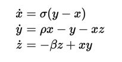

.. _typesetting_math:

Typesetting Math in e-books
============================

The calibre E-book viewer has the ability to display math embedded in e-books
(EPUB and HTML files). You can typeset the math directly with TeX or MathML or
AsciiMath. The calibre E-book viewer uses the excellent `MathJax
<https://www.mathjax.org>`_ library to do this. This is a brief tutorial on
creating e-books with math in them that work well with the calibre E-book viewer.

A simple HTML file with mathematics
-------------------------------------

You can write mathematics inline inside a simple HTML file and the calibre E-book viewer
will render it into properly typeset mathematics. In the example below, we use
TeX notation for mathematics. You will see that you can use normal TeX
commands, with the small caveat that ampersands and less than and greater than
signs have to be written as &amp; &lt; and &gt; respectively.

The first step is to tell calibre that this will contains maths. You do this by
adding the following snippet of code to the <head> section of the HTML file::

    

That's it, now you can type mathematics just as you would in a .tex file. For
example, here are Lorentz's equations::

    <h2>The Lorenz Equations</h2>

    

    \begin{align}
    \dot{x} &amp; = \sigma(y-x) \\
    \dot{y} &amp; = \rho x - y - xz \\
    \dot{z} &amp; = -\beta z + xy
    \end{align}
    

This snippet looks like the following screen shot in the calibre E-book viewer.

    :guilabel:`The Lorenz Equations`

The complete HTML file, with more equations and inline mathematics is
reproduced below. You can convert this HTML file to EPUB in calibre to end up
with an e-book you can distribute easily to other people.

.. only:: online

    Here is the generated EPUB file: `mathjax.epub <_static/mathjax.epub>`_.

.. literalinclude:: mathjax.html
    :language: html

More information
-----------------

Since the calibre E-book viewer uses the MathJax library to render mathematics, the best
place to find out more about math in e-books and get help is the `MathJax
website <https://www.mathjax.org>`_.

