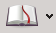
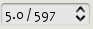
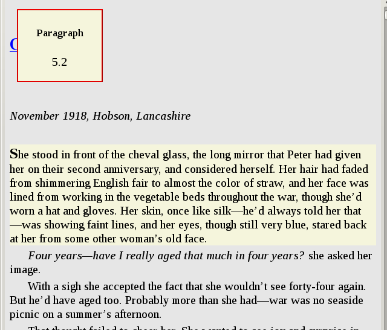
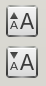

.. _viewer:

The E-book viewer
=============================

calibre includes a built-in e-book viewer that can view all the major e-book formats. 
The viewer is highly customizable and has many advanced features. 

.. contents::
    :depth: 1
    :local:

Starting the viewer
--------------------

You can view any of the books in your calibre library by selecting the book and pressing the :guilabel:`View` button. This
will open up the book in the e-book viewer. You can also launch the viewer by itself from the Start menu in Windows
or using the command :command:`ebook-viewer` in Linux and OS X (you have to install the command line tools on OS X
first by going to :guilabel:`Preferences->Advanced->Miscellaneous`).

Navigating around an e-book
-----------------------------

You can "turn pages" in a book by using the :guilabel:`Page Next` and :guilabel:`Page Previous` buttons |pni|, or by pressing
the Page Down/Page Up keys. Unlike most e-book viewers, calibre does not force you to view books in paged mode. You can
scroll by amounts less than a page by using the scroll bar or various customizable keyboard shortcuts. 

Bookmarks
^^^^^^^^^^^^

When you are in the middle of a book and close the viewer, it will remember where you stopped reading and return there
the next time you open the book. You can also set bookmarks in the book by using the :guilabel:`Bookmark` button |bookmi|. When viewing EPUB format
books, these bookmarks are actually saved in the EPUB file itself. You can add bookmarks, then send the file to a friend.
When they open the file, they will be able to see your bookmarks.

Table of Contents
^^^^^^^^^^^^^^^^^^^^

If the book you are reading defines a Table of Contents, you can access it by pressing the :guilabel:`Table of Contents` button |toci|.
This will bring up a list of sections in the book. You can click on any of them to jump to that portion of the book.

Navigating by location
^^^^^^^^^^^^^^^^^^^^^^^^

E-books, unlike paper books, have no concept of pages. Instead,
as you read through the book, you will notice that your position in the book is displayed in the upper left corner in a box
like this |navposi|. This is both your current position and the total length of the book. These numbers are independent of the screen size and font
size you are viewing the book at, and they play a similar role to page numbers in paper books.
You can enter any number you like to go to the corresponding location in the book. 

calibre also has a very handy
reference mode. You can turn it on by clicking the :guilabel:`Reference mode` button |refmi|. Once you do this, every time you move your
mouse over a paragraph, calibre will display a unique number made up of the section and paragraph numbers. 

You can use this number to unambiguously refer to parts of the books when discussing it with friends or referring to it
in other works. You can enter these numbers in the box marked Go to at the top of the window to go to a particular
reference location. 

If you click on links inside the e-book to take you to different parts of the book, such as an endnote, you can use the :guilabel:`Back` and :guilabel:`Forward` buttons 
in the top left corner to return to where you were. These buttons behave just like those in a web browser. 

Customizing the look and feel of your reading experience
------------------------------------------------------------

You can change font sizes on the fly by using the font size buttons |fontsizei|. You can also make the viewer full screen
by pressing the Full Screen button |fsi|. By clicking the Preferences button |prefbi|, you can change the default fonts used 
by the viewer to ones you like as well as the default font size when the viewer starts up. 

More advanced customization can be achieved by the User Stylesheet setting. This is a stylesheet you can set that will be applied
to every book. Using it you can do things like have white text on a black background, change paragraph styles, text justification, etc.
For examples of custom stylesheets used by calibre's users, see `the forums <https://www.mobileread.com/forums/showthread.php?t=51500>`_.

Dictionary lookup
-------------------

You can look up the meaning of words in the current book by right clicking on a word. calibre uses the publicly available dictionary
server at ``dict.org`` to look up words. The definition is displayed in a small box at the bottom of the screen. 

Copying text and images
-------------------------

You can select text and images by dragging the content with your mouse and then right clicking to copy to the clipboard.
The copied material can be pasted into another application as plain text and images.

