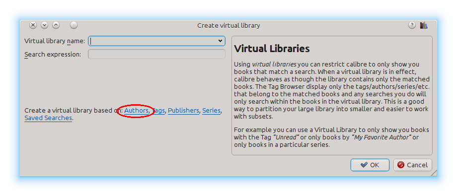

.. _virtual_libraries:

Virtual libraries
============================

In calibre, a virtual library is a way to tell calibre to open only a subset of a
normal library. For example, you might want to only work with books by a certain
author, or books having only a certain tag. Using virtual libraries is the
preferred way of partitioning your large book collection into smaller sub
collections. It is superior to splitting up your library into multiple smaller
libraries as, when you want to search through your entire collection, you can
simply go back to the full library. There is no way to search through multiple
separate libraries simultaneously in calibre.

A virtual library is different from a simple search. A search will only restrict
the list of books shown in the book list. A virtual library does that, and in
addition it also restricts the entries shown in the :guilabel:`Tag browser` to
the left. The Tag browser will only show tags, authors, series, publishers, etc.
that come from the books in the virtual library. A virtual library thus behaves
as though the actual library contains only the restricted set of books.

Creating Virtual libraries
----------------------------

|vlb| To use a virtual library click the :guilabel:`Virtual library` button located
to the left of the search bar and select the :guilabel:`Create Virtual library`
option. As a first example, let's create a virtual library that shows us only
the books by a particular author. Click the :guilabel:`Authors` link as shown
in the image below and choose the author you want to use and click OK.

The Create Virtual library dialog has been filled in for you. Click OK and you
will see that a new Virtual library has been created, and automatically
switched to, that displays only the books by the selected author. As far as
calibre is concerned, it is as if your library contains only the books by the
selected author.

You can switch back to the full library at any time by once again clicking the
:guilabel:`Virtual library` and selecting the entry named :guilabel:`<None>`.

Virtual libraries are based on *searches*. You can use any search as the 
basis of a virtual library. The virtual library will contain only the 
books matched by that search. First, type in the search you want to use 
in the search bar or build a search using the :guilabel:`Tag browser`. 
When you are happy with the returned results, click the Virtual library 
button, choose :guilabel:`Create library` and enter a name for the new virtual 
library. The virtual library will then be created based on the search 
you just typed in. Searches are very powerful, for examples of the kinds 
of things you can do with them, see :ref:`search_interface`. 

Examples of useful Virtual libraries
^^^^^^^^^^^^^^^^^^^^^^^^^^^^^^^^^^^^^^

  * Books added to calibre in the last day::
        date:>1daysago
  * Books added to calibre in the last month::
        date:>30daysago
  * Books with a rating of 5 stars::
        rating:5
  * Books with a rating of at least 4 stars::
        rating:>=4
  * Books with no rating::
        rating:false
  * Periodicals downloaded by the Fetch News function in calibre::
        tags:=News and author:=calibre
  * Books with no tags::
        tags:false
  * Books with no covers::
        cover:false

Working with Virtual libraries
-------------------------------------

You can edit a previously created virtual library or remove it, by clicking the
:guilabel:`Virtual library` and choosing the appropriate action.

You can tell calibre that you always want to apply a particular virtual library
when the current library is opened, by going to
:guilabel:`Preferences->Behavior`. 

If you use the calibre Content server, you can have it share a virtual library
instead of the full library by going to :guilabel:`Preferences->Sharing over the net`.

You can quickly use the current search as a temporary virtual library by
clicking the :guilabel:`Virtual library` button and choosing the
:guilabel:`*current search` entry.

You can display all available virtual libraries as tabs above the book list.
This is particularly handy if you like switching between virtual libraries very
often. Click the :guilabel:`Virtual library` button and select :guilabel:`Show
virtual libraries as tabs`. You can re-arrange the tabs by drag and drop and
close ones you do not want to see. Closed tabs can be restored by
right-clicking on the tab bar.

Using additional restrictions
-------------------------------

You can further restrict the books shown in a Virtual library by using
:guilabel:`Additional restrictions`. An additional restriction is saved search
you previously created that can be applied to the current Virtual library to
further restrict the books shown in a virtual library. For example, say you
have a Virtual library for books tagged as :guilabel:`Historical Fiction` and a
saved search that shows you unread books, you can click the :guilabel:`Virtual
Library` button and choose the :guilabel:`Additional restriction` option to
show only unread Historical Fiction books. To learn about saved searches, see
:ref:`saved_searches`.

