.. include:: global.rst

.. _gui:

The Graphical User Interface
=============================

The Graphical User Interface *(GUI)* provides access to all
library management and ebook format conversion features. The basic workflow
for using |app| is to first add books to the library from your hard disk.
|app| will automatically try to read metadata from the books and add them
to its internal database. Once they are in the database, you can perform a various
:ref:`actions` on them that include conversion from one format to another,
transfer to the reading device, viewing on your computer, editing metadata, including covers, etc.
Note that |app| creates copies of the files you add to it, your original files are left untouched. 

The interface is divided into various sections:

.. contents::
    :depth: 1
    :local:

.. _actions:

Actions
--------

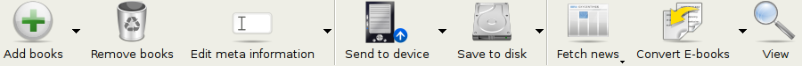

The actions toolbar provides convenient shortcuts to commonly used actions. Most of the action buttons have little arrows next to them. By clicking the arrows, you can perform variations on the default action. Please note that the actions toolbar will look slightly different depending on whether you have an ebook reader attached to your computer.

.. contents::
    :depth: 1
    :local:

.. _add_books:

Add books
~~~~~~~~~~~~~~~~~~
.. |adbi| image:: images/add_books.png

|adbi| The :guilabel:`Add books` action has five variations, accessed by the clicking the down arrow on the right side of the button.

    1. **Add books from a single directory**: Opens a file chooser dialog and allows you to specify which books in a directory should be added. This action is *context sensitive*, i.e. it depends on which :ref:`catalog <catalogs>` you have selected. If you have selected the :guilabel:`Library`, books will be added to the library. If you have selected the ebook reader device, the books will be uploaded to the device, and so on.

    2. **Add books from directories, including sub-directories (One book per directory, assumes every ebook file is the same book in a different format)**: Allows you to choose a directory. The directory and all its sub-directories are scanned recursively and any ebooks found are added to the library. The algorithm assumes that each directory contains a single book. All ebook files in a directory are assumedto be the same book in different formats. This action is the inverse of the :ref:`Save to disk <save_to_disk_multiple>` action, i.e. you can :guilabel:`Save to disk`, delete the books and re-add them with no lost information (except date).

    3. **Add books directories, including sub-directories (Multiple books per directory, assumes every ebook file is a different book)**: Allows you to choose a directory. The directory and all its sub-directories are scanned recursively and any ebooks found are added to the library. The algorithm assumes that each directory contains many books. All ebook files with the same name in a directory are assumed to be the same book in different formats. Ebooks with different names are added as different books. This action is the inverse of the :ref:`Save to disk <save_to_disk_single>` action, i.e. you can :guilabel:`Save to disk`, delete the books and re-add them with no lost information (except date).

    4. **Add empty book. (Book Entry with blank formats)**: Allows you to create a blank book record. This can be used to then manually fill out the information about a book that you may not have yet in your collection. 
    
    5. **Add by ISBN**: Allows you to add one or more books by entering just their ISBN into a list or pasting the list of ISBNs from your clipboard. 
    
The :guilabel:`Add books` action can read metadata from a wide variety of e-book formats. In addition it tries to guess metadata from the filename.
See the :ref:`config_filename_metadata` section, to learn how to configure this.

To add an additional format for an existing book, use the :ref:`edit_meta_information` action.

.. _edit_meta_information:

Edit metadata
~~~~~~~~~~~~~~~~~~~~~~~~~~~~~~~
.. |emii| image:: images/edit_meta_information.png

|emii| The :guilabel:`Edit metadata` action has six variations, which can be accessed by clicking the down arrow on the right side of the button.

    1. **Edit metadata individually**: This allows you to edit the metadata of books one-by-one, with the option of fetching metadata, including covers from the internet. It also allows you to add/remove particular ebook formats from a book. For more detail see :ref:`metadata`.
    2. **Edit metadata in bulk**: This allows you to edit common metadata fields for large numbers of books simulataneously. It operates on all the books you have selected in the :ref:`Library view <search_sort>`.
    3. **Download metadata and covers**: Downloads metadata and covers (if available), for the books that are selected in the book list.
    4. **Download only metadata**: Downloads only metadata (if available), for the books that are selected in the book list.
    5. **Download only covers**: Downloads only covers (if available), for the books that are selected in the book list.
    6. **Download only social metadata**: Downloads only social metadata such as tags and reviews (if available), for the books that are selected in the book list.
    7. **Merge Book Records**: Gives you the capability of merging the metadata and formats of two or more book records together. You can choose to either delete or keep the records that were not clicked first.

    
.. _convert_ebooks:

Convert e-books
~~~~~~~~~~~~~~~~~~~~~~
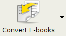

|cei| Ebooks can be converted from a number of formats into whatever format your e-book reader prefers.
Note that ebooks you purchase will typically have `Digital Rights Management <http://bugs.calibre-ebook.com/wiki/DRM>`_ *(DRM)*.
|app| will not convert these ebooks. For many DRM formats, it is easy to remove the DRM, but as this may be illegal,
you have to find tools to liberate your books yourself and then use |app| to convert them.

For most people, conversion should be a simple 1-click affair. But if you want to learn more about the conversion process, see :ref:`conversion`.
            
The :guilabel:`Convert E-books` action has three variations, accessed by the arrow next to the button.
                
    1. **Convert individually**: This will allow you to specify conversion options to customize the conversion of each selected ebook.
                
    2. **Bulk convert**: This allows you to specify options only once to convert a number of ebooks in bulk.
    
    3. **Create catalog**: This action allows you to generate a complete listing with all metadata of the books in your library,
       in several formats, like XML, CSV, BiBTeX, EPUB and MOBI. The catalog will contain all the books showing in the library view currently,
       so you can use the search features to limit the books to be catalogued. In addition, if you select multiple books using the mouse,
       only those books will be added to the catalog. If you generate the catalog in an e-book format such as EPUB or MOBI,
       the next time you connect your e-book reader, the catalog will be automatically sent to the device.
       For details on how catalogs work, see `here <http://www.mobileread.com/forums/showthread.php?p=755468#post755468>`.

.. _view:

View
~~~~~~~~~~~
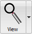

|vi| The :guilabel:`View` action displays the book in an ebook viewer program. |app| has a builtin viewer for the most e-book formats.
For other formats it uses the default operating system application. You can configure which formats should open with the internal viewer via
Preferences->Behavior. If a book has more than one format, you can view a particular format by clicking the down arrow
on the right of the :guilabel:`View` button.

    
.. _send_to_device:

Send to device
~~~~~~~~~~~~~~~~~~~~~~~~
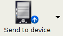

|stdi| The :guilabel:`Send to device` action has eight variations, accessed by clicking the down arrow on the right of the button.

    1. **Send to main memory**: The selected books are transferred to the main memory of the ebook reader.
    2. **Send to card (A)**: The selected books are transferred to the storage card (A) on the ebook reader.
    3. **Send to card (B)**: The selected books are transferred to the storage card (B) on the ebook reader.
    4. **Send and delete from library>**: The selected books are transferred to the selected storage location on the device, and then **deleted** from the Library.
    5. **Send Specific format>**: The selected books are transferred to the selected storage location on the device, in the format that you specify.
    6. **Eject device**: The device is detached from |app|.
    7. **Set default send to device action>**: This action allows you to Specify which of the option 1) through 6) above will be the default action when you click the main button.
    8. **Fetch Annotations**: This is an experimental action which will transfer annotations you may have made on an ebook on your device, and add those annotations to the comments metadata of the book in the |app| library

You can control the file name and folder structure of files sent to the device by setting up a template in
:guilabel:`Preferences->Import/Export->Sending books to devices`. Also see :ref:`templatelangcalibre`.
    
.. _fetch_news:

Fetch news
~~~~~~~~~~~~~~~~~
.. |fni| image:: images/fetch_news.png

|fni| The :guilabel:`Fetch news` action downloads news from various websites and converts it into an ebook that can be read on your ebook reader. Normally, the newly created ebook is added to your ebook library, but if an ebook reader is connected at the time the download finishes, the news is also uploaded to the reader automatically.
            
The :guilabel:`Fetch news` action uses simple recipes (10-15 lines of code) for each news site. To learn how to create recipes for your own news sources, see :ref:`news`.

The :guilabel:`Fetch news` action has three variations, accessed by clicking the down arrow on the right of the button.
    
    1. **Schedule news download**: This action allows you to schedule the download of of your selected news sources from a list of hundreds of available.  Scheduling can be set individually for each news source you select and the scheduling is flexible allowing you to select specific days of the week or a frequency of days between downloads.
    2. **Add a custom news service**: This action allows you to create a simple recipe for downloading news from a custom news site that you wish to access.  Creating the recipe can be as simple as specifying an RSS news feed URL, or you can be more prescriptive by creating python based code for the task, see :ref:`news`.
    3. **Download all scheduled news sources**:  This action causes |app| to immediately begin to download all news sources that you have previously scheduled.

.. _library:

Library
~~~~~~~~~~~~~~~~~
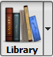

|lii| The :guilabel: `Library` action allows you to create, switch between, rename or delete a Library.  |app| allows you to create as many libraries as you wish. You coudl for instance create a fiction library, a non fiction library, a foreign language library a project library, basically any structure that suits your needs. Libraries are the highest organizational structure within |app|, each library has its own set of books, tags, categories and base storage location.

    1. **Switch\Create library..**: This action allows you to; a) connect to a pre-existing |app| library at another location from your currently open library, b) Create and empty library at a nw location or, c) Move the current Library to a newly specified location.
    2. **Quick Switch>**: This action allows you to switch between libraries that have been registered or created within |app|.
    3. **Rename Library>**: This action allows you to rename a Library.
    4. **Delete Library>**: This action allows you to **permanenetly delete** a Library.
    5. **<calibre library>**: Actions 5, 6 etc .. give you immediate switch access between multiple Libraries that you have created or attached to.

.. _device:

Device
~~~~~~~~~~~~~~~~~
.. |dvi| image:: images/device.png

|dvi| The :guilabel:`Device` action allows you to view the books in the main memory or storage cards of your device, or to eject the device (detach it from |app|).
This icon shows up automatically on the main |app| toolbar when you connect a supported device. You can click on it to see the books on your device. You can also drag  and drop books from your |app| library onto the icon to transfer them to your device. Conversely, you can drag and drop books from your device onto the |app| icon on the toolbar to transfer books from your device to the |app| library. 

    
.. _save_to_disk:

Save to disk
~~~~~~~~~~~~~~~~~~~~~~~~~
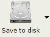

|svdi| The :guilabel:`Save to disk` action has five variations, accessed by the arrow next to the button.

.. _save_to_disk_multiple:

    1. **Save to disk**: This will save the selected books to disk organized in directories. The directory structure looks like::

            Author_(sort)
                Title
                    Book Files
                
    You can control the file name and folder structure of files saved to disk by setting up a template in
    :guilabel:`Preferences->Import/Export->Saving books to disk`. Also see :ref:`templatelangcalibre`.
            
.. _save_to_disk_single:

    2. **Save to disk in a single directory**: The selected books are saved to disk in a single directory.
            
    For 1. and 2. All available formats as well as metadata is stored to disk for each selected book. Metadata is stored in an OPF file.

    Saved books can be re-imported to the library without any loss of information by using the :ref:`Add books <add_books>` action.

    3. **Save only *<your preferred>* format to disk**: The selected books are saved to disk in the directory structure as shown in (1.) but only in your preferred ebook format you can set <your preferred> format in :guilabel:`Preferences->Behaviour->Preferred output format`

    4. **Save only *<your preferred>* format to disk in a single directory**: The selected books are saved to disk in a single directory but only in <your preferred> ebook format you can set <your preferred> format in :guilabel:`Preferences->Behaviour->Preferred output format`

    5. **Save single format to disk ..**: The selected books are saved to disk in the directory structure as shown in (1.) but only in the format you select from the pop-out list.  There are currently 35 formats available and new ones are being added all the time.

.. _connect_share:

Connect/Share
~~~~~~~~~~~~~~~~~
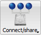

|csi| The :guilabel:`Connect/Share` action allows you to manually connect to a device or folder on your computer, it also allows you to set up you |app| library for access via a web browser, or email.

    The :guilabel:`Connect/Share` action has four variations, accessed by clicking the down arrow on the right of the button.
    
    1. **Connect to folder**: This action allows you to connect to any folder on your computer as though it were a device and use all the facilities |app| has for devices with that folder. Useful if your device cannot be supported by |app| but is available as a USB disk.
    
    2. **Connect to iTunes**: Allows you to connect to your iTunes books database as though it were a device. Once the books are sent to iTunes, you can then use iTunes to make them available on your various iDevices. Useful if you would rather not have |app| send books to your iDevice directly. 
    
    3. **Start Content Server**: This action causes |app| to start up its built-in web server.  When this is started, your |app| library will be accessible via a web browser from the internet (if you choose). You can configure how the web server is accessed by setting preferences at :guilabel:`Preferences->Sharing->Sharing over the net`
    
    4. **Setup email based sharing of books**: This action allows you to setup |app| to share books (and news feeds) by email.  After setting up email addresses for this option |app| will send news updates and book updates to the entered email addresses. You can configure how the |app| sends email by setting preferences at :guilabel:`Preferences->Sharing->Sharing books by email`. Once you have setup one or more email addresses, this menu entry get replaced by menu entries to send books to the setup email addresses. 

.. _remove_books:

Remove books
~~~~~~~~~~~~~~~~~~~~~
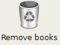

|rbi| The :guilabel:`Remove books` action **deletes books permanently**, so use it with care. It is *context sensitive*, i.e. it depends on which :ref:`catalog <catalogs>` you have selected. If you have selected the :guilabel:`Library`, books will be removed from the library. If you have selected the ebook reader device, the books will be removed from the device. To remove only a particular format for a given book use the :ref:`edit_meta_information` action.  Remove books also has five variations which can be accessed by clicking the down arrow on the right side of the button.

    1. **Remove Selected Books**: Allows you to **permanently** remove all books that are selected in the book list. 
    
    2. **Remove files of a specified format from selected books..**: Allows you to **permanently** remove ebook files of a specified format, from books that are selected in the book list.
    
    3. **Remove all files of a specified format, except..**: Allows you to **permanently** remove ebook files of a multiple formats except a given format, from books that are selected in the book list.
    
    4. **Remove covers from selected books**: Allows you to **permanently** remove cover images files, from books that are selected in the book list.
    
    5. **Remove matching books from device**: Allows you to remove ebook files from a connected device, that match the books that are selected in the book list.

.. note::
    Note that when you use Remove books to delete books from your |app| library, the book record is permanently deleted, but, on (Windows and OS X) the files are placed into the recycle bin, so you can recover them if you change your mind.

.. _configuration:

Preferences
---------------
.. |cbi| image:: images/preferences.png

The Preferences Action allows you to change the way various aspects of |app| work. To access it, click the |cbi|.
    
.. _catalogs:

Catalogs
----------
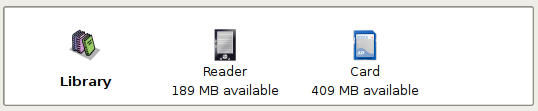

A *catalog* is a collection of books. |app| can manage two types of different catalogs:
                
    1. **Library**: This is a collection of books stored in your |app| library on your computer
                
    2. **Device**:  This is a collection of books stored in the main memory of your ebook reader. It will be available when you connect the reader to your computer.
       - In addition, you can see the books on the storage card (if any) in your reader device.

Many operations, like Adding books, deleting, viewing, etc. are context sensitive. So, for example, if you click the View button when you have the **Device** catalog selected, |app| will open the files on the device to view. If you have the **Library** catalog selected, files in your |app| library will be opened instead.

.. _search_sort:

Search & Sort
---------------
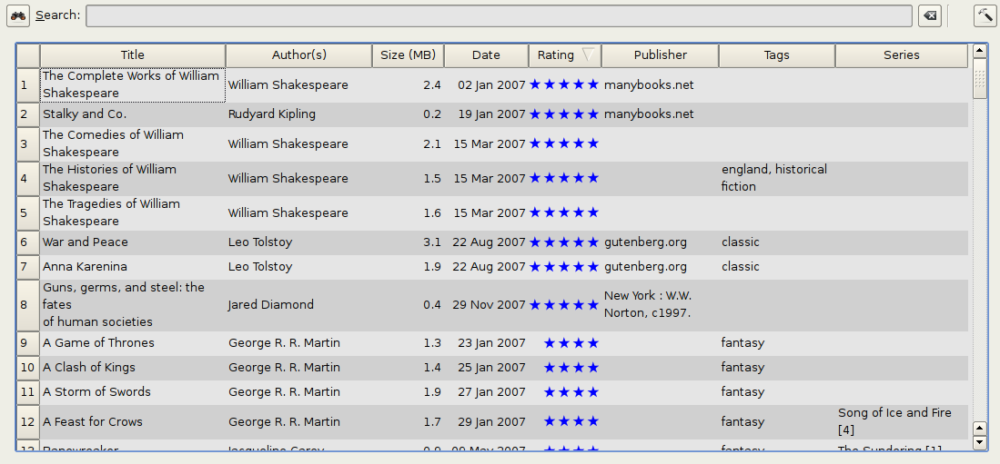

The Search & Sort section allows you to perform several powerful actions on your book collections.

    * You can sort them by title, author, date, rating etc. by clicking on the column titles. You can also sub-sort (i.e. sort on multiple columns). For example, if you click on the title column and then the author column, the book will be sorted by author and then all the entries for the same author will be sorted by title.
                
    * You can search for a particular book or set of books using the search bar. More on that below.
                
    * You can quickly and conveniently edit metadata by double-clicking the entry you want changed in the list.
                
    * You can perform :ref:`actions` on sets to books. To select multiple books you can either:
                
        - Keep the :kbd:`Ctrl` key pressed and click on the books you want selected.
                    
        - Keep the :kbd:`Shift` key pressed and click on the starting and ending book of arange of books you want selected.
                
    * You can configure which fields you want displayed by using the :ref:`configuration` dialog.

.. _search_interface:

The Search Interface
---------------------
You can search all the metadata by entering search terms in the search bar. Searches are case insensitive. For example::
    
    Asimov Foundation format:lrf

This will match all books in your library that have ``Asimov`` and ``Foundation`` in their metadata and 
are available in the LRF format. Some more examples::

    author:Asimov and not series:Foundation
    title:"The Ring" or "This book is about a ring"
    format:epub publisher:feedbooks.com

Searches are by default 'contains'. An item matches if the search string appears anywhere in the indicated metadata.
Two other kinds of searches are available: equality search and search using regular expressions.

Equality searches are indicated by prefixing the search string with an equals sign (=). For example, the query
``tag:"=science"`` will match "science", but not "science fiction" or "hard science". Regular expression searches are
indicated by prefixing the search string with a tilde (~). Any python-compatible regular expression can
be used. Regular expression searches are contains searches unless the expression contains anchors.
Should you need to search for a string with a leading equals or tilde, prefix the string with a backslash. 

Enclose search strings with quotes (") if the string contains parenthesis or spaces. For example, to search
for the tag ``Science Fiction``, you would need to search for ``tag:"=science fiction"``. If you search for
``tag:=science fiction``, you will find all books with the tag 'science' and containing the word 'fiction' in any
metadata.

You can build advanced search queries easily using the :guilabel:`Advanced Search Dialog`, accessed by 
clicking the button |sbi|.

Available fields for searching are: ``tag, title, author, publisher, series, series_index, rating, cover,
comments, format, isbn, date, pubdate, search, size`` and custom columns. If a device is plugged in, the
``ondevice`` field becomes available. To find the search name for a custom column, hover your mouse over the
column header.

The syntax for searching for dates is::

    pubdate:>2000-1 Will find all books published after Jan, 2000
    date:<=2000-1-3 Will find all books added to calibre before 3 Jan, 2000
    pubdate:=2009 Will find all books published in 2009

If the date is ambiguous, the current locale is used for date comparison. For example, in an mm/dd/yyyy
locale, 2/1/2009 is interpreted as 1 Feb 2009. In a dd/mm/yyyy locale, it is interpreted as 2 Jan 2009.  Some
special date strings are available. The string ``today`` translates to today's date, whatever it is. The
strings `yesterday`` and ``thismonth`` also work. In addition, the string ``daysago`` can be used to compare
to a date some number of days ago, for example: date:>10daysago, date:<=45daysago.

You can search for books that have a format of a certain size like this::

    size:>1.1M Will find books with a format larger than 1.1MB
    size:<=1K  Will find books with a format smaller than 1KB

Dates and numeric fields support the relational operators ``=`` (equals), ``>`` (greater than), ``>=``
(greater than or equal to), ``<`` (less than), ``<=`` (less than or equal to), and ``!=`` (not equal to).
Rating fields are considered to be numeric. For example, the search ``rating:>=3`` will find all books rated 3
or higher.

Series indices are searchable. For the standard series, the search name is 'series_index'. For
custom series columns, use the column search name followed by _index. For example, to search the indices for a
custom series column named ``#my_series``, you would use the search name ``#my_series_index``.
Series indices are numbers, so you can use the relational operators described above.

The special field ``search`` is used for saved searches. So if you save a search with the name
"My spouse's books" you can enter ``search:"My spouse's books"`` in the search bar to reuse the saved
search. More about saving searches, below.

You can search for the absence or presence of a field using the special "true" and "false" values. For example::

    cover:false will give you all books without a cover
    series:true will give you all books that belong to a series
    comments:false will give you all books with an empty comment
    format:false will give you all books with no actual files (empty records)

Yes/no custom columns are searchable. Searching for ``false``, ``empty``, or ``blank`` will find all books
with undefined values in the column. Searching for ``true`` will find all books that do not have undefined
values in the column. Searching for ``yes`` or ``checked`` will find all books with ``Yes`` in the column.
Searching for ``no`` or ``unchecked`` will find all books with ``No`` in the column.

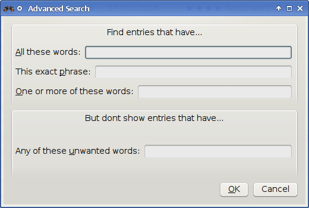
    
    :guilabel:`Advanced Search Dialog`

Saving searches
-----------------

|app| has a useful feature, it allows you to save a search you use frequently under a special name and then re-use that search with a single click. To do this, create your search, either by typing it in the search bar, or using the Tag Browser. Then, type the name you would like to give to the search in the Saved Searches box next to the search bar and click the plus icon next to the saved searches box to save the search. 

Now, you can access your saved search in the Tag Browser under "Searches". A single click will allow you to re-use any arbitrarily complex search easily, without needing to re-create it.

.. _config_filename_metadata:

Guessing metadata from file names
~~~~~~~~~~~~~~~~~~~~~~~~~~~~~~~~~~
In the :guilabel:`Add/Save` section of the configuration dialog, you can specify a regular expression that |app| will use to try and guess metadata from the names of ebook files
that you add to the library. The default regular expression is::

    title - author

i.e., it will assumes that all character up to the first ``-`` are the title of the book and subsequent characters are the author of the book. For example, the filename::

    Foundation and Earth - Isaac Asimov.txt

will be interpreted to have the title: Foundation and Earth and author: Isaac Asimov

.. tip::
    If the filename does not contain the hyphen, the regular expression will fail.

.. _book_details:

Book Details
-------------
.. image:: images/book_details.png

The Book Details display shows you extra information and the cover for the currently selected book.

.. _jobs:

Jobs
-----

The Jobs panel shows you the number of currently running jobs. Jobs are tasks that run in a separate process, they include converting ebooks and talking to your reader device. You can click on the jobs panel to access the list of jobs. Once a job has completed, by double-clicking it in the list, you can see a detailed log from that job. This is useful to debug jobs that may not have completed successfully.

Keyboard Shortcuts
---------------------

Calibre has several keyboard shortcuts to save you time and mouse movement. These shortcuts are active in the book list view (when you're not editing the details of a particular book), and most of them affect the title you have selected. The |app| e-book viewer has its own shortcuts, which can be customised by clicking the Preferences button in the viewer.

.. note::

    Note: The Calibre keyboard shortcuts do not require a modifier key (Command, Option, Control etc.), unless specifically noted. You only need to press the letter key, e.g. E to edit.

.. list-table:: Keyboard Shortcuts
    :widths: 10 100
    :header-rows: 1

    * - Keyboard Shortcut
      - Action
    * - :kbd:`F2 (Enter in OS X)`
      - Edit the metadata of the currently selected field in the book list.
    * - :kbd:`A` 
      - Add Books
    * - :kbd:`C` 
      - Convert selected Books
    * - :kbd:`D` 
      - Send to device
    * - :kbd:`Del` 
      - Remove selected Books
    * - :kbd:`E` 
      - Edit metadata of selected books
    * - :kbd:`I` 
      - Show book details
    * - :kbd:`M` 
      - Merge selected records
    * - :kbd:`Alt+M` 
      - Merge selected records, keeping originals
    * - :kbd:`O` 
      - Open containing folder
    * - :kbd:`S` 
      - Save to Disk
    * - :kbd:`V` 
      - View
    * - :kbd:`Alt+V/Cmd+V in OS X` 
      - View specific format
    * - :kbd:`Alt+Shift+J` 
      - Toggle jobs list
    * - :kbd:`Alt+Shift+B` 
      - Toggle Cover Browser
    * - :kbd:`Alt+Shift+T` 
      - Toggle Tag Browser
    * - :kbd:`Alt+A` 
      - Show books by the Same author as the current book
    * - :kbd:`Alt+T` 
      - Show books with the same tags as current book
    * - :kbd:`Alt+P` 
      - Show books by the same publisher as current book
    * - :kbd:`Alt+Shift+S` 
      - Show books in the same series as current book
    * - :kbd:`/, Ctrl+F` 
      - Focus the search bar
    * - :kbd:`Shift+Ctrl+F`
      - Open the advanced search dialog
    * - :kbd:`Ctrl+D` 
      - Download metadata and shortcuts
    * - :kbd:`Ctrl+R` 
      - Restart calibre
    * - :kbd:`Ctrl+Q` 
      - Quit calibre

