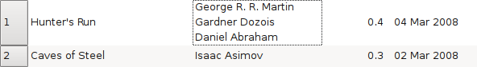

.. include:: global.rst
===============================================
|app| User Manual
===============================================

|app| is an e-book library manager. It can view, convert and catalog e-books in most of the major e-book formats. It can also talk to a few e-book reader devices. It can go out to the internet and fetch metadata for your books. It can download newspapers and convert them into e-books for convenient reading. It is cross platform, running on Linux, Windows and OS X. 

So you've just started |app|. What do you do now? Well, before |app| can do anything with your ebooks, it first has to know about them. So drag and drop a few e-book files into |app|, or click the "Add books" button and browse for the ebooks you want to work with. Once you've added the books, they will show up in the main view looking something like this:

Once you've admired the list of books you just added to your heart's content, you'll probably want to actually read one. In order to do that you'll have to convert the book to a format your reader understands. When first running |app|, the Welcome Wizard starts and it will have setup calibre for your reader device. Conversion is a breeze, just select the book you want to convert, and click the "Convert E-book" button. Ignore all the options for now and just click "OK". The little icon in the bottom right corner will start spinning. Once it's finished spinning, your converted book is ready. Click the "View" button to read the book.

Now if you want to read the book on your reader, just connect it to the computer, wait till calibre detects it (10-20secs) and then click the "Send to device" button. Once the icon stops spinning again, disconnect your reader and read away! If you didn't convert the book in the previous step, |app| will auto convert it to the format your reader device understands. 

To get started with more advanced usage, you should read about the :ref:`Graphical User Interface <gui>`. For even more power and versatility, learn the :ref:`Command Line Interface <cli>`. 

You will find the list of :ref:`Frequently Asked Questions <faq>` useful as well. 

.. only:: online
    
    An e-book version of this User Manual is available in `EPUB format <calibre.epub>`_. 
    
Sections
------------

.. toctree::
   :maxdepth: 1

   gui
   news
   viewer
   conversion
   metadata
   faq 
   tutorials
   customize
   cli/cli-index
   develop
   glossary

