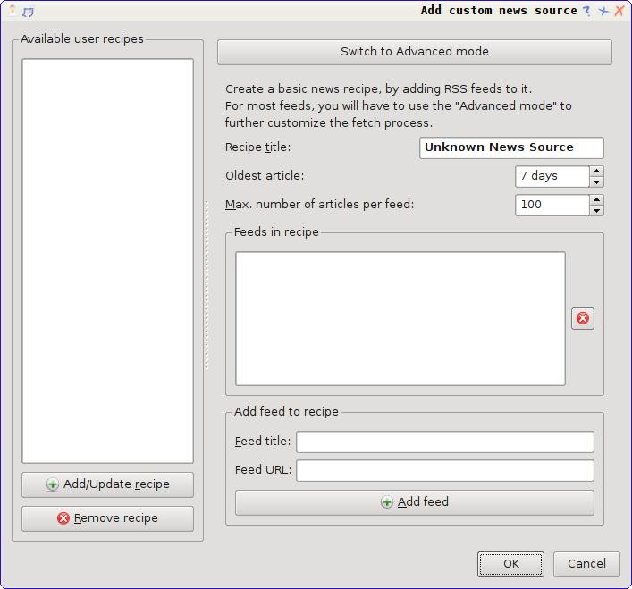
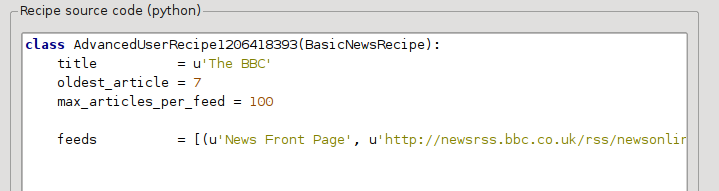
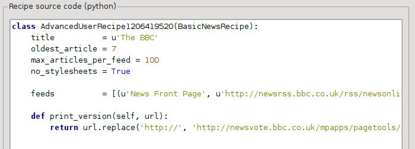

.. include:: global.rst

.. _news:

Adding your favorite news website
==================================

|app| has a powerful, flexible and easy-to-use framework for downloading news from the internet and converting it into an e-book. In the following, I will show you by means of examples, how to get news from various websites.

To gain an understanding of how to use the framework, follow the examples in the order listed below:

.. contents::
    :depth: 2
    :local:

Completely automatic fetching
-------------------------------

If your news source is simple enough, |app| may well be able to fetch it completely automatically, all you need to do is provide the URL. |app| gathers all the information needed to download a news source into a :term:`recipe`. In order to tell |app| about a news source, you have to create a :term:`recipe` for it. Let's see some examples:

.. _portfolio:

portfolio.com
~~~~~~~~~~~~~~~~~~~

*portfolio.com* is the website for *Condé Nast Portfolio*, a business related magazine. In order to download articles from the magazine and convert them to e-books, we rely on the :term:`RSS` feeds of portfolio.com. A list of such feeds is available at http://www.portfolio.com/rss/.

Lets pick a couple of feeds that look interesting:

    #. Business Travel: http://feeds.portfolio.com/portfolio/businesstravel
    #. Tech Observer: http://feeds.portfolio.com/portfolio/thetechobserver

I got the URLs by clicking the little orange RSS icon next to each feed name. To make |app| download the feeds and convert them into an e-book, you should click the :guilabel:`Fetch news` button and then the :guilabel:`Add a custom news source` menu item. A dialog similar to that shown below should open up.

First enter ``Portfolio`` into the :guilabel:`Recipe title` field. This will be the title of the e-book that will be created from the articles in the above feeds. 

The next two fields (:guilabel:`Oldest article` and :guilabel:`Max. number of articles`) allow you some control over how many articles should be downloaded from each feed, and they are pretty self explanatory.

To add the feeds to the recipe, enter the feed title and the feed URL and click the :guilabel:`Add feed` button. Once you have added both feeds, simply click the :guilabel:`Add/update recipe` button and you're done! Close the dialog.

To test your new :term:`recipe`, click the :guilabel:`Fetch news` button and in the :guilabel:`Custom news sources` sub-menu click :guilabel:`Portfolio`. After a couple of minutes, the newly downloaded Portfolio e-book will appear in the main library view (if you have your reader connected, it will be put onto the reader instead of into the library). Select it and hit the :guilabel:`View` button to read!

The reason this worked so well, with so little effort is that *portfolio.com* provides *full-content* :term:`RSS` feeds, i.e., the article content is embedded in the feed itself. For most news sources that provide news in this fashion, with *full-content* feeds, you don't need any more effort to convert them to e-books. Now we will look at a news source that does not provide full content feeds. In such feeds, the full article is a webpage and the feed only contains a link to the webpage with a short summary of the article. 

.. _bbc:

bbc.co.uk
~~~~~~~~~~~~~~

Lets try the following two feeds from *The BBC*:

    #. News Front Page: http://newsrss.bbc.co.uk/rss/newsonline_world_edition/front_page/rss.xml
    #. Science/Nature: http://newsrss.bbc.co.uk/rss/newsonline_world_edition/science/nature/rss.xml

Follow the procedure outlined in :ref:`portfolio` to create a recipe for *The BBC* (using the feeds above). Looking at the downloaded e-book, we see that |app| has done a creditable job of extracting only the content you care about from each article's webpage. However, the extraction process is not perfect. Sometimes it leaves in undesirable content like menus and navigation aids or it removes content that should have been left alone, like article headings. In order, to have perfect content extraction, we will need to customize the fetch process, as described in the next section. 

Customizing the fetch process
--------------------------------

When you want to perfect the download process, or download content from a particularly complex website, you can avail yourself of all the power and flexibility of the :term:`recipe` framework. In order to do that, in the :guilabel:`Add custom news sources` dialog, simply click the :guilabel:`Switch to Advanced mode` button.

The easiest and often most productive customization is to use the print version of the online articles. The print version typically has much less cruft and translates much more smoothly to an e-book. Let's try to use the print version of the articles from *The BBC*.

Using the print version of bbc.co.uk
~~~~~~~~~~~~~~~~~~~~~~~~~~~~~~~~~~~~~~

The first step is to look at the e-book we downloaded previously from :ref:`bbc`. At the end of each article, in the e-book is a little blurb telling you where the article was downloaded from. Copy and paste that URL into a browser. Now on the article webpage look for a link that points to the "Printable version". Click it to see the print version of the article. It looks much neater! Now compare the two URLs. For me they were:

    Article URL
        http://news.bbc.co.uk/2/hi/science/nature/7312016.stm

    Print version URL
        http://newsvote.bbc.co.uk/mpapps/pagetools/print/news.bbc.co.uk/2/hi/science/nature/7312016.stm

So it looks like to get the print version, we need to prefix every article URL with:
    
    newsvote.bbc.co.uk/mpapps/pagetools/print/

Now in the :guilabel:`Advanced Mode` of the Custom  news sources dialog, you should see something like (remember to select *The BBC* recipe before switching to advanced mode):

You can see that the fields from the :guilabel:`Basic mode` have been translated to python code in a straightforward manner. We need to add instructions to this recipe to use the print version of the articles. All that's needed is to add the following two lines:

.. code-block:: python

    def print_version(self, url):
        return url.replace('http://', 'http://newsvote.bbc.co.uk/mpapps/pagetools/print/')

This is python, so indentation is important. After you've added the lines, it should look like:

.. image:: images/bbc_altered.png

In the above, ``def print_version(self, url)`` defines a *method* that is called by |app| for every article. ``url`` is the URL of the original article. What ``print_version`` does is take that url and replace it with the new URL that points to the print version of the article. To learn about `python <http://www.python.org>`_ see the `tutorial <http://docs.python.org/tut/>`_.

Now, click the :guilabel:`Add/update recipe` button and your changes will be saved. Re-download the e-book. You should have a much improved e-book. One of the problems with the new version is that the fonts on the print version webpage are too small. This is automatically fixed when converting to an e-book, but even after the fixing process, the font size of the menus and navigation bar to become too large relative to the article text. To fix this, we will do some more customization, in the next section.

Replacing article styles
~~~~~~~~~~~~~~~~~~~~~~~~~~~~~

In the previous section, we saw that the font size for articles from the print version of *The BBC* was too small. In most websites, *The BBC* included, this font size is set by means of :term:`CSS` stylesheets. We can disable the fetching of such stylesheets by adding the line::

    no_stylesheets = True

The recipe now looks like:

.. _bbc1:

The new version looks pretty good. If you're a perfectionist, you'll want to read the next section, which deals with actually modifying the downloaded content.

Slicing and dicing
~~~~~~~~~~~~~~~~~~~~~~~

|app| contains very powerful and flexible abilities when it comes to manipulating downloaded content. To show off a couple of these, let's look at our old friend the :ref:`The BBC <bbc1>` recipe again. Looking at the source code (:term:`HTML`) of a couple of articles (print version), we see that they have a footer that contains no useful information, contained in 

.. code-block:: html

    

    ...
    

This can be removed by adding::

    remove_tags    = [dict(name='div', attrs={'class':'footer'})]

to the recipe. Finally, lets replace some of the :term:`CSS` that we disabled earlier, with our own :term:`CSS` that is suitable for conversion to an e-book::

    extra_css      = '.headline {font-size: x-large;} \n .fact { padding-top: 10pt  }' 

With these additions, our recipe has become "production quality", indeed it is very close to the actual recipe used by |app| for the *BBC*, shown below:

.. literalinclude:: ../web/feeds/recipes/bbc.py

This :term:`recipe` explores only the tip of the iceberg when it comes to the power of |app|. To explore more of the abilities of |app| we'll examine a more complex real life example in the next section.

Real life example
~~~~~~~~~~~~~~~~~~~~~

A reasonably complex real life example that exposes more of the :term:`API` of ``BasicNewsRecipe`` is the :term:`recipe` for *The New York Times*

.. literalinclude:: ../web/feeds/recipes/nytimes.py
    :linenos:

We see several new features in this :term:`recipe`. First, we have::

    timefmt = ' [%a, %d %b, %Y]'

This sets the displayed time on the front page of the created e-book to be in the format,
``Day, Day_Number Month, Year``. See :attr:`timefmt <libprs500.web.feeds.news.BasicNewsRecipe.timefmt>`.

Tips for developing new recipes
---------------------------------

The best way to develop new recipes is to use the command line interface. Create the recipe using your favorite python editor and save it to a file say :file:`myrecipe.py`. You can download content using this recipe with the command:

    :command:`feeds2disk` :option:`--debug` :option:`--test` myrecipe.py

The :command:`feeds2disk` will download all the webpages and save them to the current directory. The :option:`--debug` makes feeds2disk spit out a lot of information about what it is doing. The :option:`--test` makes it download only a couple of articles from at most two feeds. 

Once the download is complete, you can look at the downloaded :term:`HTML` by opening the file :file:`index.html` in a browser. Once you're satisfied that the download and preprocessing is happening correctly, you can generate an LRF ebook with the command

    :command:`html2lrf` :option:`--use-spine` :option:`--page-break-before` "$" index.html

If the generated :term:`LRF` looks good, you can finally, run 

    :command:`feeds2lrf` myrecipe.py

to see the final :term:`LRF` format e-book generated from your recipe. If you're satisfied with your recipe, consider attaching it to `the wiki <http://libprs500.kovidgoyal.net/wiki/UserRecipes>`_, so that others can use it as well. If you feel there is enough demand to justify its inclusion into the set of built-in recipes, add a comment to the ticket http://libprs500.kovidgoyal.net/ticket/405

.. seealso::

    :ref:`feeds2disk`
        The command line interfce for downloading content from the internet

    :ref:`feeds2lrf`
        The command line interface for downloading content fro the internet and converting it into a :term:`LRF` e-book.
    
    :ref:`html2lrf`
        The command line interface for converting :term:`HTML` into a :term:`LRF` e-book.

Further reading
--------------------

To learn more about writing advanced recipes using some of the facilities, available in ``BasicNewsRecipe`` you should consult the following sources:

    :ref:`API Documentation <news_recipe>`
        Documentation of the ``BasicNewsRecipe`` class and all its important methods and fields.

    `BasicNewsRecipe <http://libprs500.kovidgoyal.net/browser/trunk/src/libprs500/web/feeds/news.py>`_
        The source code of ``BasicNewsRecipe``

    `Built-in recipes <http://libprs500.kovidgoyal.net/browser/trunk/src/libprs500/web/feeds/recipes>`_
        The source code for the built-in recipes that come with |app|

Migrating old style profiles to recipes
----------------------------------------

In earlier versions of |app| there was a similar, if less powerful, framework for fetching news based on *Profiles*. If you have a profile that you would like to migrate to a recipe, the basic technique is simple, as they are very similar (on the surface). Common changes you have to make include:

    * Replace ``DefaultProfile`` with ``BasicNewsRecipe``

    * Remove ``max_recursions``

    * If the server you're downloading from doesn't like multiple connects, set ``simultaneous_downloads = 1``.

API documentation
--------------------

.. toctree::
    
    news_recipe
